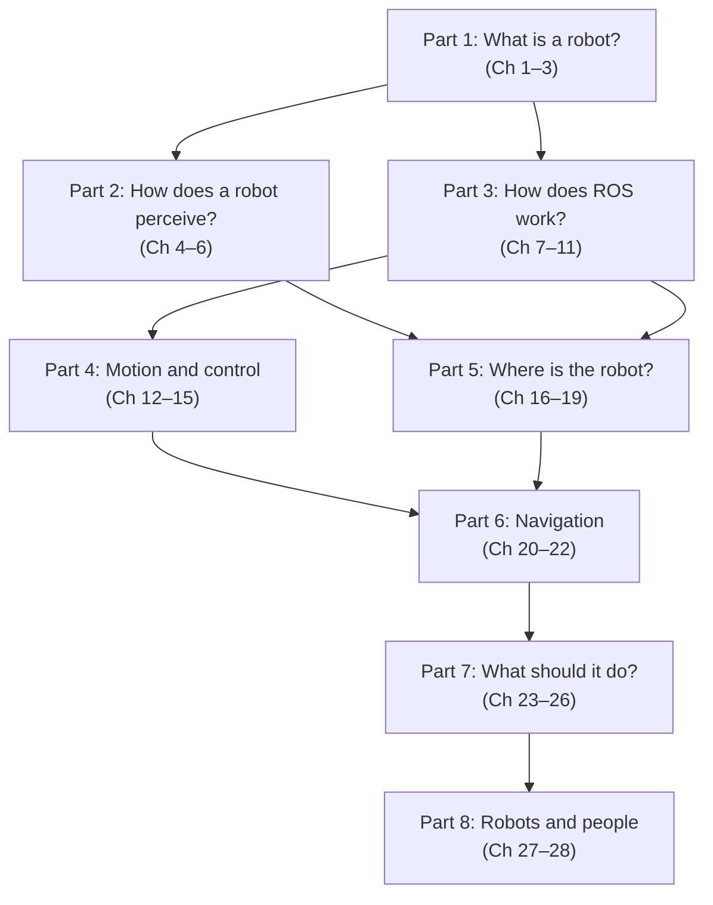
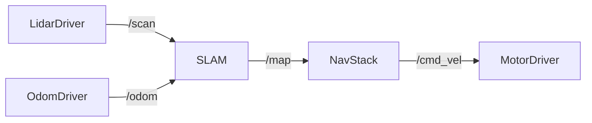

# Introduction

## I.1 What This Book Is

This book is a practical introduction to autonomous robotics for students who already know how to program. It grew out of a university course — Autonomous Robotics (COSI 119a) — taught at Brandeis University over several years. The course was designed around a single conviction: the best way to learn robotics is to build robots, run them, watch them fail, fix them, and run them again.

This book follows that same conviction. Theory appears when it is needed to understand something real. Code appears when it is time to make something work. Every major concept connects to software you can write and behavior you can observe on a physical or simulated robot. There are no purely theoretical chapters; every section leads somewhere you can touch.

## I.2 Why Robotics Now

Robots are no longer confined to factory floors and research labs. They vacuum floors, deliver packages, assist surgeons, drive on public roads, tend crops, and care for the elderly. The scope of what counts as a robot has expanded dramatically, and that expansion is accelerating.

For a computer scientist, this creates an unusual opportunity. Robotics draws on nearly every subfield of computing simultaneously. A robot is a distributed system — many processes running concurrently across multiple machines. It has real-time constraints that operating systems must accommodate. It uses algorithms for path planning, search, and probabilistic inference. It interprets camera and LIDAR data using computer vision. It makes decisions using AI techniques. It controls actuators through feedback loops that come from control theory. And it does all of this in software that is large, concurrent, and must not fail when the hardware misbehaves.

No other single domain puts all of these together in a context where the result moves around in the physical world. That is what makes robotics both difficult and deeply rewarding as a field to study.

The tools have also matured considerably. The Robot Operating System (ROS) is now the standard framework for robot software development worldwide, in both research and industry. Affordable platforms like the TurtleBot3 put real hardware within reach of a student budget. Cloud-based development environments mean you no longer need a powerful personal computer. The foundations are stable, the tools are open-source, and the problems are genuinely hard and genuinely important.

## I.3 What You Will Learn

This book takes you from first principles to a working autonomous robot. Along the way, five major capabilities build on each other.

The first is understanding the **sense-decide-act loop**. Every robot — from a Roomba to a self-driving car — operates by continuously sensing its environment, deciding what to do, and acting. This loop is the organizing principle of the book, and understanding it deeply will help you reason about any robot system you encounter.

The second is **ROS**. The Robot Operating System is the framework used throughout this book. You will learn how to structure robot software as a graph of communicating processes, how to use the standard message types and command-line tools, and how to integrate hardware drivers, algorithms, and interfaces into a working system. ROS is the shared language of the robotics community, and fluency in it opens up an enormous ecosystem of existing software.

The third is **navigation** — one of the hardest and most important problems in mobile robotics. You will learn how robots build maps, localize themselves within those maps, plan paths around obstacles, and execute those paths reliably. These capabilities, taken together, are what let a robot operate usefully in the real world.

The fourth is **perception**: working with LIDAR scan data and camera images. You will learn to filter noise, detect features, and use sensor information to make decisions about the environment.

The fifth is **behavior** — how to structure decision-making so that a collection of sensor-processing and motor-control routines becomes a robot that does something useful and coherent. Finite state machines and behavior trees are the tools for this, and you will use both.

Running through all of these is practical engineering. Robots fail in ways software-only systems do not. Hardware misbehaves. Sensors produce garbage data. Timing matters. You will learn to use simulation to develop and test before touching hardware, to debug distributed systems, and to build software that degrades gracefully when things go wrong.

## I.4 What You Need

This book assumes you can write Python programs of moderate complexity — functions, classes, loops, conditionals. You do not need to be an expert programmer, but you need to be comfortable reading and writing code and reasoning about what it does.

You will also need basic familiarity with Linux and the command line. ROS runs on Linux and is operated primarily through a terminal. You will use the shell constantly — to launch programs, inspect running processes, examine message streams, and manage files. Basic comfort is all that is required at the start; deeper skills accumulate naturally as you use them.

No hardware or electronics knowledge is required. You do not need to know how motors work, how to solder, or how to read a circuit diagram. ROS provides a hardware abstraction layer that lets you write robot software without understanding the electronics underneath. That said, [Chapter 2](../ch02_robot_hardware/) gives you enough intuition about the physical layer to debug problems when the hardware behaves unexpectedly.

Some math appears in the localization and Kalman filter chapters — specifically linear algebra and basic probability. Both are introduced from the ground up. Prior exposure makes the material easier, but it is not a prerequisite.

## I.5 The Platform: TurtleBot3

The robot used throughout this book is the TurtleBot3 from Robotis — a small, affordable differential-drive robot that runs ROS on a Raspberry Pi. It costs approximately $500, is assembled from a kit, and is one of the most widely used educational and research robots in the world. Every code example in this book was written with the TurtleBot3 in mind, and every concept can be demonstrated on it.

Simulation is equally important. Gazebo, the standard ROS simulator, lets you develop and test algorithms before putting them on physical hardware. Many students do most of their coursework in simulation and use physical robots only for final testing. Both workflows are legitimate, and both are covered throughout.

The TurtleBot3 is not the only robot that can run this software. The ROS concepts, algorithms, and code patterns in this book apply to any differential-drive ground robot. If you are working with a different platform, the hardware chapters will explain what you need to know to adapt.

## I.6 How This Book Is Organized

The book is divided into eight parts, each built around one central question about autonomous robots.

Parts 1 and 3 — the foundations and ROS — should be read first, as everything else builds on them. After that, Parts 2, 4, and 5 can be approached in any order depending on what you are working on. Parts 6, 7, and 8 assume all of the earlier material.

Each chapter draws directly on course materials developed and refined over multiple semesters of teaching. The homework assignments and project ideas at the end of the book are the same ones students have worked through; they are designed to be challenging but achievable, and to produce robots that actually do something interesting.

## I.7 A Note on ROS

Despite its name, the Robot Operating System is not an operating system. It runs on top of Linux. A more accurate description is that ROS is a distributed process management and communication framework for robot software.

In practice this means: a robot's software is decomposed into many small programs called **nodes**, each responsible for one function — reading a sensor, estimating position, planning a path, commanding motors. Nodes communicate by publishing typed messages to named **topics**, and any node can subscribe to any topic. ROS handles all the networking, serialization, and process coordination. You write nodes that do specific jobs; ROS connects them into a working system.

This architecture has an important consequence: robot software becomes modular. A LIDAR driver written for one robot works on any robot that uses the same LIDAR and publishes on the same topic. A localization algorithm written for a TurtleBot3 works on any differential-drive robot that publishes standard odometry and scan messages. Reuse is the norm rather than the exception.

This book uses **ROS 2** (specifically ROS 2 Jazzy Jalisco, released 2024, with long-term support through 2029). ROS 2 improves on ROS 1 in several important ways: no central `roscore` process to manage, better real-time support, improved security, and more robust communication under unreliable networks. All code examples and commands in this book are written for ROS 2.

## I.7 About This Book's Origins

The source material for this book comes from lecture notes, slides, and assignments developed over several years of teaching Autonomous Robotics (COSI 119a) at Brandeis University. That course material lives in two directories of Markdown files, accumulated across many semesters.

The narrative text of this book was generated from that source material by AI language models — specifically Claude (Anthropic) and Copilot (Microsoft). Each chapter was drafted by one or both models working from the original course content. The AI was instructed to follow the source material closely, resolve cross-references, update all content from ROS 1 to ROS 2, and add diagrams and code examples where they help.

This process is experimental. The source material was not originally written as a book, and the AI may have introduced errors, omissions, or outdated information when filling gaps. Technical claims should be verified against the official [ROS 2 documentation](https://docs.ros.org/en/jazzy/) and the [TurtleBot3 manual](https://emanual.robotis.com/docs/en/platform/turtlebot3/overview/).

If you find a mistake — factual, technical, or conceptual — please report it to [pitosalas@gmail.com](mailto:pitosalas@gmail.com). Corrections are genuinely appreciated.

---

*Next: [Chapter 1: Defining Robots](../ch01_defining_robots/)*
