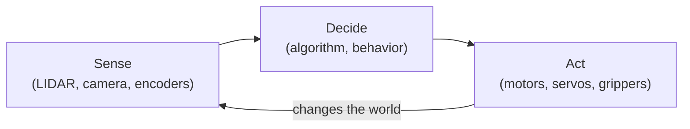

# Chapter 1: Defining Robots

## 1.1 Why Defining "Robot" Is Hard

Ask ten people what a robot is and you will get ten different answers. Some picture a humanoid machine walking on two legs. Others think of a robotic arm on a factory floor, a self-driving car, or a Roomba bumping quietly around the living room. They are all right — and that is the point.

The word "robot" comes from the Czech *robota*, meaning forced labor or drudgery, coined by playwright Karel Čapek in 1920. In the century since, it has been applied to such a wide variety of machines that no single definition covers all of them. That is fine. For the purposes of this book, the exact definition matters less than understanding the *characteristics* that make something robotic. We will arrive at those characteristics shortly — but first, a tour.

## 1.2 A Tour of Real Robots

The best way to build intuition about what robots are is to look at the range of things that are actually called robots. The examples below span domains from medicine to agriculture, from the home to outer space. Looking at what they share — and where they differ — is more useful than any abstract definition.

### Humanoid Robots

The humanoid form is the most culturally recognizable: two legs, two arms, a head. Tesla's Optimus and Boston Dynamics' Atlas are current examples. These robots attract enormous attention because they look like us and, in principle, can move through environments designed for the human body — up stairs, through doorways, across cluttered warehouse floors.

The humanoid form is compelling but not always practical. Stable bipedal locomotion is an extraordinarily hard engineering problem. The human body solves it through a combination of skeletal structure, muscle activation, and continuous sensory feedback that took millions of years to evolve. Reproducing it in hardware and software takes enormous effort. Most real-world robotic applications use simpler, more reliable platforms. Still, humanoids represent an important research direction: a robot that can do what a human body can do can, in principle, slot into any workflow designed for humans — from dangerous factory tasks to disaster response to physical caregiving.

### Surgical Robots

The DaVinci Surgical System from Intuitive Surgical occupies an interesting position: it does not operate autonomously. A surgeon controls it from a console, watching a high-definition 3D view of the surgical site and manipulating hand controls that the system translates into movements of tiny instruments inside the patient's body. So in what sense is it a robot?

It is a robot because it interposes computation between the human's intent and the physical action. The system scales down large hand movements to tiny instrument motions, filters out hand tremor, and can rotate instruments in ways a human wrist cannot. That computational mediation — the sensing, processing, and acting layer inserted between human and world — is the robotic ingredient. Surgical robots have made certain complex procedures significantly more reliable and have reduced recovery times for patients.

### Assistive Robots

A different category of robot addresses vulnerability rather than precision. Companion robots for people with dementia — Jennie from Tombot is one example — provide social interaction and cognitive engagement. These robots sense cues from the person they are with, generate appropriate responses, and adapt their behavior over time. They are not robots in the action-movie sense. But they perceive their environment, make decisions, and act — which is what this book is about.

### Autonomous Transportation

Airport trams have run without human drivers for decades, following fixed guideways with predictable conditions. Modern autonomous vehicles extend this to open roads, navigating among unpredictable human drivers and pedestrians. These systems sense their environment through cameras, LIDAR, radar, and GPS; process that sensor data to build a model of the scene; and execute decisions about steering, acceleration, and braking without human intervention. Whether you call them robots or autonomous vehicles is a question of labeling. By the characteristics that matter to us, they are robots.

### Bomb Disposal Robots

When a suspicious object needs to be examined, a robot can go instead of a person. Bomb disposal systems typically sit somewhere on the spectrum between remote-controlled and autonomous: a human operator drives the robot to the scene using video from the robot's cameras, then uses manipulator arms to examine or move the object. As autonomy research progresses, more of the moment-to-moment decision-making is shifting to the robot itself. The primary value is clear: keeping humans out of danger. Murphy's 2004 study [Human-robot interaction in rescue robotics](https://ieeexplore.ieee.org/document/1284435) analyzed how operators and robots work together under stress and remains a foundational reference on the human side of this problem.

### Domestic Robots

The Roomba may be the most widely owned robot in the world. It navigates a home, avoids obstacles, detects stairs, returns to its charging dock, and vacuums floors — all without human direction. By research standards it is not sophisticated. But it illustrates a key principle: autonomy does not require intelligence. A Roomba senses its environment (bump sensors, cliff detectors, wall sensors, wheel encoders), applies simple decision rules, and acts (motor commands, brush speed). That is the sense-decide-act loop in action, running on modest hardware, solving a real problem.

### Agricultural Robots

Labor shortages and the high cost of pesticides are driving significant investment in agricultural robotics. One example is the Odd Bot, which identifies weeds and removes them mechanically — row by row, plant by plant — without herbicides. More broadly, precision agriculture uses robots and sensors to apply water, fertilizer, and treatment exactly where and when needed, reducing waste and improving yield. The scale of these deployments — over large outdoor areas, in variable weather and terrain — makes them challenging engineering problems.

### Manufacturing Robots

Industrial robot arms have transformed manufacturing over the past fifty years. They weld, paint, assemble, and inspect with precision and consistency that human workers cannot match for repetitive tasks. Modern manufacturing systems increasingly mix robots and humans in shared workspaces, with robots handling heavy or hazardous operations and humans handling tasks requiring judgment and dexterity. The arms themselves are actuators; the intelligence lies in the programs that coordinate them with sensors, conveyors, and other systems.

### Science Fiction Robots

Wall-E, R2-D2, C-3PO, HAL 9000, the Terminator. Fictional robots do things real ones do not yet do: they reason about the world, form emotional connections, pursue their own goals. But the gap is closing faster than many expected. The physical form of Wall-E — a tracked mobile platform with camera eyes, a gripper, and a laser — could be built today using components from this book. What remains hard is the cognition: the ability to understand context, form plans, and act with genuine flexibility. Science fiction has always been a useful design space for robotics research, and it continues to be.

## 1.3 What Makes Something a Robot?

Looking across these examples, three characteristics keep appearing. Not every "robot" has all three in equal measure, but all three need to be present to some degree.

**Sensing.** A robot perceives its environment through sensors — cameras, LIDAR, microphones, touch sensors, GPS, accelerometers, encoders. Without sensing, a machine is executing a fixed script that takes no account of the actual state of the world. A garage door opener is not a robot; an autonomous vehicle that detects and avoids pedestrians is. Sensing is what lets a robot respond to reality rather than just replaying a program.

**Acting.** A robot has effectors — components that change the physical world. Motors, wheels, arms, grippers, speakers. Sensing alone is measurement; acting alone is blind execution. The combination, connected by computation, is what makes a robot. The computation between sensor and actuator is where all the interesting engineering happens.

**Autonomy.** This is the most variable characteristic. Autonomy exists on a spectrum, from fully teleoperated (a human controls every individual action) to fully autonomous (the robot perceives, decides, and acts entirely on its own). Most real robots sit somewhere in the middle, and the appropriate level of autonomy depends on the task, the environment, and the stakes.

A bomb disposal robot is mostly teleoperated; a Roomba is highly autonomous for a narrow task; a self-driving car targets full autonomy in complex open environments; a surgical robot amplifies human skill without replacing human judgment. All four are robots.

A useful working definition, then: **a robot is a physical machine that senses its environment, makes decisions based on those sensors, and takes physical actions in the world — with some degree of autonomy over that process.**

One influential approach to robot decision-making, called **behavior-based robotics**, replaces a single centralized decision module with a collection of simple reactive behaviors that run in parallel and compete to control the robot. Rodney Brooks introduced this with his [subsumption architecture](https://www.semanticscholar.org/paper/A-robust-layered-control-system-for-a-mobile-robot-Brooks/dc66c15a005dd1a3a9f033769e7fbc3b943be188), where higher-level behaviors can suppress or override lower-level ones — much like reflexes and deliberation work together in animals. De Silva and Ekanayake provide a broader [survey of behavior-based approaches](http://www.cs.utah.edu/~alnds/papers/behavior_robotics_2008.pdf) for readers who want to go deeper.

The sense-decide-act loop below is the central pattern this definition captures:

Every chapter in this book deepens your understanding of one or more of these three elements. Part 2 is about sensing. Parts 3 and 4 are about the decision-making infrastructure and motion control. Parts 5 and 6 are about where that loop takes the robot. Parts 7 and 8 are about structuring complex behavior.

## 1.4 Why Study Robotics Now?

Robotics has become a serious field with serious employment prospects. Boston alone is a global hub, home to Amazon Robotics, Boston Dynamics, iRobot, and dozens of startups. Robotics roles exist at every level: hardware engineering, embedded software, algorithms, simulation, testing, and product development.

More importantly for a student, robotics is technically rich in a way that makes you better at software engineering generally. Building a robot that works requires you to reason carefully about concurrency, about the gap between a model and the physical world, about how to test systems that interact with an environment you cannot fully control, and about what happens when things go wrong in ways you did not anticipate. These skills transfer.

The tools are ready. ROS has been in continuous development since 2007 and is used in research robots, commercial products, and student labs worldwide. Gazebo provides simulation environments realistic enough to develop and validate full navigation stacks before touching hardware. The TurtleBot3 is inexpensive, well-documented, and can run the full ROS navigation stack out of the box. There is no better time to start.

## 1.5 What This Book Covers

The book is organized into eight parts that answer eight questions about autonomous robots. Part 1 (this chapter plus Chapters 2 and 3) establishes what robots are, what hardware they use, and why they need specialized software. Part 2 (Chapters 4 through 6) covers perception: how robots use LIDAR and cameras to gather information about their environment. Part 3 (Chapters 7 through 11) goes deep on ROS: the nodes-topics-services-actions architecture, the development workflow, and best practices. Part 4 (Chapters 12 through 15) covers motion: coordinate frames, differential drive kinematics, PID control, and robot body description. Part 5 (Chapters 16 through 19) covers localization: odometry, SLAM, AMCL, and Kalman filters. Part 6 (Chapters 20 through 22) covers navigation: path planning and the ROS navigation stack. Part 7 (Chapters 23 through 26) covers behavior: how robots decide what to do using finite state machines and behavior trees. Part 8 (Chapters 27 and 28) addresses the increasingly important problem of robots operating around people.

By the end, you will have both the conceptual foundation and the practical skills to build, program, and reason about autonomous robots. The next chapter begins with the physical layer — the hardware that all this software runs on.

---

*Next: [Chapter 2: Robot Hardware](../ch02_robot_hardware/)*
