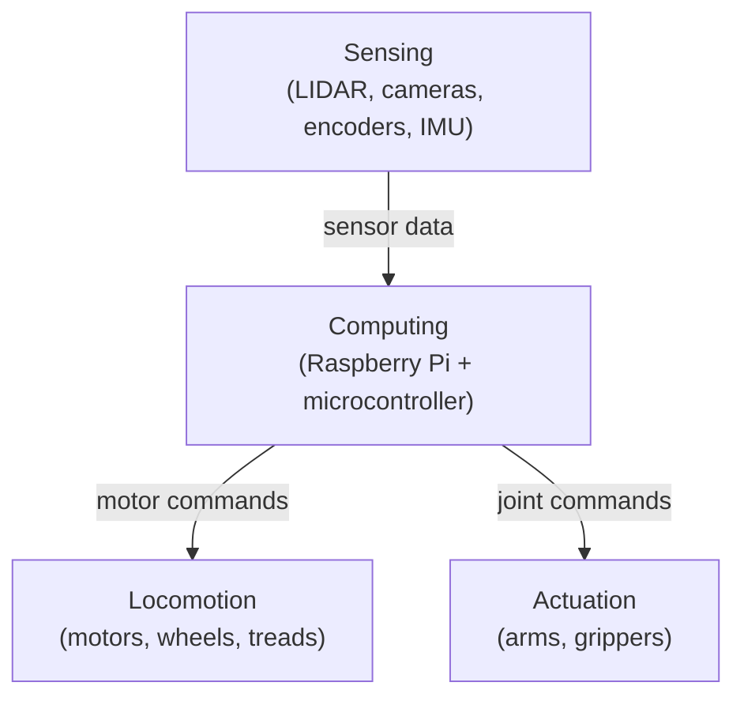
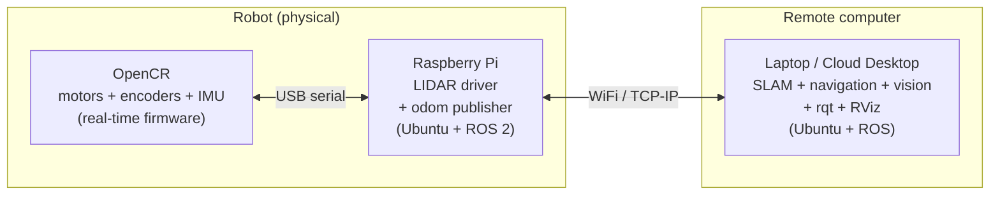
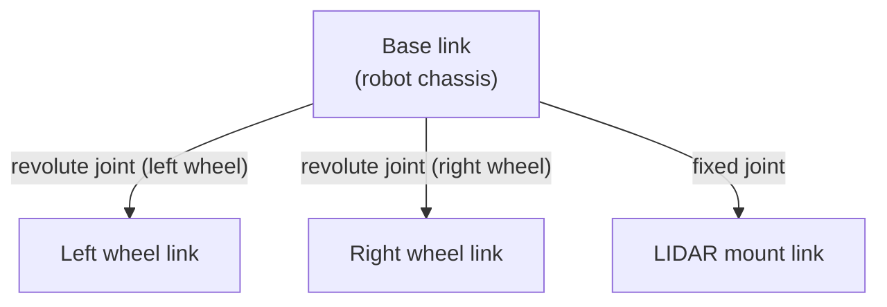

# Chapter 2: Robot Hardware

Every robot is built from the same four subsystems: locomotion, sensing, actuation, and computing. Understanding each subsystem — and how they connect — is essential before writing a line of robot software. The hardware determines what the software can do, and the software is only useful if it correctly models the hardware. This chapter covers the physical layer. Later chapters build the software on top of it.

## 2.1 The Four Subsystems



The computing subsystem is the brain: it receives data from sensors and sends commands to motors and actuators. The sensing subsystem is the nervous system: it continuously feeds information about the world into the compute layer. The locomotion and actuation subsystems are the body: they carry out whatever the brain decides.

Each subsystem is represented in software. When your code publishes a velocity command, it is talking to the locomotion subsystem. When your code subscribes to `/scan`, it is receiving data from the sensing subsystem. Understanding what each piece of hardware does makes the software much easier to reason about.

## 2.2 Locomotion

How a robot moves determines almost everything about how you program it — the constraints on path planning, the geometry of the control loop, the format of velocity commands.

### Holonomic vs. Non-Holonomic Motion

A **holonomic** robot can move instantaneously in any direction without first reorienting. Think of a drone or a robot on mecanum wheels: it can slide sideways, move diagonally, or spin in place while moving forward, all independently. The number of controllable degrees of freedom equals the total degrees of freedom of the system.

A **non-holonomic** robot cannot move in all directions freely. A standard car is non-holonomic: you cannot slide it sideways. To move from one parking space to the next, you must execute a sequence of forward and backward arcs. Most wheeled ground robots are non-holonomic, and this constraint has deep implications for path planning — the robot cannot simply follow the geometrically shortest path; it must plan routes that respect its turning constraints.

### Differential Drive

Differential drive is the most common configuration for educational and research robots, and it is what the TurtleBot3 uses. Two wheels are independently driven, one on each side, with one or two passive caster wheels providing balance. The name comes from the fact that the robot's behavior is determined by the *difference* in wheel speeds.

When both wheels turn at the same speed, the robot moves in a straight line. When the left wheel turns faster than the right, the robot curves right. When the two wheels turn in opposite directions at equal speed, the robot pivots in place. Every motion is a combination of linear velocity and angular velocity — precisely the two values in the ROS `Twist` message that you will use to command the robot.

```
Both wheels forward at same speed  →  straight ahead
Left wheel faster than right        →  curve right
Right wheel faster than left        →  curve left
Left forward, right backward        →  pivot in place (rotate)
```

This simplicity is one of the reasons differential drive is so popular: the relationship between wheel commands and robot motion is straightforward to model and implement.

### Four-Wheeled Platforms

With four wheels, steering becomes more complex. Two main approaches exist.

**Skid steering**, used by tanks and tracked vehicles, drives the left and right wheel pairs at different speeds to turn. It is mechanically simple — no separate steering mechanism is needed — but it causes wheel scrub (lateral sliding) during turns, which wastes energy and wears the wheels.

**Ackermann steering**, used by cars, has two wheels that can pivot for steering and all four that roll. The Ackermann geometry ensures all four wheels follow concentric arcs during a turn, eliminating scrub. The tradeoff is mechanical complexity (a steering linkage) and a minimum turning radius — a car cannot turn as tightly as a differential-drive robot.

**Mecanum wheels** are a special case that achieves holonomic motion with four wheels. Each wheel has small rollers mounted at 45° around its rim. By independently varying the speed and direction of all four mecanum wheels, the robot can move in any direction — forward, sideways, diagonally — without rotating. This is useful for applications requiring precise positioning in tight spaces.

### Legged Robots

Legged robots can traverse terrain that wheels cannot: stairs, rubble, uneven ground, gaps. Boston Dynamics' Spot (quadruped) and Atlas (biped) are the most visible current examples. The tradeoff is enormous complexity. Each leg has multiple joints; each joint requires its own motor, position sensor, and torque feedback; the controller must coordinate gait patterns — walk, trot, gallop — in real time while maintaining dynamic balance. Legged robotics is an active research area. For coursework, wheeled platforms are standard.

### Tracks (Treads)

Tracked robots use continuous belts like a tank or bulldozer. Treads distribute weight over a large contact area, providing excellent traction on rough or soft terrain. Steering is by skid: left and right tracks driven at different speeds. The large contact patch that gives treads good traction also causes high friction and energy consumption during turns. Tracked robots are common in outdoor, military, and search-and-rescue applications.

## 2.3 Sensing

A robot without sensors is blind. Sensors are the only connection between the robot's software and the physical world it operates in. Every decision the robot makes is based on what its sensors tell it.

### LIDAR

LIDAR (Light Detection And Ranging) is the primary sensor for indoor obstacle detection and mapping. A rotating laser fires pulses in a 360° sweep and measures the time each pulse takes to return — the "time of flight." From the round-trip travel time, the sensor computes the distance to the nearest obstacle in each direction. The result is a **scan**: an array of distance values indexed by angle.

```
Scan array: [d₀, d₁, d₂, ..., d₃₅₉]
             ↑                    ↑
           angle 0°           angle 359°
Each dᵢ = distance in meters to nearest obstacle at bearing i°
```

The TurtleBot3 Burger uses a YDLIDAR X4, which produces a 360° scan. This scan is published on the `/scan` topic as a `sensor_msgs/LaserScan` message at roughly 5–10 Hz. [Chapter 5](../ch05_lidar/) covers how to work with this data in detail.

One important limitation deserves emphasis: a 2D LIDAR operates in a single horizontal plane, like a disk cutting through space at the height of the sensor. It is completely blind to anything above or below that plane. A chair leg at floor level is visible; the seat of the chair overhanging the robot is invisible. This geometric blind spot is a frequent source of surprising robot behavior and must be accounted for in any real deployment.

### Visual Cameras

A camera captures a color image — a 2D matrix of pixels, each carrying red, green, and blue values. In code this is simply `pixel[x, y] = {r, g, b}`. The TurtleBot3 Waffle Pi includes a Raspberry Pi Camera; the Burger does not. Images are published on `/camera/rgb/image_raw` as `sensor_msgs/Image` messages.

The processing library for camera images in robotics is **OpenCV** (Open Computer Vision). OpenCV provides functions for color filtering, edge detection, blob finding, marker detection, and much more. [Chapter 6](../ch06_computer_vision/) covers the basics of using OpenCV with ROS.

Camera data volume is high. At 640×480 resolution and 30 frames per second, a camera generates nearly 28 million pixel values per second. Over WiFi this creates real bandwidth pressure — compressed topics (`/compressed`, `/theora`) exist specifically to address this.

### Depth Cameras

A depth camera augments each pixel with a distance measurement: `pixel[x, y] = {r, g, b, d}`. The Intel RealSense and Orbbec Astra are common examples. Depth cameras are useful when you detect an object with the camera and also need to know how far away it is — for example, when a robot arm needs to reach for something. The TurtleBot3 base platform does not include a depth camera, but adding one is straightforward.

### Wheel Encoders

Encoders are sensors built into the wheel motors that count how far each wheel has rotated. As the wheel turns, the encoder generates pulses — typically hundreds per revolution. Counting those pulses tells you how far the wheel has traveled, which tells you (approximately) how far and in what direction the robot has moved. This motion estimate, accumulated over time, is called **odometry**, and it is published on the `/odom` topic.

Odometry is the robot's primary self-localization signal, but it accumulates error. Wheels slip. Floors are not perfectly flat. The error grows with distance traveled. A robot relying solely on odometry will eventually lose track of where it is. Fred Martin's paper [Real Robots Don't Drive Straight](https://www.aaai.org/Papers/Symposia/Spring/2007/SS-07-09/SS07-09-020.pdf) is a short, readable account of exactly how and why this happens — required reading for anyone surprised that their robot curves when they commanded it to go straight. Later chapters describe how to combine odometry with LIDAR to build more reliable position estimates.

### IMU (Inertial Measurement Unit)

An IMU measures forces and rotation rates using accelerometers and gyroscopes. A 3-axis gyroscope reports rotational velocity around each axis. A 3-axis accelerometer reports linear acceleration along each axis. A 3-axis magnetometer measures the local magnetic field (used as a compass heading). Together, a 9-axis IMU gives a rich picture of the robot's motion and orientation.

The TurtleBot3's OpenCR board includes an MPU9250, a 9-axis IMU. Its data is published on the `/imu` topic. The IMU is particularly useful for measuring rotation — it can tell you how fast the robot is turning with much less lag than wheel encoders. It is typically fused with odometry using a filter to produce a better overall pose estimate.

## 2.4 Computation

A robot's computing architecture is distributed. Different computational tasks have different latency and throughput requirements, and no single processor handles all of them optimally.

### Microcontroller

The microcontroller layer runs directly on the hardware, with real-time constraints. On the TurtleBot3, this is the **OpenCR** board — an Arduino-compatible microcontroller from Robotis. It handles the lowest-level tasks: reading encoder pulses from the wheel motors at high frequency, commanding motor currents to achieve target speeds, and reading the IMU. These tasks require microsecond response times and tight timing guarantees. The microcontroller does not run Linux; it runs firmware — small, deterministic programs burned directly onto the chip.

### Single-Board Computer (SBC)

Above the microcontroller sits a single-board computer running a full Linux operating system. On the TurtleBot3, this is a **Raspberry Pi**. The Pi runs the full ROS 2 stack: the LIDAR driver, the motor interface node, and the odometry publisher. It communicates with the OpenCR over USB serial. It connects to your laptop over WiFi. The Pi has enough computing power for the real-time-adjacent tasks but is not powerful enough for computationally expensive algorithms like computer vision or SLAM.

### Remote Computer

Computationally expensive algorithms — SLAM, computer vision, path planning, user interfaces — typically run on your laptop or a cloud desktop. ROS is designed for exactly this: nodes running on different machines communicate transparently over the network using the same publish-subscribe mechanism as nodes on the same machine. From the perspective of any individual node, the location of other nodes is invisible.



As robots become more capable and deployments more autonomous, the trend is toward more powerful onboard computers — NVIDIA Jetson boards and similar — that can run the full stack without a remote machine, enabling the robot to operate independently of a network connection.

## 2.5 The TurtleBot3

The TurtleBot3 from Robotis is the platform used throughout this book. Two models exist: the **Burger** (smaller, no camera, ~$300) and the **Waffle Pi** (larger, includes camera, ~$600). Both use the same software stack and are interchangeable for most of this book's content. The [official TurtleBot3 manual](https://emanual.robotis.com/docs/en/platform/turtlebot3/overview/) covers hardware assembly, firmware flashing, and ROS 2 bringup in detail — consult it whenever you need to set up or troubleshoot the physical robot.

The Burger's hardware, from the ground up: two Dynamixel XL430 servo motors, each with a built-in encoder, drive the two powered wheels. A passive caster wheel at the rear provides stability. An OpenCR microcontroller board sits in the middle of the chassis, connected to both motors via the Dynamixel protocol. A YDLIDAR X4 sits on top, connected to the Raspberry Pi via USB. The Raspberry Pi 3B+ (or 4) sits between the LIDAR and the battery, running Ubuntu 20.04 and ROS Noetic. The whole stack runs from a 11.1V LiPo battery.

In software, the TurtleBot3 presents a clean interface. Your code publishes velocity commands to `/cmd_vel`. The robot drives. Your code subscribes to `/scan` and `/odom`. The robot tells you what it sees and where it thinks it is. The details of motor control, encoder reading, and LIDAR data processing are handled by the robot's onboard software, invisible to your application code.

## 2.6 Robot Bodies: Joints, Links, and URDF

For robots with arms, manipulators, or any multi-segment structure, the body must be described formally so that software can reason about geometry. ROS uses a representation called a **kinematic tree**: a hierarchy of rigid **links** connected at **joints**.

A link is a rigid segment of the robot — a body part. A joint is the connection between two links, and it has a type that determines what motion is allowed across it. A **revolute** joint rotates around a single axis (an elbow, a wrist). A **prismatic** joint slides along an axis (a piston, a linear actuator). A **fixed** joint is rigid — it connects two links with no relative motion.



This structure is encoded in a file format called **URDF** (Unified Robot Description Format), an XML dialect. ROS reads URDF to understand the robot's geometry — for 3D visualization in RViz, for computing transforms between frames, and for collision detection.

For a robot arm, the kinematic tree extends further: shoulder, upper arm, elbow, forearm, wrist, gripper. Given the angles of all joints, **forward kinematics** computes the position and orientation of the gripper. Given a desired gripper position, **inverse kinematics** computes what joint angles are needed. Both operations are handled by ROS libraries and are covered in Chapter 15.

For the TurtleBot3, the URDF is simple: two revolute wheel joints and a fixed LIDAR mount. You will encounter it when visualizing the robot in RViz and when working with coordinate transforms in Chapter 12.

## 2.7 Summary

The TurtleBot3's hardware maps directly to software interfaces that your code will use throughout this book:

| Hardware | Physical component | ROS topic | Message type |
|---|---|---|---|
| Locomotion | Dynamixel motors | `/cmd_vel` | `geometry_msgs/Twist` |
| LIDAR | YDLIDAR X4 | `/scan` | `sensor_msgs/LaserScan` |
| Encoders | Built into Dynamixel | `/odom` | `nav_msgs/Odometry` |
| IMU | MPU9250 on OpenCR | `/imu` | `sensor_msgs/Imu` |
| Camera (Waffle) | Raspberry Pi Camera | `/camera/rgb/image_raw` | `sensor_msgs/Image` |

Every time your code interacts with any of these topics, it is interacting with the hardware described in this chapter. The next chapter introduces the software framework — ROS — that makes all of this work together.

---

*Previous: [Chapter 1: Defining Robots](../ch01_defining_robots/)*
*Next: [Chapter 3: Robot Software Architecture](../ch03_software_architecture/)*
