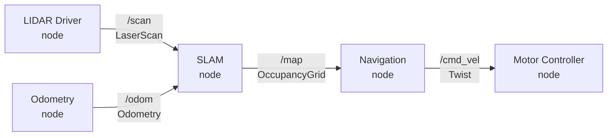

# Chapter 3: Robot Software Architecture

## 3.1 Why Robots Need Special Software

A robot is not a normal computer program. A normal program runs, produces output, and stops. A robot program runs continuously, reads from sensors at high frequency, makes decisions, and sends commands to motors — all at the same time, forever, while the physical world changes around it.

This creates problems that ordinary software architectures handle badly:

**Concurrency.** A robot might be reading LIDAR data, processing camera images, tracking its position, and planning a path all at once. These activities run in parallel and must not block each other.

**Distribution.** A robot's software does not all run on one computer. The low-level motor controller runs on a microcontroller. ROS nodes run on a Raspberry Pi. Computationally expensive algorithms run on a laptop. All of these must communicate reliably over a network.

**Hardware abstraction.** The same navigation algorithm should work whether the robot has a Hokuyo LIDAR or a YDLIDAR. The same motor control code should work on a TurtleBot3 or a custom platform. Hardware details should be isolated from algorithmic logic.

**Modularity and reuse.** A localization algorithm written once should be reusable across many robots and many applications. Robot software systems are too large and complex to rebuild from scratch each time.

ROS (the Robot Operating System) was designed to address all four of these needs. It is the standard framework for robot software development and the one used throughout this book.

## 3.2 ROS Is Not an Operating System

Despite its name, ROS is not an operating system. It runs on top of Linux. A more accurate description:

> ROS is a distributed process management and communication framework for robot software.

What that means in practice: ROS provides the infrastructure for running many small programs (called **nodes**), connecting them together through a message-passing system, and coordinating them across multiple computers on a network.

You write the nodes. ROS handles everything else.

The official documentation for ROS 2 Humble is at [docs.ros.org/en/humble](https://docs.ros.org/en/humble/). When any concept in this chapter needs more depth — DDS transport, QoS settings, lifecycle nodes — that is the authoritative reference.

## 3.3 Nodes

A **node** is a single running program — a process — that does one thing. Examples:

- A node that reads the LIDAR and publishes scan data
- A node that reads wheel encoder data and publishes odometry
- A node that subscribes to odometry and scan data and publishes a map
- A node that subscribes to a goal position and publishes motor commands

A real robot system has dozens of nodes running simultaneously. Each node is small and focused. This makes nodes easy to test, replace, and reuse.

Here is the simplest possible ROS 2 node in Python:

```python
#!/usr/bin/env python3
import rclpy
from rclpy.node import Node
from std_msgs.msg import Int32

class CounterPublisher(Node):
    def __init__(self):
        super().__init__('my_publisher_node')
        self.pub = self.create_publisher(Int32, 'counter', 10)
        self.timer = self.create_timer(0.5, self.timer_callback)  # 2 Hz
        self.count = 0

    def timer_callback(self):
        msg = Int32()
        msg.data = self.count
        self.pub.publish(msg)
        self.count += 1

def main():
    rclpy.init()
    rclpy.spin(CounterPublisher())
    rclpy.shutdown()

if __name__ == '__main__':
    main()
```

This node publishes an incrementing integer to a topic called `counter` at 2 Hz. That is all it does. Another node somewhere else on the network can subscribe to `counter` and receive those integers.

ROS 2 nodes are written as classes that inherit from `Node`. This is more structured than ROS 1's procedural style, but it makes concurrency and lifecycle management much cleaner. Each node instance owns its publishers, subscribers, timers, and clients. The [rclpy API documentation](https://docs.ros2.org/humble/api/rclpy/) covers all available methods on `Node` and the other core classes.

## 3.4 Topics and Messages

**Topics** are named channels through which nodes communicate. A node **publishes** messages to a topic; any number of other nodes can **subscribe** to that topic and receive those messages.

Topics are typed: every message on a topic has the same structure. The LIDAR publishes `sensor_msgs/LaserScan` messages on `/scan`. The odometry system publishes `nav_msgs/Odometry` messages on `/odom`. The motor controller subscribes to `geometry_msgs/Twist` messages on `/cmd_vel`.

This is the **publish-subscribe** pattern. Publishers do not know who is listening. Subscribers do not know who is publishing. They are decoupled — you can swap out a node without changing anything else, as long as the new node uses the same topic names and message types.



Key commands for working with topics:

```bash
ros2 topic list              # list all active topics
ros2 topic echo /scan        # print messages on /scan in real time
ros2 topic info /odom        # show publishers, subscribers, message type
ros2 topic hz /scan          # measure publish rate
```

## 3.5 No Master: ROS 2 Uses DDS

ROS 1 required a central `roscore` process — a global coordinator that every node had to contact before it could communicate. If `roscore` crashed, the entire system stopped.

ROS 2 eliminates this single point of failure. Communication is built on **DDS** (Data Distribution Service), an industrial middleware standard. DDS uses peer-to-peer discovery: nodes find each other automatically using multicast announcements, with no central coordinator. You simply start your nodes — in any order, on any machines on the same network — and they discover each other. The [ROS 2 DDS documentation](https://docs.ros.org/en/humble/Concepts/Intermediate/About-Different-Middleware-Vendors.html) explains the available DDS implementations and how to switch between them.

This changes the development workflow:
- No `roscore` to start first
- Nodes can be started and stopped in any order
- The system continues to operate even if individual nodes crash and restart
- Multiple robots on the same network need **ROS_DOMAIN_ID** set to different values to avoid cross-talk

```bash
export ROS_DOMAIN_ID=42   # isolate this robot from others on the network
```

## 3.6 Services

Topics are asynchronous: publishers and subscribers run independently. Sometimes you need synchronous communication — send a request, wait for a response. That is what **services** are for.

A service has a server (a node that advertises the service) and a client (a node that calls it). The client blocks until the server responds. Services are typed with request and response fields.

Services are appropriate for occasional, bounded-time operations: asking for the current map, requesting a sensor calibration, querying robot status. They are *not* appropriate for ongoing, time-extended operations (like navigating to a goal) — use actions for those.

```python
# Calling a service (client side) in ROS 2
import rclpy
from rclpy.node import Node
from std_srvs.srv import Empty

class OdomResetter(Node):
    def __init__(self):
        super().__init__('odom_resetter')
        self.client = self.create_client(Empty, '/reset_odometry')
        self.client.wait_for_service()
        future = self.client.call_async(Empty.Request())
        rclpy.spin_until_future_complete(self, future)
```

## 3.7 Actions

**Actions** handle long-running, goal-oriented tasks. Navigation is the canonical example: you send a goal (drive to position X,Y), and the action server works toward it asynchronously, sending periodic **feedback** (current position, progress) and eventually a **result** (succeeded, failed, preempted).

Unlike services, actions are non-blocking. You can cancel an action mid-execution. You receive feedback while it runs. Actions are what the ROS navigation stack uses.

An action is defined with three message types:
- `Goal` — what you want the robot to do
- `Feedback` — progress updates while it runs
- `Result` — the outcome when it finishes

## 3.8 The Computation Graph

Together, nodes, topics, services, and actions form the **computation graph** — the full picture of what is running and how it is connected. The `rqt_graph` tool visualizes it:

```bash
ros2 run rqt_graph rqt_graph
```

This is one of the most useful debugging tools in ROS. When your robot is not behaving as expected, the computation graph often shows immediately whether nodes are connected correctly, whether topics have publishers and subscribers, and whether messages are flowing.

## 3.9 Running ROS Software

**Running a single node:**

```bash
ros2 run package_name executable_name
```

**Running multiple nodes with a launch file:**

```bash
ros2 launch package_name filename.launch.py
```

In ROS 2, launch files are Python scripts (not XML). This gives them the full power of Python — conditionals, loops, computed parameters — while remaining explicit and readable. Here is a minimal example:

```python
# my_robot_pkg/launch/teleop.launch.py
from launch import LaunchDescription
from launch_ros.actions import Node

def generate_launch_description():
    return LaunchDescription([
        Node(
            package='turtlebot3_teleop',
            executable='teleop_keyboard',
            name='turtlebot3_teleop_keyboard',
            output='screen'
        )
    ])
```

## 3.10 Package Structure

ROS software is organized into **packages**. A package is a directory with a standard structure:

ROS 2 Python packages have a different layout than ROS 1:

```
my_robot_pkg/
  my_robot_pkg/    # Python package (node source files go here)
    __init__.py
    my_node.py
  launch/          # .launch.py files
  resource/
  test/
  package.xml      # package metadata (format 3)
  setup.py         # Python package setup
  setup.cfg
```

Create a new package with:

```bash
cd ~/ros2_ws/src
ros2 pkg create my_robot_pkg --build-type ament_python \
    --dependencies rclpy std_msgs geometry_msgs
```

Build all packages in the workspace:

```bash
cd ~/ros2_ws
colcon build
source install/setup.bash
```

The build tool in ROS 2 is `colcon` (not `catkin_make`). The build system for Python packages is `ament_python` (not catkin). After building, source `install/setup.bash` rather than `devel/setup.bash`.

## 3.11 Concurrency in Practice

ROS is heavily concurrent. Each topic subscription in a node runs its callback in a separate thread. This means race conditions are real and must be handled.

Key rules:
- Do not block or sleep inside a callback — it starves the executor
- Be careful sharing data between callbacks and the main loop — use locks or keep logic in one place
- Do not create your own threads — if you need more parallelism, split into multiple nodes
- Call `rclpy.spin(node)` after creating the node so the executor processes callbacks until Ctrl-C

```python
class ScanProcessor(Node):
    def __init__(self):
        super().__init__('scan_processor')
        self.create_subscription(LaserScan, '/scan', self.scan_callback, 10)

    def scan_callback(self, msg):
        # process LaserScan message
        # do NOT sleep or block here
        pass

def main():
    rclpy.init()
    rclpy.spin(ScanProcessor())  # keeps node alive, processes callbacks
    rclpy.shutdown()
```

## 3.12 Summary

| Concept | What It Is | When to Use |
|---|---|---|
| Node | Single running program | One per distinct function |
| Topic | Named message stream | Continuous data flow |
| Message | Typed data structure | All communication |
| Service | Synchronous request/reply | Occasional, bounded-time ops |
| Action | Async goal with feedback | Long-running tasks |
| DDS | Peer-to-peer discovery (no master) | Automatic — no setup needed |
| Launch file | Multi-node startup script (.launch.py) | Running full applications |

The next chapter moves from software to perception — how robots gather information about the world through their sensors.

---

*Previous: [Chapter 2: Robot Hardware](../ch02_robot_hardware/)*
*Next: [Chapter 4: Sensors Overview](../ch04_sensors_overview/)*
