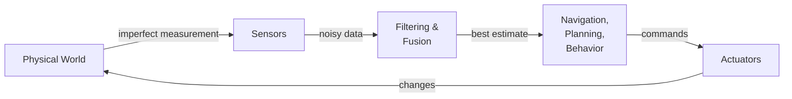

# Chapter 4: Sensors Overview

## 4.1 Why Sensors Are Everything

Robotics is, at its core, sensor-driven. A robot that cannot perceive its environment cannot respond to it — and a robot that cannot respond to its environment is not autonomous. Every behavior a robot exhibits, from avoiding an obstacle to delivering a package, begins with sensor data. Understanding sensors — what they measure, how they fail, and how to work with their data — is therefore fundamental to everything else in this book.

Sensors are imperfect. This is not a minor caveat; it is a central fact of robotics that shapes every algorithm and system design in the field. A LIDAR scan contains invalid readings. Wheel encoders slip. Cameras wash out in bright sunlight. An IMU drifts over time. The gap between what a sensor reports and what is actually true in the world is constant, and every layer of software above the sensor must account for it. The robot does not know the true state of the world — it only has a probabilistic estimate based on imperfect measurements.



This chapter introduces the sensors you will work with throughout the book. Later chapters go deep on each one. Here the goal is to understand what each sensor is for, what it produces, and what its limitations are.

## 4.2 LIDAR

LIDAR (Light Detection And Ranging) is the primary sensor for obstacle detection and mapping in indoor mobile robots. A rotating laser fires pulses continuously around a 360° arc. Each pulse travels until it hits a surface and returns to the sensor. The sensor measures the round-trip travel time and, knowing the speed of light, computes the distance to that surface. Do this thousands of times per second across all angles and you have a complete 2D map of the robot's immediate surroundings.

The result of one full rotation is called a **scan**. A scan is an array of distance values, one per angle increment around the robot. On the YDLIDAR X4 (the sensor used in the TurtleBot3 Burger), the scan covers 360° with several hundred readings per rotation at roughly 5–10 rotations per second. In ROS, each scan is published as a `sensor_msgs/LaserScan` message on the `/scan` topic.

The key field in a `LaserScan` message is `ranges` — the array of distance values. Each element `ranges[i]` is the distance in meters to the nearest obstacle at the bearing corresponding to index `i`. The mapping from index to angle is given by `angle_min + i * angle_increment`.

```python
# How to compute bearing for each range reading
import math
angle = msg.angle_min + i * msg.angle_increment
distance = msg.ranges[i]
# Convert to Cartesian (in robot's local frame):
x = distance * math.cos(angle)
y = distance * math.sin(angle)
```

LIDAR data is reliable, fast, and relatively simple to process, which is why it is the backbone of most indoor navigation systems. But it has one important geometric limitation: a 2D LIDAR operates in a single horizontal plane. It is completely blind to anything above or below that plane. A chair leg is visible; the seat overhanging the robot is not. A person's feet are visible; their legs above the sensor are not. This limitation must be kept in mind whenever you design robot behavior around LIDAR data.

3D LIDAR sensors (which produce point clouds rather than flat scans) remove this limitation, but they are substantially more expensive. For most coursework and many real deployments, 2D LIDAR is sufficient.

## 4.3 Visual Cameras

A camera captures a color image — a two-dimensional array of pixels, where each pixel carries red, green, and blue intensity values. In software, this is simply a 3D array of shape `(height, width, 3)`. The TurtleBot3 Waffle Pi includes a Raspberry Pi Camera Module (standard RGB); the Burger does not include a camera. Images are published on `/camera/rgb/image_raw` as `sensor_msgs/Image` messages.

The processing library for camera images in robotics is OpenCV (`cv2` in Python). OpenCV provides an extensive toolkit: color space conversion, thresholding, edge detection, contour finding, template matching, feature detection, and much more. [Chapter 6](../ch06_computer_vision/) covers the subset of OpenCV that is most useful for robot control.

One practical concern with cameras is data volume. A 640×480 image at 30 frames per second generates roughly 27 million pixel values per second. Over a WiFi link, this saturates bandwidth quickly. ROS addresses this with compressed image topics — `/camera/rgb/image_raw/compressed` publishes JPEG-compressed frames, and `/camera/rgb/image_raw/theora` publishes a compressed video stream. When working with a robot over wireless, always use compressed topics for transmission and decompress locally for processing.

## 4.4 Depth Cameras

A depth camera augments each pixel with a distance measurement, giving `{r, g, b, d}` per pixel. The Intel RealSense D435 and the Orbbec Astra are common examples. Depth cameras are useful when you need both visual identification of an object and its 3D location — for example, when a robot arm needs to reach for a detected object, or when you want to classify obstacles by shape rather than just location.

The TurtleBot3 base platforms (both Burger and Waffle Pi) do not include a depth camera as standard equipment. Adding one is straightforward — the RealSense and Astra both have ROS drivers that publish depth and color data on standard topics. Be aware that depth cameras are significantly more computationally expensive than 2D LIDAR and require a more powerful compute platform to process in real time.

## 4.5 Wheel Encoders and Odometry

Wheel encoders are sensors integrated into the drive motors that count how far each wheel has rotated. As the wheel turns, the encoder generates discrete pulses — typically hundreds per full rotation. Counting these pulses and knowing the wheel's circumference gives the distance the wheel has traveled. From the distance each wheel has traveled, differential-drive kinematics computes how far the robot has moved and in what direction. This accumulated position estimate is called **odometry**.

Odometry is published on the `/odom` topic as `nav_msgs/Odometry` messages. Each message contains the robot's estimated pose (position and orientation) and velocity. The pose is expressed in a coordinate frame called `odom`, which is anchored at the robot's starting position.

The fundamental problem with odometry is error accumulation. Wheels slip on smooth floors. Slight asymmetries in the motors cause the robot to drift. Bumps in the floor introduce rotational errors. Each individual error is small, but they compound over time: a robot relying on odometry alone will gradually lose track of where it is. Over a short distance (a few meters), odometry is reliable enough to use directly. Over longer distances, it must be corrected using external references such as LIDAR-based localization (Chapter 17) or fiducial markers.

```python
# Subscribing to odometry in ROS 2
import rclpy
from rclpy.node import Node
from nav_msgs.msg import Odometry

class OdomReader(Node):
    def __init__(self):
        super().__init__('odom_reader')
        self.create_subscription(Odometry, '/odom', self.odom_callback, 10)

    def odom_callback(self, msg):
        x = msg.pose.pose.position.x
        y = msg.pose.pose.position.y
        # Orientation is a quaternion — see Chapter 12 for conversion to heading angle
        qz = msg.pose.pose.orientation.z
        qw = msg.pose.pose.orientation.w
```

## 4.6 IMU (Inertial Measurement Unit)

An IMU measures forces and rotation rates using solid-state sensors. A three-axis accelerometer measures linear acceleration along each spatial axis. A three-axis gyroscope measures angular velocity around each axis. A three-axis magnetometer measures the local magnetic field, which (in outdoor or magnetically clean environments) gives an absolute heading reference.

Together, nine measurements give a rich picture of the robot's instantaneous motion. The IMU is particularly useful for measuring angular velocity: it can tell you how fast the robot is rotating with much lower latency than wheel encoders, which makes it valuable for fast, responsive control.

The TurtleBot3's OpenCR board includes an MPU9250 9-axis IMU. Its data is published on `/imu` as `sensor_msgs/Imu` messages. The IMU is typically used in combination with odometry — the two are fused together using a filter (extended Kalman filter or similar) to produce a pose estimate that is better than either sensor alone.

One important limitation: gyroscopes drift. Even a high-quality MEMS gyroscope accumulates a small rotational error every second. Over minutes, this drift becomes significant. In practice, gyroscope data must be regularly corrected against an independent reference (the magnetometer, or LIDAR-based localization) to remain useful for long-duration operation.

## 4.7 Other Sensors

Beyond the primary sensors above, robots use a variety of specialized sensors depending on the application.

**Touch and bump sensors** detect physical contact. They are simple and reliable — binary outputs that tell the robot it has hit something. The Roomba's bump sensor triggers a reactive escape behavior that is the entire basis of its navigation. On research platforms, bump sensors serve as a last-resort safety layer when other sensors fail to detect an obstacle in time.

**Cliff sensors** use downward-pointing infrared emitters and detectors to detect the absence of floor beneath the robot. When the robot reaches the edge of a table or the top of a staircase, the reflected infrared signal disappears and the robot stops. This is standard on domestic robots and useful on any platform that operates near elevation changes.

**GPS** provides absolute position outdoors with an accuracy of roughly 1–5 meters for consumer-grade receivers. It is unavailable indoors and unreliable near tall buildings where satellite signals are obstructed. For outdoor robots, GPS provides a global reference that can correct the accumulated drift of odometry. For indoor robots, it is not useful.

**Ultrasonic sensors** emit sound pulses and measure the echo return time, similar in principle to LIDAR but using sound instead of light. They are inexpensive and simple, but have lower angular resolution, shorter range, and more noise than LIDAR. They are common on low-cost platforms and as backup proximity sensors.

## 4.8 Sensor Fusion

No single sensor is sufficient. Each sensor has blind spots, failure modes, and domains where its data becomes unreliable. The solution is sensor fusion: combining data from multiple sensors to produce a state estimate that is more accurate and more robust than any individual sensor could provide.

The simplest fusion combines wheel odometry with IMU data. Odometry gives position but drifts during turns. The IMU gives accurate angular velocity but drifts over time. Combined with a complementary filter or an extended Kalman filter, the two produce a pose estimate better than either alone.

The most powerful fusion for indoor mobile robots combines odometry with LIDAR. Odometry provides a short-term position estimate; LIDAR matches the current scan against a map to correct accumulated drift. This is the basis of SLAM (Simultaneous Localization and Mapping), which is covered in Chapter 17.

The key insight is that the robot never knows exactly where it is or exactly what the world looks like. It maintains a **probability distribution** over possible states — a belief about where it might be — and updates that belief as new sensor data arrives. The algorithms in Chapters 17–19 formalize this probabilistic view.

## 4.9 Working with Sensor Data in ROS

Every sensor in a ROS system publishes its data on a topic with a standard message type. This uniformity is one of ROS's great strengths: a navigation algorithm written for the TurtleBot3's LIDAR will work with any other 2D LIDAR that publishes standard `LaserScan` messages.

The key sensor topics on the TurtleBot3 are:

| Topic | Message Type | Sensor | Rate |
|---|---|---|---|
| `/scan` | `sensor_msgs/LaserScan` | YDLIDAR X4 | 5–10 Hz |
| `/odom` | `nav_msgs/Odometry` | Wheel encoders | 30 Hz |
| `/imu` | `sensor_msgs/Imu` | MPU9250 | 30 Hz |
| `/camera/rgb/image_raw` | `sensor_msgs/Image` | Pi Camera (Waffle only) | 30 fps |

Two command-line tools are indispensable when working with sensor data. `ros2 topic echo /scan` prints scan messages to the terminal in real time — useful for verifying that the sensor is publishing and that values are in a reasonable range. `ros2 topic hz /scan` measures the actual publish rate — useful for detecting sensor failures or processing bottlenecks.

For visual inspection, **RViz** is the primary tool. It can display LIDAR scans as point clouds, render the robot model in 3D, show the occupancy grid map, and overlay the robot's estimated trajectory — all in real time. Getting comfortable with RViz is a high-leverage investment: it will be your primary window into what the robot perceives throughout this book.

---

*Previous: [Chapter 3: Robot Software Architecture](../ch03_software_architecture/)*
*Next: [Chapter 5: Working with LIDAR](../ch05_lidar/)*
