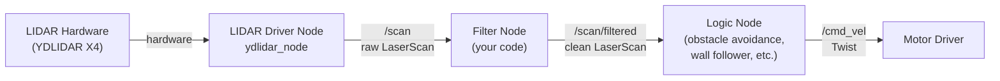

# Chapter 5: Working with LIDAR

LIDAR is the workhorse sensor of indoor mobile robotics. It is fast, reliable, and produces data that is relatively straightforward to process compared to camera images. Almost every meaningful behavior a TurtleBot3 can perform — obstacle avoidance, wall following, mapping, localization — depends on LIDAR data. This chapter teaches you how to work with it in practice: how to subscribe to scan data, how to interpret it correctly, how to filter out invalid readings, and how to structure your code so the rest of your logic stays clean.

## 5.1 The LaserScan Message

LIDAR data arrives in ROS 2 as `sensor_msgs/LaserScan` messages on the `/scan` topic. The full field specification is in the [sensor_msgs/LaserScan API reference](https://docs.ros2.org/jazzy/api/sensor_msgs/msg/LaserScan.html). To use it, subscribe within a Node class:

```python
from sensor_msgs.msg import LaserScan
# Inside __init__:
self.create_subscription(LaserScan, '/scan', self.scan_callback, 10)
```

The `LaserScan` message has several fields, but the ones you will use constantly are:

```
ranges[]        — array of float32 distance values, one per angle increment (meters)
angle_min       — start angle of the scan (radians)
angle_max       — end angle of the scan (radians)
angle_increment — angular distance between measurements (radians)
range_min       — minimum valid range (anything below is invalid)
range_max       — maximum valid range (anything above is invalid)
```

The `ranges` array is the core of the message. Each element is a distance in meters. The angle corresponding to element `i` is:

```
angle_i = angle_min + i * angle_increment
```

One rule to internalize immediately: **do not assume `ranges` has exactly 360 elements.** Different LIDAR models, different firmware versions, and simulated vs. physical sensors all produce different array lengths. Always use `len(msg.ranges)` to find the actual count. Hardcoding 360 is a common mistake that produces silent, wrong behavior.

```python
def scan_callback(msg):
    n = len(msg.ranges)  # actual number of readings — don't assume 360
    mid = n // 2         # index pointing directly ahead (angle ~0)
```

## 5.2 Understanding the Data

The `ranges` array is a snapshot of the robot's environment at one moment in time. Index 0 corresponds to `angle_min`, and the last index corresponds to `angle_max`. For a 360° LIDAR, `angle_min` is typically `-π` (or `0`) and `angle_max` is `π` (or `2π`).

Whether angles increase clockwise or counterclockwise depends on the specific LIDAR model and how the driver is configured. For the YDLIDAR X4 on the TurtleBot3 with the standard ROS driver, angles increase counterclockwise when viewed from above — the same convention as standard mathematical angles. Index 0 points forward (ahead of the robot).

There is a critical difference between the simulated LIDAR in Gazebo and the physical YDLIDAR X4 that will burn you if you do not know it:

- **Gazebo simulation**: no obstacle in range → `ranges[i] = float('inf')`
- **Physical YDLIDAR X4**: no obstacle in range → `ranges[i] = 0.0`

A value of `0.0` on the physical robot does *not* mean an obstacle is zero meters away. It means "no valid reading." Code that works perfectly in simulation (checking for obstacles below a threshold) can behave dangerously on hardware if it misinterprets zeros as nearby obstacles. Always filter before acting.

## 5.3 Filtering Invalid Data

LIDAR data is noisy. Individual readings can be wrong for many reasons: a ray reflects off a shiny surface at an unexpected angle, the beam grazes an edge at a shallow angle, or the target is outside the sensor's valid range. Before your algorithm sees the data, invalid readings need to be removed.

The definition of "invalid" combines several criteria:
- The reading is `inf` (Gazebo no-return)
- The reading is `0.0` or very near zero (physical robot no-return, or obstacle touching sensor)
- The reading is below `range_min` (too close for reliable measurement)
- The reading is above `range_max` (too far for reliable measurement)

A clean filter function:

```python
def valid_range(r, range_min, range_max):
    return (not math.isnan(r) and
            not math.isinf(r) and
            range_min <= r <= range_max)

def filter_scan(msg):
    return [r if valid_range(r, msg.range_min, msg.range_max)
            else float('inf')
            for r in msg.ranges]
```

This replaces invalid values with `inf` — a safe sentinel that will not accidentally trigger obstacle-detection thresholds. Code downstream can then safely compute `min()` on any sector without special-casing invalid values (since `inf` will never win a minimum over valid readings, unless the sector is entirely invalid — which is also useful information).

## 5.4 Working with Sectors

Raw `ranges` indices are not intuitive to work with directly. The standard approach is to divide the scan into named angular sectors — front, left, right, rear — and work with those sectors as units.

The sector boundaries depend on the actual scan resolution. For a scan with `n` readings covering 360°, one reading covers `360/n` degrees. A sector covering ±30° around forward contains `int(30 / (360/n))` readings on each side. Here is a general-purpose sector extraction:

```python
def get_sector(ranges, center_deg, half_width_deg):
    """Extract a sector centered at center_deg with ±half_width_deg."""
    n = len(ranges)
    deg_per_idx = 360.0 / n

    def idx(deg):
        return int(deg / deg_per_idx) % n

    start = idx(center_deg - half_width_deg)
    end   = idx(center_deg + half_width_deg)

    if start <= end:
        return list(ranges[start:end+1])
    else:  # wraps around 0
        return list(ranges[start:]) + list(ranges[:end+1])
```

For illustrative examples in this chapter, we use a 360-reading scan (which is representative of the YDLIDAR X4 at typical resolution). Named sectors:

```python
# Assumes n=360 for illustration — use get_sector() for production code
front = list(ranges[0:30])  + list(ranges[330:360])  # ±30° ahead
left  = list(ranges[60:120])                          # left side
right = list(ranges[240:300])                         # right side
rear  = list(ranges[150:210])                         # behind
```

To find the closest obstacle in a sector, take the minimum of the filtered values:

```python
front_filtered = [r for r in front if r != float('inf')]
if front_filtered:
    closest_ahead = min(front_filtered)
```

## 5.5 The Filter Node Pattern

As your robot code grows, you will find that every node that uses LIDAR data needs to apply the same filtering logic. Duplicating that logic across nodes is a maintenance problem. The standard solution is a dedicated **filter node**.

The filter node sits between the LIDAR driver and all logic nodes. It subscribes to `/scan` (raw LIDAR data), applies filtering and any other preprocessing, and publishes to `/scan/filtered`. Every other node subscribes to `/scan/filtered` and never sees raw data.



This pattern has several benefits. The filtering logic lives in one place and is tested once. Logic nodes are simpler because they can assume valid data. Switching from physical hardware to simulation requires changing only the filter node (to handle `0` vs `inf` differently), not every logic node.

A minimal filter node:

```python
#!/usr/bin/env python3
import math
import rclpy
from rclpy.node import Node
from sensor_msgs.msg import LaserScan

class LidarFilter(Node):
    def __init__(self):
        super().__init__('lidar_filter')
        self.pub = self.create_publisher(LaserScan, '/scan/filtered', 1)
        self.create_subscription(LaserScan, '/scan', self.scan_callback, 1)

    def scan_callback(self, msg):
        filtered = list(msg.ranges)
        for i, r in enumerate(filtered):
            if (math.isnan(r) or math.isinf(r) or
                    r < msg.range_min or r > msg.range_max):
                filtered[i] = float('inf')
        out = LaserScan()
        out.header = msg.header
        out.angle_min = msg.angle_min
        out.angle_max = msg.angle_max
        out.angle_increment = msg.angle_increment
        out.time_increment = msg.time_increment
        out.scan_time = msg.scan_time
        out.range_min = msg.range_min
        out.range_max = msg.range_max
        out.ranges = filtered
        self.pub.publish(out)

def main():
    rclpy.init()
    rclpy.spin(LidarFilter())
    rclpy.shutdown()

if __name__ == '__main__':
    main()
```

## 5.6 Semantic Scan Topics

An extension of the filter node pattern is the **semantic scan node**. Instead of publishing a cleaned-up `LaserScan`, it publishes a custom message with higher-level fields derived from the scan — for example, the minimum distance in each named sector, or boolean flags indicating whether each direction is clear.

This is not standard ROS practice for general-purpose components, but it is very useful for application-specific code. A wall-follower node that needs only `right_wall_distance` is simpler and easier to test when that single number is published as a topic rather than re-derived from the full `ranges` array inside the node.

## 5.7 Practical Example: Obstacle Avoidance

To make these ideas concrete, here is a complete node that drives the robot forward and stops when an obstacle comes within 0.5 meters ahead.

```python
#!/usr/bin/env python3
import math
import rclpy
from rclpy.node import Node
from sensor_msgs.msg import LaserScan
from geometry_msgs.msg import Twist

STOP_DISTANCE = 0.5   # meters
FORWARD_SPEED = 0.15  # m/s

class ObstacleStop(Node):
    def __init__(self):
        super().__init__('obstacle_stop')
        self.cmd_pub = self.create_publisher(Twist, '/cmd_vel', 1)
        self.create_subscription(LaserScan, '/scan', self.scan_callback, 1)

    def scan_callback(self, msg):
        n = len(msg.ranges)

        # Extract ±20° front sector
        width = int(20.0 / (360.0 / n))
        front_indices = list(range(0, width)) + list(range(n - width, n))
        front_ranges = [msg.ranges[i] for i in front_indices]

        # Filter invalid readings
        valid = [r for r in front_ranges
                 if not math.isnan(r) and not math.isinf(r)
                 and msg.range_min <= r <= msg.range_max]

        # Decide
        twist = Twist()
        if valid and min(valid) < STOP_DISTANCE:
            twist.linear.x = 0.0
            twist.angular.z = 0.0
        else:
            twist.linear.x = FORWARD_SPEED
            twist.angular.z = 0.0

        self.cmd_pub.publish(twist)

def main():
    rclpy.init()
    rclpy.spin(ObstacleStop())
    rclpy.shutdown()

if __name__ == '__main__':
    main()
```

This is a purely reactive controller: it reads sensor data and immediately produces a motor command. No state, no memory, no map. Reactive controllers are simple and fast, but they cannot handle complex environments. More sophisticated behaviors — wall following, navigation, exploration — build on this pattern while adding state and more sophisticated decision logic. For a thorough treatment of wall-following specifically, Bayer's [Wall Following for Autonomous Navigation](https://sunfest.seas.upenn.edu/wp-content/uploads/2018/07/12-bayer.pdf) is a practical reference that maps directly to TurtleBot-scale robots.

## 5.8 Visualizing LIDAR Data in RViz

RViz is an indispensable tool for debugging LIDAR-based code. To display the scan:

1. Launch RViz: `rviz2`
2. Set the Fixed Frame to `base_link` (or `odom`)
3. Click Add → By topic → `/scan` → LaserScan
4. The scan appears as a ring of colored dots around the robot model

RViz 2 shows the scan in real time. Move the robot and watch the dots respond. Place an obstacle near the robot and verify it appears in the expected angular position. This visual feedback is far faster for debugging than reading raw numbers from `ros2 topic echo`.

For offline analysis, record scan messages to a bag file and replay or inspect offline:

```bash
ros2 bag record /scan                     # record to bag
ros2 bag info <bag_dir>                   # inspect contents
ros2 topic echo /scan --once              # print one message
```

To capture scan data as CSV, use a short Python script that subscribes to `/scan` and writes `ranges` to a file — the `ros2 topic echo` command can also export in YAML format for offline inspection.

---

*Previous: [Chapter 4: Sensors Overview](../ch04_sensors_overview/)*
*Next: [Chapter 6: Computer Vision](../ch06_computer_vision/)*
