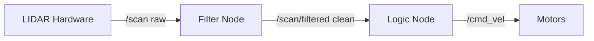

# Chapter 5 Outline: Working with LIDAR

## 5.1 The LaserScan Message

- ROS message type: `sensor_msgs/LaserScan`
- Key fields:
  - `ranges[]` — array of distance values, one per angle increment
  - `angle_min`, `angle_max` — angular coverage in radians
  - `angle_increment` — radians between consecutive readings
  - `range_min`, `range_max` — valid distance bounds
- Do not assume 360 values — use `len(msg.ranges)` to get actual count
- Subscribe to `/scan` topic to receive scans

## 5.2 Understanding the Data

- Each index in `ranges[]` corresponds to a bearing angle
- Index 0 = `angle_min`; last index = `angle_max`
- Clockwise vs. counter-clockwise depends on hardware (check your LIDAR spec)
- Distance units: almost always meters
- Simulated LIDAR (Gazebo) returns `inf` for no obstacle; real YDLIDAR X4 returns `0`

## 5.3 Invalid Data and Filtering

- Sensors generate noisy data — filter before use
- Invalid readings:
  - `inf` (Gazebo) or `0` (physical robot) when no obstacle in range
  - Values below `range_min` or above `range_max`
- Filter pattern:

```python
def filter_ranges(ranges, range_min, range_max):
    return [r if range_min < r < range_max else float('inf')
            for r in ranges]
```

- Always filter before computing min, argmin, or sector averages

## 5.4 Working with Sectors

- Common pattern: divide scan into named sectors (front, left, right, rear)
- Example for 360-reading scan:

```python
front = msg.ranges[0:30] + msg.ranges[330:360]   # ±30° of forward
left  = msg.ranges[60:120]
right = msg.ranges[240:300]
rear  = msg.ranges[150:210]
```

- Use `min()` on a sector to get closest obstacle in that direction
- Use `numpy` for efficient array operations on large scans

## 5.5 The Filter Node Pattern

- Recommended architecture: dedicated filter node between raw LIDAR and logic nodes
- Filter node: subscribes to `/scan`, publishes cleaned data to `/scan/filtered`
- Logic node: subscribes to `/scan/filtered`, never sees raw invalid data
- Benefits: separation of concerns, reusable filter, easier testing



## 5.6 Semantic Scan Topics

- More advanced pattern: filter node also computes derived values
- Publish `/scan/semantic` with fields like `front_clear`, `left_dist`, `right_dist`
- Logic node works with high-level concepts, not raw arrays
- Makes the logic node simpler and more readable

## 5.7 Practical Example: Obstacle Detection

- Goal: stop the robot when an obstacle is within 0.5m directly ahead
- Steps:
  1. Subscribe to `/scan`
  2. Filter invalid readings
  3. Extract front sector (±20°)
  4. Compute minimum distance in front sector
  5. Publish `Twist` with zero velocity if min < 0.5m

```python
def scan_callback(msg):
    front = list(msg.ranges[0:20]) + list(msg.ranges[340:360])
    valid = [r for r in front if msg.range_min < r < msg.range_max]
    if valid and min(valid) < 0.5:
        stop_robot()
```

## 5.8 Visualizing LIDAR Data in RViz

- RViz displays LIDAR scans as point clouds in real time
- Add `LaserScan` display, set topic to `/scan`
- Useful for verifying sensor is working and data looks reasonable
- Dump raw scan to CSV for offline analysis:

```bash
rostopic echo /scan -w 4 -p -n 50 > ~/scan_data.csv
```
