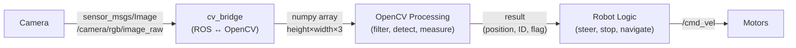

# Chapter 6: Computer Vision

LIDAR tells a robot where obstacles are. A camera tells it what they are. Color, texture, shape, text, faces, printed markers — none of these are accessible through a LIDAR scan, but all of them are visible in a camera image. Computer vision is the field of algorithms that extract meaning from pixels, and in robotics it connects the rich information in images to actionable decisions.

This chapter focuses on practical computer vision for robot control: getting images from ROS, processing them with OpenCV, and using the results to steer a robot. The examples build toward a complete line-following robot — a classic benchmark that exercises the full perception-to-action pipeline.

## 6.1 What Vision Adds

A LIDAR scan tells you there is an object at bearing 45°, distance 1.2 meters. A camera can tell you it is a red ball, a door, a person, or a stop sign. This richer semantic content enables behaviors that LIDAR alone cannot support: following a specific colored path, docking to a visual marker, recognizing a goal location, or detecting when a person is nearby.

The tradeoff is complexity. Camera images contain orders of magnitude more data than LIDAR scans and require more computation to process. Vision algorithms are also sensitive to lighting: an algorithm calibrated under fluorescent lab lights may fail in sunlight or shadow. These are not reasons to avoid vision — they are constraints to design around.



## 6.2 Camera Types

Several types of cameras appear in robotics, each suited to different tasks.

A **standard RGB camera** captures color images — `{r, g, b}` values per pixel. It is the simplest and cheapest option, suitable for color detection, line following, and fiducial recognition. The TurtleBot3 Waffle Pi includes a Raspberry Pi Camera Module V2, which is a standard RGB camera.

A **depth camera** adds a distance measurement per pixel: `{r, g, b, d}`. Depth cameras like the Intel RealSense D435 or Orbbec Astra are useful when you need both visual identification and 3D position — for example, a robot arm reaching for a detected object. They are significantly more expensive and computationally demanding than 2D cameras.

A **stereo camera** uses two lenses separated by a known distance. The disparity between corresponding pixels in the two images encodes depth, similar to human binocular vision. Stereo cameras work without active illumination (unlike many depth cameras) and function outdoors.

A **fisheye or wide-angle camera** captures a wider field of view — up to 180° — at the cost of significant barrel distortion at the image edges. Useful for surveillance and navigation contexts where wide coverage matters.

For this chapter, we work with the standard RGB camera on the TurtleBot3 Waffle Pi.

## 6.3 Images in ROS

Camera images in ROS are published as `sensor_msgs/Image` messages. The primary topic is `/camera/rgb/image_raw`. This topic publishes raw, uncompressed images — each message contains the full pixel data for one frame.

Raw images are large. Over a WiFi link, publishing raw images saturates bandwidth and introduces lag. ROS provides two compressed alternatives:

- `/camera/rgb/image_raw/compressed` — JPEG or PNG compression; much smaller than raw, with slight quality loss
- `/camera/rgb/image_raw/theora` — Theora video codec; even smaller for video streams

For remote development (robot on WiFi, processing on laptop), always subscribe to a compressed topic and decompress locally. For onboard processing (algorithm running on the Raspberry Pi or Jetson), raw topics are fine.

To see what the camera sees:

```bash
ros2 run rqt_image_view rqt_image_view
```

This opens a GUI where you can select any image topic and see a live feed. It is the first thing to run when debugging camera-based code — verify the image looks right before spending time debugging the algorithm.

```bash
ros2 topic hz /camera/rgb/image_raw   # measure frame rate
ros2 topic info /camera/rgb/image_raw # show message type and publishers
```

## 6.4 OpenCV and cv_bridge

OpenCV (`cv2` in Python) is the standard library for computer vision processing. It operates on `numpy` arrays, not on ROS message objects. The bridge between the two worlds is the `cv_bridge` package, which converts `sensor_msgs/Image` messages to `numpy` arrays and back. The [cv_bridge ROS 2 documentation](https://docs.ros.org/en/jazzy/p/cv_bridge/) covers installation and the full API.

A minimal ROS 2 node that receives camera images and processes them:

```python
#!/usr/bin/env python3
import rclpy
from rclpy.node import Node
import cv2
import numpy as np
from sensor_msgs.msg import Image
from cv_bridge import CvBridge

class CameraProcessor(Node):
    def __init__(self):
        super().__init__('camera_processor')
        self.bridge = CvBridge()
        self.create_subscription(Image, '/camera/rgb/image_raw',
                                 self.image_callback, 10)

    def image_callback(self, msg):
        # Convert ROS Image message to OpenCV numpy array (BGR format)
        cv_image = self.bridge.imgmsg_to_cv2(msg, desired_encoding='bgr8')
        # cv_image.shape == (height, width, 3)

        # --- your OpenCV processing goes here ---

        # Display (optional, useful for debugging)
        cv2.imshow("Camera", cv_image)
        cv2.waitKey(1)

def main():
    rclpy.init()
    rclpy.spin(CameraProcessor())
    rclpy.shutdown()

if __name__ == '__main__':
    main()
```

Note the encoding: OpenCV uses BGR (blue-green-red) channel order, not RGB. When you index into `cv_image[y, x]`, you get `[blue, green, red]`. This matters when specifying colors — always use BGR order in OpenCV calls, not RGB.

## 6.5 Color Filtering

The most common first step in robot vision is isolating pixels of a specific color. LIDAR detects obstacles regardless of color; vision can select *which* obstacles or features to respond to based on color.

RGB color space is inconvenient for color filtering because a given color (say, "yellow") corresponds to many different `{r, g, b}` combinations depending on lighting. In bright light, yellow is a large value; in shadow, it is small. The *hue* (what color it is) and the *brightness* (how much light there is) are tangled together.

**HSV (Hue-Saturation-Value)** separates hue from brightness. Hue is a single number (0–179 in OpenCV) representing the color angle on the color wheel, independent of lighting. Saturation measures color purity. Value measures brightness. For color filtering, you set a hue range and accept a wide range of saturation and value — this gives you a filter that recognizes a color across a range of lighting conditions.

```python
# Convert BGR image to HSV
hsv = cv2.cvtColor(cv_image, cv2.COLOR_BGR2HSV)

# Define yellow range in HSV
# Hue: 20–40 (yellow on the 0–179 OpenCV hue scale)
# Saturation: wide range to accept various lighting
# Value: wide range to accept dim and bright
lower_yellow = np.array([20,  50,  50])
upper_yellow = np.array([40, 255, 255])

# Create binary mask: 255 where color matches, 0 elsewhere
mask = cv2.inRange(hsv, lower_yellow, upper_yellow)
```

The result is a binary image: white (255) pixels are yellow, black (0) pixels are not. You can visualize this mask with `cv2.imshow("mask", mask)`.

Color thresholds must always be tuned for the specific environment. The values above work under typical indoor fluorescent lighting; sunlight and incandescent lighting shift the hue significantly. When deploying a vision-based robot, always test under actual operating conditions and retune if needed.

## 6.6 Finding the Centroid

Once you have a binary mask, you often need to know *where* the matching pixels are — specifically, the center of mass, called the **centroid**. For a line-following robot, the centroid of the line tells you whether the line is to the left or right of center, which tells you how to steer.

OpenCV computes image moments — statistical summaries of pixel distributions — with `cv2.moments()`. The centroid follows from the first-order moments:

```python
M = cv2.moments(mask)

if M['m00'] > 0:  # m00 is the total white pixel area — check nonzero
    cx = int(M['m10'] / M['m00'])  # centroid x coordinate
    cy = int(M['m01'] / M['m00'])  # centroid y coordinate

    # Draw centroid for debugging
    cv2.circle(cv_image, (cx, cy), 10, (0, 0, 255), -1)
else:
    cx, cy = None, None  # no yellow pixels found
```

`cx` is the horizontal position of the centroid in the image (0 = left edge, image_width = right edge). If `cx` is less than `image_width / 2`, the yellow line is to the left of the robot's view. If it is greater, the line is to the right. This directly encodes the steering error.

## 6.7 Line Following

Line following brings together everything in this chapter: get an image, filter by color, find the centroid, and compute a steering command. It is a complete perception-to-action pipeline.

```mermaid
graph LR
    CAM["Camera<br/>/camera/rgb/image_raw"] -->|"Image"| CB["cv_bridge<br/>imgmsg_to_cv2"]
    CB -->|"BGR array"| HSV["Convert to HSV<br/>cv2.cvtColor"]
    HSV -->|"HSV array"| MASK["Color Mask<br/>cv2.inRange"]
    MASK -->|"binary image"| CROP["Crop to<br/>bottom strip"]
    CROP -->|"strip"| MOM["Moments →<br/>centroid cx"]
    MOM -->|"cx"| ERR["error =<br/>cx − width/2"]
    ERR -->|"error"| CTRL["P-controller<br/>angular_z = −Kp·error"]
    CTRL -->|"Twist"| MOTORS["/cmd_vel"]
```



The crop step (working only with the bottom strip of the image) focuses the centroid computation on the part of the image closest to the robot, where the line is most relevant for immediate steering.

Full implementation:

```python
#!/usr/bin/env python3
import rclpy
from rclpy.node import Node
import cv2
import numpy as np
from sensor_msgs.msg import Image
from geometry_msgs.msg import Twist
from cv_bridge import CvBridge

KP            = 1.0 / 320   # proportional gain (tune this)
FORWARD_SPEED = 0.15         # m/s

class LineFollower(Node):
    def __init__(self):
        super().__init__('line_follower')
        self.bridge = CvBridge()
        self.cmd_pub = self.create_publisher(Twist, '/cmd_vel', 1)
        self.create_subscription(Image, '/camera/rgb/image_raw',
                                 self.image_callback, 10)

    def image_callback(self, msg):
        cv_image = self.bridge.imgmsg_to_cv2(msg, desired_encoding='bgr8')
        h, w = cv_image.shape[:2]

        # Work only with the bottom 20% of the image
        strip = cv_image[int(0.8 * h):h, :]

        # Color filter: yellow in HSV
        hsv = cv2.cvtColor(strip, cv2.COLOR_BGR2HSV)
        mask = cv2.inRange(hsv,
                           np.array([20,  50,  50]),
                           np.array([40, 255, 255]))

        # Find centroid
        M = cv2.moments(mask)
        twist = Twist()

        if M['m00'] > 0:
            cx = int(M['m10'] / M['m00'])
            error = cx - w / 2          # positive = line is right of center
            twist.linear.x = FORWARD_SPEED
            twist.angular.z = -KP * error   # steer toward line
        else:
            # No line detected — stop
            twist.linear.x = 0.0
            twist.angular.z = 0.0

        self.cmd_pub.publish(twist)

def main():
    rclpy.init()
    rclpy.spin(LineFollower())
    rclpy.shutdown()

if __name__ == '__main__':
    main()
```

This is a **proportional controller** (P-controller): the steering correction is proportional to the error. When the line is far to the right, the robot turns sharply right. When the line is nearly centered, it turns gently. The gain `KP` controls how aggressively the robot reacts. Too high and it oscillates; too low and it drifts off before correcting. Chapter 14 covers PID control in detail — adding integral and derivative terms produces smoother, more robust line following.

## 6.8 Fiducial Markers

Color filtering works when the environment is controlled, but it is fragile: a yellow floor tile breaks a yellow-line follower, and changing lighting shifts the color thresholds. **Fiducial markers** are a more robust alternative for situations where you need to reliably identify specific locations or objects.

A fiducial is a printed pattern designed specifically for machine recognition. Each marker has a unique binary ID encoded in its pattern. A vision algorithm can detect the marker, decode its ID, and — because the marker's physical size is known — compute its precise 3D position and orientation relative to the camera.

The two most widely used fiducial systems in ROS robotics are:

**ArUco markers** — developed at the University of Córdoba, integrated into OpenCV. The `aruco_detect` ROS package detects ArUco markers and publishes their poses as `fiducial_msgs/FiducialTransformArray` messages.

**AprilTags** — developed at the University of Michigan, widely used in research robotics. The `apriltag_ros` package provides full ROS integration. Olson's original paper [AprilTag: A robust and flexible visual fiducial system](https://april.eecs.umich.edu/pdfs/olson2011tags.pdf) explains the encoding scheme and detection algorithm; it is worth reading to understand why AprilTags are more reliable than simpler QR-code-style markers under poor lighting and at oblique angles.

Both systems work in varied lighting, from multiple distances, and at moderate angles. They provide sub-centimeter position accuracy at close range. Typical uses in robot applications include: labeling goal locations the robot should navigate to, providing absolute position references to correct odometry drift, enabling visual docking, and coordinating multi-robot systems where robots need to recognize each other.

```bash
# Launch ArUco detection (ROS 2 — aruco_opencv or similar package)
ros2 launch aruco_opencv aruco_opencv.launch.py

# View detected fiducials
ros2 topic echo /fiducial_transforms
```

> **Note:** The ROS 1 `aruco_detect` package has ROS 2 equivalents including `aruco_opencv` and `ros2_aruco`. Check the current package availability for your ROS 2 distribution (Humble, Jazzy, etc.) before installing.

## 6.9 Practical Considerations

Several practical issues affect vision-based robot code in ways that are easy to underestimate.

**Bandwidth.** Raw image topics should only be used for local processing. Over WiFi, always subscribe to `/compressed` and use `CompressedImage` messages. The `cv_bridge` package handles compressed images as well as raw ones.

**Latency.** Each step in the vision pipeline adds delay: camera capture, serialization, network transmission, deserialization, processing, motor command publication. For a line-following robot moving at 0.15 m/s, even 200ms of total pipeline latency corresponds to 3cm of travel between sense and response. If the robot oscillates or overshoots, latency is often a contributor. Measure pipeline latency with `ros2 topic delay /camera/rgb/image_raw` and optimize the bottlenecks.

**Lighting.** Vision algorithms are sensitive to lighting in ways that no amount of careful code can fully compensate for. When your robot works in the lab but fails in the hallway, lighting is usually the reason. Test under actual operating conditions. Build tuning tools (sliders for HSV thresholds, live mask display) so you can adjust quickly.

**Resolution.** Higher resolution gives more detail but more computation. For line following and color detection, 320×240 is often sufficient and runs comfortably on a Raspberry Pi. For fiducial detection at distance, higher resolution helps. Profile your pipeline before committing to a resolution.

**Debugging.** The most important tool is `cv2.imshow()` — display the image, the HSV conversion, the mask, and any intermediate results at every stage. When an algorithm fails, visual inspection of intermediate images reveals the problem far faster than reading numbers.

---

*Previous: [Chapter 5: Working with LIDAR](../ch05_lidar/)*
