# Introduction

## I.1 What This Book Is

This book is a practical introduction to autonomous robotics for students who already know how to program. It grew out of a university course — Autonomous Robotics (COSI 119a) — taught at Brandeis University over several years. The course was designed around a single conviction: the best way to learn robotics is to build robots, run them, watch them fail, fix them, and run them again.

This book follows that same conviction. Theory appears when it is needed to understand something real. Code appears when it is time to make something work. Every major concept connects to software you can write and behavior you can observe on a physical or simulated robot. There are no purely theoretical chapters; every section leads somewhere you can touch.

## I.2 Why Robotics Now

Robots are no longer confined to factory floors and research labs. They vacuum floors, deliver packages, assist surgeons, drive on public roads, tend crops, and care for the elderly. The scope of what counts as a robot has expanded dramatically, and that expansion is accelerating.

For a computer scientist, this creates an unusual opportunity. Robotics draws on nearly every subfield of computing simultaneously. A robot is a distributed system — many processes running concurrently across multiple machines. It has real-time constraints that operating systems must accommodate. It uses algorithms for path planning, search, and probabilistic inference. It interprets camera and LIDAR data using computer vision. It makes decisions using AI techniques. It controls actuators through feedback loops that come from control theory. And it does all of this in software that is large, concurrent, and must not fail when the hardware misbehaves.

No other single domain puts all of these together in a context where the result moves around in the physical world. That is what makes robotics both difficult and deeply rewarding as a field to study.

The tools have also matured considerably. The Robot Operating System (ROS) is now the standard framework for robot software development worldwide, in both research and industry. Affordable platforms like the TurtleBot3 put real hardware within reach of a student budget. Cloud-based development environments mean you no longer need a powerful personal computer. The foundations are stable, the tools are open-source, and the problems are genuinely hard and genuinely important.

## I.3 What You Will Learn

This book takes you from first principles to a working autonomous robot. Along the way, five major capabilities build on each other.

The first is understanding the **sense-decide-act loop**. Every robot — from a Roomba to a self-driving car — operates by continuously sensing its environment, deciding what to do, and acting. This loop is the organizing principle of the book, and understanding it deeply will help you reason about any robot system you encounter.

The second is **ROS**. The Robot Operating System is the framework used throughout this book. You will learn how to structure robot software as a graph of communicating processes, how to use the standard message types and command-line tools, and how to integrate hardware drivers, algorithms, and interfaces into a working system. ROS is the shared language of the robotics community, and fluency in it opens up an enormous ecosystem of existing software.

The third is **navigation** — one of the hardest and most important problems in mobile robotics. You will learn how robots build maps, localize themselves within those maps, plan paths around obstacles, and execute those paths reliably. These capabilities, taken together, are what let a robot operate usefully in the real world.

The fourth is **perception**: working with LIDAR scan data and camera images. You will learn to filter noise, detect features, and use sensor information to make decisions about the environment.

The fifth is **behavior** — how to structure decision-making so that a collection of sensor-processing and motor-control routines becomes a robot that does something useful and coherent. Finite state machines and behavior trees are the tools for this, and you will use both.

Running through all of these is practical engineering. Robots fail in ways software-only systems do not. Hardware misbehaves. Sensors produce garbage data. Timing matters. You will learn to use simulation to develop and test before touching hardware, to debug distributed systems, and to build software that degrades gracefully when things go wrong.

## I.4 What You Need

This book assumes you can write Python programs of moderate complexity — functions, classes, loops, conditionals. You do not need to be an expert programmer, but you need to be comfortable reading and writing code and reasoning about what it does.

You will also need basic familiarity with Linux and the command line. ROS runs on Linux and is operated primarily through a terminal. You will use the shell constantly — to launch programs, inspect running processes, examine message streams, and manage files. Basic comfort is all that is required at the start; deeper skills accumulate naturally as you use them.

No hardware or electronics knowledge is required. You do not need to know how motors work, how to solder, or how to read a circuit diagram. ROS provides a hardware abstraction layer that lets you write robot software without understanding the electronics underneath. That said, Chapter 2 gives you enough intuition about the physical layer to debug problems when the hardware behaves unexpectedly.

Some math appears in the localization and Kalman filter chapters — specifically linear algebra and basic probability. Both are introduced from the ground up. Prior exposure makes the material easier, but it is not a prerequisite.

## I.5 The Platform: TurtleBot3

The robot used throughout this book is the TurtleBot3 from Robotis — a small, affordable differential-drive robot that runs ROS on a Raspberry Pi. It costs approximately $500, is assembled from a kit, and is one of the most widely used educational and research robots in the world. Every code example in this book was written with the TurtleBot3 in mind, and every concept can be demonstrated on it.

Simulation is equally important. Gazebo, the standard ROS simulator, lets you develop and test algorithms before putting them on physical hardware. Many students do most of their coursework in simulation and use physical robots only for final testing. Both workflows are legitimate, and both are covered throughout.

The TurtleBot3 is not the only robot that can run this software. The ROS concepts, algorithms, and code patterns in this book apply to any differential-drive ground robot. If you are working with a different platform, the hardware chapters will explain what you need to know to adapt.

## I.6 How This Book Is Organized

The book is divided into eight parts, each built around one central question about autonomous robots.

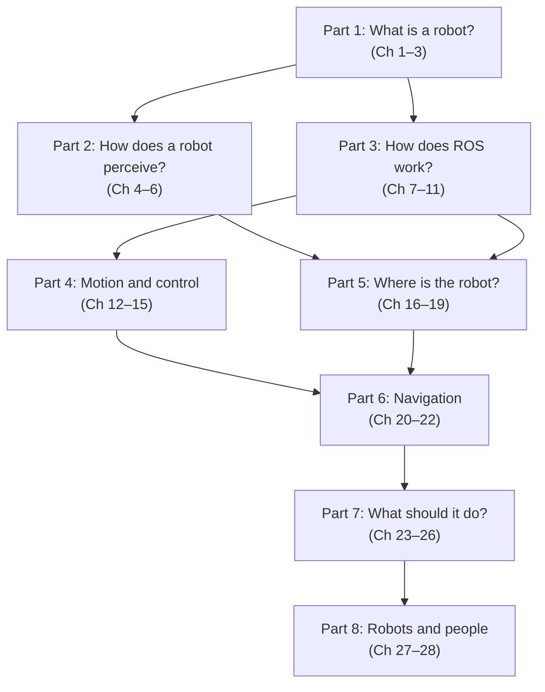

Parts 1 and 3 — the foundations and ROS — should be read first, as everything else builds on them. After that, Parts 2, 4, and 5 can be approached in any order depending on what you are working on. Parts 6, 7, and 8 assume all of the earlier material.

Each chapter draws directly on course materials developed and refined over multiple semesters of teaching. The homework assignments and project ideas at the end of the book are the same ones students have worked through; they are designed to be challenging but achievable, and to produce robots that actually do something interesting.

## I.7 A Note on ROS

Despite its name, the Robot Operating System is not an operating system. It runs on top of Linux. A more accurate description is that ROS is a distributed process management and communication framework for robot software.

In practice this means: a robot's software is decomposed into many small programs called **nodes**, each responsible for one function — reading a sensor, estimating position, planning a path, commanding motors. Nodes communicate by publishing typed messages to named **topics**, and any node can subscribe to any topic. ROS handles all the networking, serialization, and process coordination. You write nodes that do specific jobs; ROS connects them into a working system.

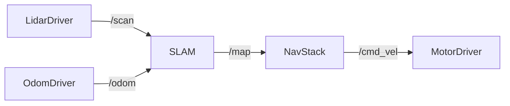

This architecture has an important consequence: robot software becomes modular. A LIDAR driver written for one robot works on any robot that uses the same LIDAR and publishes on the same topic. A localization algorithm written for a TurtleBot3 works on any differential-drive robot that publishes standard odometry and scan messages. Reuse is the norm rather than the exception.

This book uses **ROS 1** (specifically ROS Noetic, released 2020, supported through 2025). ROS 2 is the current generation and improves on ROS 1 in several areas — better real-time support, improved security, more robust communication under unreliable networks. The architecture and concepts are largely the same between the two versions. Learning ROS 1 thoroughly is the most efficient path to understanding ROS 2, and the code patterns transfer directly.

---

*Next: [Chapter 1: Defining Robots](ch01_defining_robots.md)*
---
title: "Chapter 1: Defining Robots"
date: 2026-04-26
author: Claude Sonnet 4.6
---

# Chapter 1: Defining Robots

## 1.1 Why Defining "Robot" Is Hard

Ask ten people what a robot is and you will get ten different answers. Some picture a humanoid machine walking on two legs. Others think of a robotic arm on a factory floor, a self-driving car, or a Roomba bumping quietly around the living room. They are all right — and that is the point.

The word "robot" comes from the Czech *robota*, meaning forced labor or drudgery, coined by playwright Karel Čapek in 1920. In the century since, it has been applied to such a wide variety of machines that no single definition covers all of them. That is fine. For the purposes of this book, the exact definition matters less than understanding the *characteristics* that make something robotic. We will arrive at those characteristics shortly — but first, a tour.

## 1.2 A Tour of Real Robots

The best way to build intuition about what robots are is to look at the range of things that are actually called robots. The examples below span domains from medicine to agriculture, from the home to outer space. Looking at what they share — and where they differ — is more useful than any abstract definition.

### Humanoid Robots

The humanoid form is the most culturally recognizable: two legs, two arms, a head. Tesla's Optimus and Boston Dynamics' Atlas are current examples. These robots attract enormous attention because they look like us and, in principle, can move through environments designed for the human body — up stairs, through doorways, across cluttered warehouse floors.

The humanoid form is compelling but not always practical. Stable bipedal locomotion is an extraordinarily hard engineering problem. The human body solves it through a combination of skeletal structure, muscle activation, and continuous sensory feedback that took millions of years to evolve. Reproducing it in hardware and software takes enormous effort. Most real-world robotic applications use simpler, more reliable platforms. Still, humanoids represent an important research direction: a robot that can do what a human body can do can, in principle, slot into any workflow designed for humans — from dangerous factory tasks to disaster response to physical caregiving.

### Surgical Robots

The DaVinci Surgical System from Intuitive Surgical occupies an interesting position: it does not operate autonomously. A surgeon controls it from a console, watching a high-definition 3D view of the surgical site and manipulating hand controls that the system translates into movements of tiny instruments inside the patient's body. So in what sense is it a robot?

It is a robot because it interposes computation between the human's intent and the physical action. The system scales down large hand movements to tiny instrument motions, filters out hand tremor, and can rotate instruments in ways a human wrist cannot. That computational mediation — the sensing, processing, and acting layer inserted between human and world — is the robotic ingredient. Surgical robots have made certain complex procedures significantly more reliable and have reduced recovery times for patients.

### Assistive Robots

A different category of robot addresses vulnerability rather than precision. Companion robots for people with dementia — Jennie from Tombot is one example — provide social interaction and cognitive engagement. These robots sense cues from the person they are with, generate appropriate responses, and adapt their behavior over time. They are not robots in the action-movie sense. But they perceive their environment, make decisions, and act — which is what this book is about.

### Autonomous Transportation

Airport trams have run without human drivers for decades, following fixed guideways with predictable conditions. Modern autonomous vehicles extend this to open roads, navigating among unpredictable human drivers and pedestrians. These systems sense their environment through cameras, LIDAR, radar, and GPS; process that sensor data to build a model of the scene; and execute decisions about steering, acceleration, and braking without human intervention. Whether you call them robots or autonomous vehicles is a question of labeling. By the characteristics that matter to us, they are robots.

### Bomb Disposal Robots

When a suspicious object needs to be examined, a robot can go instead of a person. Bomb disposal systems typically sit somewhere on the spectrum between remote-controlled and autonomous: a human operator drives the robot to the scene using video from the robot's cameras, then uses manipulator arms to examine or move the object. As autonomy research progresses, more of the moment-to-moment decision-making is shifting to the robot itself. The primary value is clear: keeping humans out of danger.

### Domestic Robots

The Roomba may be the most widely owned robot in the world. It navigates a home, avoids obstacles, detects stairs, returns to its charging dock, and vacuums floors — all without human direction. By research standards it is not sophisticated. But it illustrates a key principle: autonomy does not require intelligence. A Roomba senses its environment (bump sensors, cliff detectors, wall sensors, wheel encoders), applies simple decision rules, and acts (motor commands, brush speed). That is the sense-decide-act loop in action, running on modest hardware, solving a real problem.

### Agricultural Robots

Labor shortages and the high cost of pesticides are driving significant investment in agricultural robotics. One example is the Odd Bot, which identifies weeds and removes them mechanically — row by row, plant by plant — without herbicides. More broadly, precision agriculture uses robots and sensors to apply water, fertilizer, and treatment exactly where and when needed, reducing waste and improving yield. The scale of these deployments — over large outdoor areas, in variable weather and terrain — makes them challenging engineering problems.

### Manufacturing Robots

Industrial robot arms have transformed manufacturing over the past fifty years. They weld, paint, assemble, and inspect with precision and consistency that human workers cannot match for repetitive tasks. Modern manufacturing systems increasingly mix robots and humans in shared workspaces, with robots handling heavy or hazardous operations and humans handling tasks requiring judgment and dexterity. The arms themselves are actuators; the intelligence lies in the programs that coordinate them with sensors, conveyors, and other systems.

### Science Fiction Robots

Wall-E, R2-D2, C-3PO, HAL 9000, the Terminator. Fictional robots do things real ones do not yet do: they reason about the world, form emotional connections, pursue their own goals. But the gap is closing faster than many expected. The physical form of Wall-E — a tracked mobile platform with camera eyes, a gripper, and a laser — could be built today using components from this book. What remains hard is the cognition: the ability to understand context, form plans, and act with genuine flexibility. Science fiction has always been a useful design space for robotics research, and it continues to be.

## 1.3 What Makes Something a Robot?

Looking across these examples, three characteristics keep appearing. Not every "robot" has all three in equal measure, but all three need to be present to some degree.

**Sensing.** A robot perceives its environment through sensors — cameras, LIDAR, microphones, touch sensors, GPS, accelerometers, encoders. Without sensing, a machine is executing a fixed script that takes no account of the actual state of the world. A garage door opener is not a robot; an autonomous vehicle that detects and avoids pedestrians is. Sensing is what lets a robot respond to reality rather than just replaying a program.

**Acting.** A robot has effectors — components that change the physical world. Motors, wheels, arms, grippers, speakers. Sensing alone is measurement; acting alone is blind execution. The combination, connected by computation, is what makes a robot. The computation between sensor and actuator is where all the interesting engineering happens.

**Autonomy.** This is the most variable characteristic. Autonomy exists on a spectrum, from fully teleoperated (a human controls every individual action) to fully autonomous (the robot perceives, decides, and acts entirely on its own). Most real robots sit somewhere in the middle, and the appropriate level of autonomy depends on the task, the environment, and the stakes.

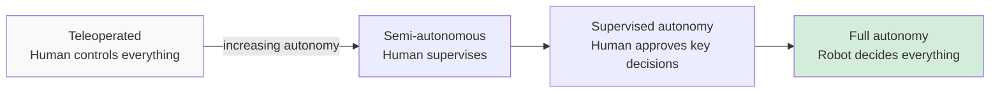

A bomb disposal robot is mostly teleoperated; a Roomba is highly autonomous for a narrow task; a self-driving car targets full autonomy in complex open environments; a surgical robot amplifies human skill without replacing human judgment. All four are robots.

A useful working definition, then: **a robot is a physical machine that senses its environment, makes decisions based on those sensors, and takes physical actions in the world — with some degree of autonomy over that process.**

The sense-decide-act loop below is the central pattern this definition captures:

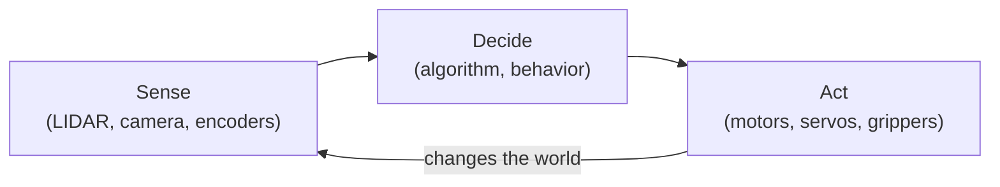

Every chapter in this book deepens your understanding of one or more of these three elements. Part 2 is about sensing. Parts 3 and 4 are about the decision-making infrastructure and motion control. Parts 5 and 6 are about where that loop takes the robot. Parts 7 and 8 are about structuring complex behavior.

## 1.4 Why Study Robotics Now?

Robotics has become a serious field with serious employment prospects. Boston alone is a global hub, home to Amazon Robotics, Boston Dynamics, iRobot, and dozens of startups. Robotics roles exist at every level: hardware engineering, embedded software, algorithms, simulation, testing, and product development.

More importantly for a student, robotics is technically rich in a way that makes you better at software engineering generally. Building a robot that works requires you to reason carefully about concurrency, about the gap between a model and the physical world, about how to test systems that interact with an environment you cannot fully control, and about what happens when things go wrong in ways you did not anticipate. These skills transfer.

The tools are ready. ROS has been in continuous development since 2007 and is used in research robots, commercial products, and student labs worldwide. Gazebo provides simulation environments realistic enough to develop and validate full navigation stacks before touching hardware. The TurtleBot3 is inexpensive, well-documented, and can run the full ROS navigation stack out of the box. There is no better time to start.

## 1.5 What This Book Covers

The book is organized into eight parts that answer eight questions about autonomous robots. Part 1 (this chapter plus Chapters 2 and 3) establishes what robots are, what hardware they use, and why they need specialized software. Part 2 (Chapters 4 through 6) covers perception: how robots use LIDAR and cameras to gather information about their environment. Part 3 (Chapters 7 through 11) goes deep on ROS: the nodes-topics-services-actions architecture, the development workflow, and best practices. Part 4 (Chapters 12 through 15) covers motion: coordinate frames, differential drive kinematics, PID control, and robot body description. Part 5 (Chapters 16 through 19) covers localization: odometry, SLAM, AMCL, and Kalman filters. Part 6 (Chapters 20 through 22) covers navigation: path planning and the ROS navigation stack. Part 7 (Chapters 23 through 26) covers behavior: how robots decide what to do using finite state machines and behavior trees. Part 8 (Chapters 27 and 28) addresses the increasingly important problem of robots operating around people.

By the end, you will have both the conceptual foundation and the practical skills to build, program, and reason about autonomous robots. The next chapter begins with the physical layer — the hardware that all this software runs on.

---

*Next: [Chapter 2: Robot Hardware](ch02_robot_hardware.md)*
---
title: "Chapter 2: Robot Hardware"
date: 2026-04-26
author: Claude Sonnet 4.6
---

# Chapter 2: Robot Hardware

Every robot is built from the same four subsystems: locomotion, sensing, actuation, and computing. Understanding each subsystem — and how they connect — is essential before writing a line of robot software. The hardware determines what the software can do, and the software is only useful if it correctly models the hardware. This chapter covers the physical layer. Later chapters build the software on top of it.

## 2.1 The Four Subsystems

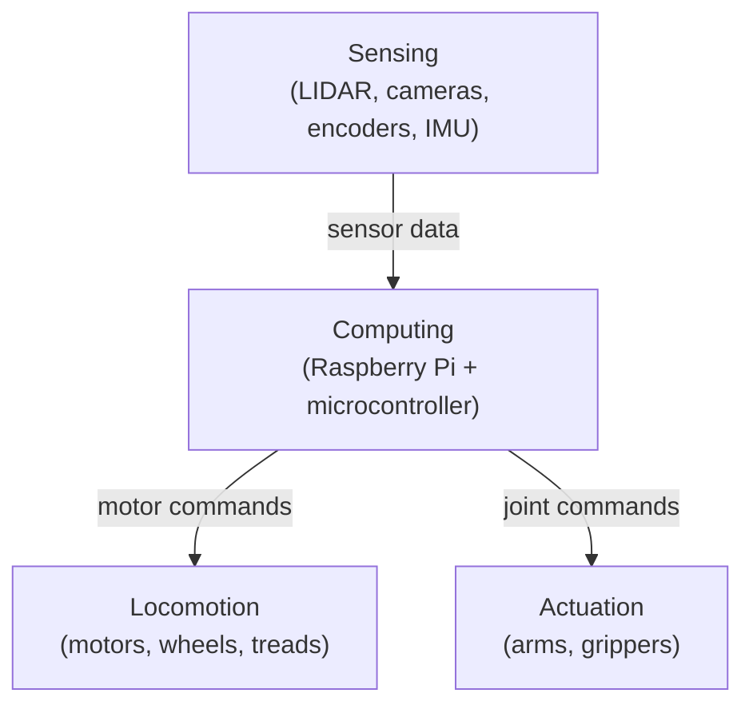

The computing subsystem is the brain: it receives data from sensors and sends commands to motors and actuators. The sensing subsystem is the nervous system: it continuously feeds information about the world into the compute layer. The locomotion and actuation subsystems are the body: they carry out whatever the brain decides.

Each subsystem is represented in software. When your code publishes a velocity command, it is talking to the locomotion subsystem. When your code subscribes to `/scan`, it is receiving data from the sensing subsystem. Understanding what each piece of hardware does makes the software much easier to reason about.

## 2.2 Locomotion

How a robot moves determines almost everything about how you program it — the constraints on path planning, the geometry of the control loop, the format of velocity commands.

### Holonomic vs. Non-Holonomic Motion

A **holonomic** robot can move instantaneously in any direction without first reorienting. Think of a drone or a robot on mecanum wheels: it can slide sideways, move diagonally, or spin in place while moving forward, all independently. The number of controllable degrees of freedom equals the total degrees of freedom of the system.

A **non-holonomic** robot cannot move in all directions freely. A standard car is non-holonomic: you cannot slide it sideways. To move from one parking space to the next, you must execute a sequence of forward and backward arcs. Most wheeled ground robots are non-holonomic, and this constraint has deep implications for path planning — the robot cannot simply follow the geometrically shortest path; it must plan routes that respect its turning constraints.

### Differential Drive

Differential drive is the most common configuration for educational and research robots, and it is what the TurtleBot3 uses. Two wheels are independently driven, one on each side, with one or two passive caster wheels providing balance. The name comes from the fact that the robot's behavior is determined by the *difference* in wheel speeds.

When both wheels turn at the same speed, the robot moves in a straight line. When the left wheel turns faster than the right, the robot curves right. When the two wheels turn in opposite directions at equal speed, the robot pivots in place. Every motion is a combination of linear velocity and angular velocity — precisely the two values in the ROS `Twist` message that you will use to command the robot.

```
Both wheels forward at same speed  →  straight ahead
Left wheel faster than right        →  curve right
Right wheel faster than left        →  curve left
Left forward, right backward        →  pivot in place (rotate)
```

This simplicity is one of the reasons differential drive is so popular: the relationship between wheel commands and robot motion is straightforward to model and implement.

### Four-Wheeled Platforms

With four wheels, steering becomes more complex. Two main approaches exist.

**Skid steering**, used by tanks and tracked vehicles, drives the left and right wheel pairs at different speeds to turn. It is mechanically simple — no separate steering mechanism is needed — but it causes wheel scrub (lateral sliding) during turns, which wastes energy and wears the wheels.

**Ackermann steering**, used by cars, has two wheels that can pivot for steering and all four that roll. The Ackermann geometry ensures all four wheels follow concentric arcs during a turn, eliminating scrub. The tradeoff is mechanical complexity (a steering linkage) and a minimum turning radius — a car cannot turn as tightly as a differential-drive robot.

**Mecanum wheels** are a special case that achieves holonomic motion with four wheels. Each wheel has small rollers mounted at 45° around its rim. By independently varying the speed and direction of all four mecanum wheels, the robot can move in any direction — forward, sideways, diagonally — without rotating. This is useful for applications requiring precise positioning in tight spaces.

### Legged Robots

Legged robots can traverse terrain that wheels cannot: stairs, rubble, uneven ground, gaps. Boston Dynamics' Spot (quadruped) and Atlas (biped) are the most visible current examples. The tradeoff is enormous complexity. Each leg has multiple joints; each joint requires its own motor, position sensor, and torque feedback; the controller must coordinate gait patterns — walk, trot, gallop — in real time while maintaining dynamic balance. Legged robotics is an active research area. For coursework, wheeled platforms are standard.

### Tracks (Treads)

Tracked robots use continuous belts like a tank or bulldozer. Treads distribute weight over a large contact area, providing excellent traction on rough or soft terrain. Steering is by skid: left and right tracks driven at different speeds. The large contact patch that gives treads good traction also causes high friction and energy consumption during turns. Tracked robots are common in outdoor, military, and search-and-rescue applications.

## 2.3 Sensing

A robot without sensors is blind. Sensors are the only connection between the robot's software and the physical world it operates in. Every decision the robot makes is based on what its sensors tell it.

### LIDAR

LIDAR (Light Detection And Ranging) is the primary sensor for indoor obstacle detection and mapping. A rotating laser fires pulses in a 360° sweep and measures the time each pulse takes to return — the "time of flight." From the round-trip travel time, the sensor computes the distance to the nearest obstacle in each direction. The result is a **scan**: an array of distance values indexed by angle.

```
Scan array: [d₀, d₁, d₂, ..., d₃₅₉]
             ↑                    ↑
           angle 0°           angle 359°
Each dᵢ = distance in meters to nearest obstacle at bearing i°
```

The TurtleBot3 Burger uses a YDLIDAR X4, which produces a 360° scan. This scan is published on the `/scan` topic as a `sensor_msgs/LaserScan` message at roughly 5–10 Hz. Chapter 5 covers how to work with this data in detail.

One important limitation deserves emphasis: a 2D LIDAR operates in a single horizontal plane, like a disk cutting through space at the height of the sensor. It is completely blind to anything above or below that plane. A chair leg at floor level is visible; the seat of the chair overhanging the robot is invisible. This geometric blind spot is a frequent source of surprising robot behavior and must be accounted for in any real deployment.

### Visual Cameras

A camera captures a color image — a 2D matrix of pixels, each carrying red, green, and blue values. In code this is simply `pixel[x, y] = {r, g, b}`. The TurtleBot3 Waffle Pi includes a Raspberry Pi Camera; the Burger does not. Images are published on `/camera/rgb/image_raw` as `sensor_msgs/Image` messages.

The processing library for camera images in robotics is **OpenCV** (Open Computer Vision). OpenCV provides functions for color filtering, edge detection, blob finding, marker detection, and much more. Chapter 6 covers the basics of using OpenCV with ROS.

Camera data volume is high. At 640×480 resolution and 30 frames per second, a camera generates nearly 28 million pixel values per second. Over WiFi this creates real bandwidth pressure — compressed topics (`/compressed`, `/theora`) exist specifically to address this.

### Depth Cameras

A depth camera augments each pixel with a distance measurement: `pixel[x, y] = {r, g, b, d}`. The Intel RealSense and Orbbec Astra are common examples. Depth cameras are useful when you detect an object with the camera and also need to know how far away it is — for example, when a robot arm needs to reach for something. The TurtleBot3 base platform does not include a depth camera, but adding one is straightforward.

### Wheel Encoders

Encoders are sensors built into the wheel motors that count how far each wheel has rotated. As the wheel turns, the encoder generates pulses — typically hundreds per revolution. Counting those pulses tells you how far the wheel has traveled, which tells you (approximately) how far and in what direction the robot has moved. This motion estimate, accumulated over time, is called **odometry**, and it is published on the `/odom` topic.

Odometry is the robot's primary self-localization signal, but it accumulates error. Wheels slip. Floors are not perfectly flat. The error grows with distance traveled. A robot relying solely on odometry will eventually lose track of where it is. Later chapters describe how to combine odometry with LIDAR to build more reliable position estimates.

### IMU (Inertial Measurement Unit)

An IMU measures forces and rotation rates using accelerometers and gyroscopes. A 3-axis gyroscope reports rotational velocity around each axis. A 3-axis accelerometer reports linear acceleration along each axis. A 3-axis magnetometer measures the local magnetic field (used as a compass heading). Together, a 9-axis IMU gives a rich picture of the robot's motion and orientation.

The TurtleBot3's OpenCR board includes an MPU9250, a 9-axis IMU. Its data is published on the `/imu` topic. The IMU is particularly useful for measuring rotation — it can tell you how fast the robot is turning with much less lag than wheel encoders. It is typically fused with odometry using a filter to produce a better overall pose estimate.

## 2.4 Computation

A robot's computing architecture is distributed. Different computational tasks have different latency and throughput requirements, and no single processor handles all of them optimally.

### Microcontroller

The microcontroller layer runs directly on the hardware, with real-time constraints. On the TurtleBot3, this is the **OpenCR** board — an Arduino-compatible microcontroller from Robotis. It handles the lowest-level tasks: reading encoder pulses from the wheel motors at high frequency, commanding motor currents to achieve target speeds, and reading the IMU. These tasks require microsecond response times and tight timing guarantees. The microcontroller does not run Linux; it runs firmware — small, deterministic programs burned directly onto the chip.

### Single-Board Computer (SBC)

Above the microcontroller sits a single-board computer running a full Linux operating system. On the TurtleBot3, this is a **Raspberry Pi**. The Pi runs the full ROS 2 stack: the LIDAR driver, the motor interface node, and the odometry publisher. It communicates with the OpenCR over USB serial. It connects to your laptop over WiFi. The Pi has enough computing power for the real-time-adjacent tasks but is not powerful enough for computationally expensive algorithms like computer vision or SLAM.

### Remote Computer

Computationally expensive algorithms — SLAM, computer vision, path planning, user interfaces — typically run on your laptop or a cloud desktop. ROS is designed for exactly this: nodes running on different machines communicate transparently over the network using the same publish-subscribe mechanism as nodes on the same machine. From the perspective of any individual node, the location of other nodes is invisible.

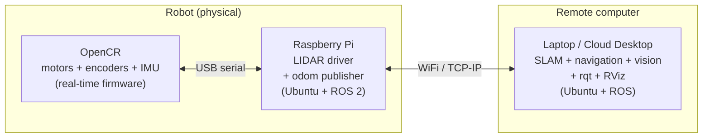

As robots become more capable and deployments more autonomous, the trend is toward more powerful onboard computers — NVIDIA Jetson boards and similar — that can run the full stack without a remote machine, enabling the robot to operate independently of a network connection.

## 2.5 The TurtleBot3

The TurtleBot3 from Robotis is the platform used throughout this book. Two models exist: the **Burger** (smaller, no camera, ~$300) and the **Waffle Pi** (larger, includes camera, ~$600). Both use the same software stack and are interchangeable for most of this book's content.

The Burger's hardware, from the ground up: two Dynamixel XL430 servo motors, each with a built-in encoder, drive the two powered wheels. A passive caster wheel at the rear provides stability. An OpenCR microcontroller board sits in the middle of the chassis, connected to both motors via the Dynamixel protocol. A YDLIDAR X4 sits on top, connected to the Raspberry Pi via USB. The Raspberry Pi 3B+ (or 4) sits between the LIDAR and the battery, running Ubuntu 20.04 and ROS Noetic. The whole stack runs from a 11.1V LiPo battery.

In software, the TurtleBot3 presents a clean interface. Your code publishes velocity commands to `/cmd_vel`. The robot drives. Your code subscribes to `/scan` and `/odom`. The robot tells you what it sees and where it thinks it is. The details of motor control, encoder reading, and LIDAR data processing are handled by the robot's onboard software, invisible to your application code.

## 2.6 Robot Bodies: Joints, Links, and URDF

For robots with arms, manipulators, or any multi-segment structure, the body must be described formally so that software can reason about geometry. ROS uses a representation called a **kinematic tree**: a hierarchy of rigid **links** connected at **joints**.

A link is a rigid segment of the robot — a body part. A joint is the connection between two links, and it has a type that determines what motion is allowed across it. A **revolute** joint rotates around a single axis (an elbow, a wrist). A **prismatic** joint slides along an axis (a piston, a linear actuator). A **fixed** joint is rigid — it connects two links with no relative motion.

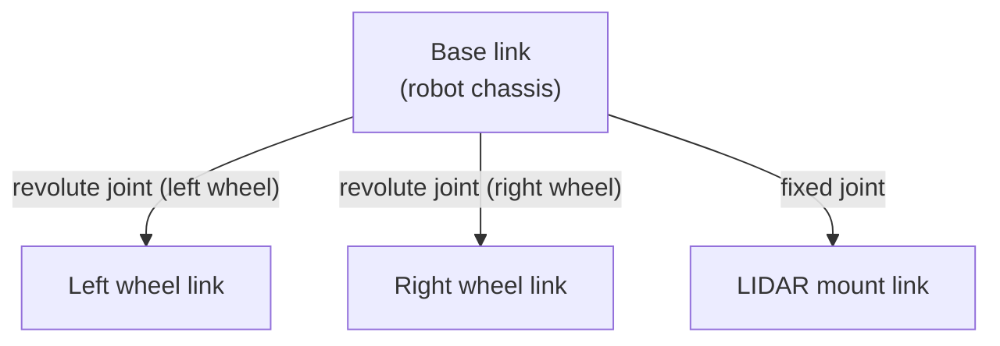

This structure is encoded in a file format called **URDF** (Unified Robot Description Format), an XML dialect. ROS reads URDF to understand the robot's geometry — for 3D visualization in RViz, for computing transforms between frames, and for collision detection.

For a robot arm, the kinematic tree extends further: shoulder, upper arm, elbow, forearm, wrist, gripper. Given the angles of all joints, **forward kinematics** computes the position and orientation of the gripper. Given a desired gripper position, **inverse kinematics** computes what joint angles are needed. Both operations are handled by ROS libraries and are covered in Chapter 15.

For the TurtleBot3, the URDF is simple: two revolute wheel joints and a fixed LIDAR mount. You will encounter it when visualizing the robot in RViz and when working with coordinate transforms in Chapter 12.

## 2.7 Summary

The TurtleBot3's hardware maps directly to software interfaces that your code will use throughout this book:

| Hardware | Physical component | ROS topic | Message type |
|---|---|---|---|
| Locomotion | Dynamixel motors | `/cmd_vel` | `geometry_msgs/Twist` |
| LIDAR | YDLIDAR X4 | `/scan` | `sensor_msgs/LaserScan` |
| Encoders | Built into Dynamixel | `/odom` | `nav_msgs/Odometry` |
| IMU | MPU9250 on OpenCR | `/imu` | `sensor_msgs/Imu` |
| Camera (Waffle) | Raspberry Pi Camera | `/camera/rgb/image_raw` | `sensor_msgs/Image` |

Every time your code interacts with any of these topics, it is interacting with the hardware described in this chapter. The next chapter introduces the software framework — ROS — that makes all of this work together.

---

*Previous: [Chapter 1: Defining Robots](ch01_defining_robots.md)*
*Next: [Chapter 3: Robot Software Architecture](ch03_software_architecture.md)*
---
title: "Chapter 3: Robot Software Architecture"
date: 2026-04-26
author: Claude Sonnet 4.6
---

# Chapter 3: Robot Software Architecture

## 3.1 Why Robots Need Special Software

A robot is not a normal computer program. A normal program runs, produces output, and stops. A robot program runs continuously, reads from sensors at high frequency, makes decisions, and sends commands to motors — all at the same time, forever, while the physical world changes around it.

This creates problems that ordinary software architectures handle badly:

**Concurrency.** A robot might be reading LIDAR data, processing camera images, tracking its position, and planning a path all at once. These activities run in parallel and must not block each other.

**Distribution.** A robot's software does not all run on one computer. The low-level motor controller runs on a microcontroller. ROS nodes run on a Raspberry Pi. Computationally expensive algorithms run on a laptop. All of these must communicate reliably over a network.

**Hardware abstraction.** The same navigation algorithm should work whether the robot has a Hokuyo LIDAR or a YDLIDAR. The same motor control code should work on a TurtleBot3 or a custom platform. Hardware details should be isolated from algorithmic logic.

**Modularity and reuse.** A localization algorithm written once should be reusable across many robots and many applications. Robot software systems are too large and complex to rebuild from scratch each time.

ROS (the Robot Operating System) was designed to address all four of these needs. It is the standard framework for robot software development and the one used throughout this book.

## 3.2 ROS Is Not an Operating System

Despite its name, ROS is not an operating system. It runs on top of Linux. A more accurate description:

> ROS is a distributed process management and communication framework for robot software.

What that means in practice: ROS provides the infrastructure for running many small programs (called **nodes**), connecting them together through a message-passing system, and coordinating them across multiple computers on a network.

You write the nodes. ROS handles everything else.

## 3.3 Nodes

A **node** is a single running program — a process — that does one thing. Examples:

- A node that reads the LIDAR and publishes scan data
- A node that reads wheel encoder data and publishes odometry
- A node that subscribes to odometry and scan data and publishes a map
- A node that subscribes to a goal position and publishes motor commands

A real robot system has dozens of nodes running simultaneously. Each node is small and focused. This makes nodes easy to test, replace, and reuse.

Here is the simplest possible ROS 2 node in Python:

```python
#!/usr/bin/env python3
import rclpy
from rclpy.node import Node
from std_msgs.msg import Int32

class CounterPublisher(Node):
    def __init__(self):
        super().__init__('my_publisher_node')
        self.pub = self.create_publisher(Int32, 'counter', 10)
        self.timer = self.create_timer(0.5, self.timer_callback)  # 2 Hz
        self.count = 0

    def timer_callback(self):
        msg = Int32()
        msg.data = self.count
        self.pub.publish(msg)
        self.count += 1

def main():
    rclpy.init()
    rclpy.spin(CounterPublisher())
    rclpy.shutdown()

if __name__ == '__main__':
    main()
```

This node publishes an incrementing integer to a topic called `counter` at 2 Hz. That is all it does. Another node somewhere else on the network can subscribe to `counter` and receive those integers.

ROS 2 nodes are written as classes that inherit from `Node`. This is more structured than ROS 1's procedural style, but it makes concurrency and lifecycle management much cleaner. Each node instance owns its publishers, subscribers, timers, and clients.

## 3.4 Topics and Messages

**Topics** are named channels through which nodes communicate. A node **publishes** messages to a topic; any number of other nodes can **subscribe** to that topic and receive those messages.

Topics are typed: every message on a topic has the same structure. The LIDAR publishes `sensor_msgs/LaserScan` messages on `/scan`. The odometry system publishes `nav_msgs/Odometry` messages on `/odom`. The motor controller subscribes to `geometry_msgs/Twist` messages on `/cmd_vel`.

This is the **publish-subscribe** pattern. Publishers do not know who is listening. Subscribers do not know who is publishing. They are decoupled — you can swap out a node without changing anything else, as long as the new node uses the same topic names and message types.

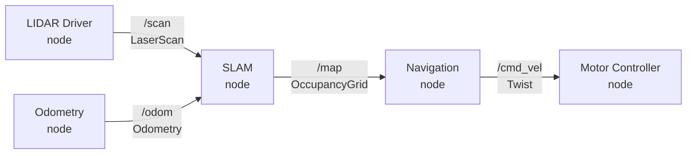

Key commands for working with topics:

```bash
ros2 topic list              # list all active topics
ros2 topic echo /scan        # print messages on /scan in real time
ros2 topic info /odom        # show publishers, subscribers, message type
ros2 topic hz /scan          # measure publish rate
```

## 3.5 No Master: ROS 2 Uses DDS

ROS 1 required a central `roscore` process — a global coordinator that every node had to contact before it could communicate. If `roscore` crashed, the entire system stopped.

ROS 2 eliminates this single point of failure. Communication is built on **DDS** (Data Distribution Service), an industrial middleware standard. DDS uses peer-to-peer discovery: nodes find each other automatically using multicast announcements, with no central coordinator. You simply start your nodes — in any order, on any machines on the same network — and they discover each other.

This changes the development workflow:
- No `roscore` to start first
- Nodes can be started and stopped in any order
- The system continues to operate even if individual nodes crash and restart
- Multiple robots on the same network need **ROS_DOMAIN_ID** set to different values to avoid cross-talk

```bash
export ROS_DOMAIN_ID=42   # isolate this robot from others on the network
```

## 3.6 Services

Topics are asynchronous: publishers and subscribers run independently. Sometimes you need synchronous communication — send a request, wait for a response. That is what **services** are for.

A service has a server (a node that advertises the service) and a client (a node that calls it). The client blocks until the server responds. Services are typed with request and response fields.

Services are appropriate for occasional, bounded-time operations: asking for the current map, requesting a sensor calibration, querying robot status. They are *not* appropriate for ongoing, time-extended operations (like navigating to a goal) — use actions for those.

```python
# Calling a service (client side) in ROS 2
import rclpy
from rclpy.node import Node
from std_srvs.srv import Empty

class OdomResetter(Node):
    def __init__(self):
        super().__init__('odom_resetter')
        self.client = self.create_client(Empty, '/reset_odometry')
        self.client.wait_for_service()
        future = self.client.call_async(Empty.Request())
        rclpy.spin_until_future_complete(self, future)
```

## 3.7 Actions

**Actions** handle long-running, goal-oriented tasks. Navigation is the canonical example: you send a goal (drive to position X,Y), and the action server works toward it asynchronously, sending periodic **feedback** (current position, progress) and eventually a **result** (succeeded, failed, preempted).

Unlike services, actions are non-blocking. You can cancel an action mid-execution. You receive feedback while it runs. Actions are what the ROS navigation stack uses.

An action is defined with three message types:
- `Goal` — what you want the robot to do
- `Feedback` — progress updates while it runs
- `Result` — the outcome when it finishes

## 3.8 The Computation Graph

Together, nodes, topics, services, and actions form the **computation graph** — the full picture of what is running and how it is connected. The `rqt_graph` tool visualizes it:

```bash
rqt_graph
```

This is one of the most useful debugging tools in ROS. When your robot is not behaving as expected, the computation graph often shows immediately whether nodes are connected correctly, whether topics have publishers and subscribers, and whether messages are flowing.

## 3.9 Running ROS Software

**Running a single node:**

```bash
ros2 run package_name executable_name
```

**Running multiple nodes with a launch file:**

```bash
ros2 launch package_name filename.launch.py
```

In ROS 2, launch files are Python scripts (not XML). This gives them the full power of Python — conditionals, loops, computed parameters — while remaining explicit and readable. Here is a minimal example:

```python
# my_robot_pkg/launch/teleop.launch.py
from launch import LaunchDescription
from launch_ros.actions import Node

def generate_launch_description():
    return LaunchDescription([
        Node(
            package='turtlebot3_teleop',
            executable='teleop_keyboard',
            name='turtlebot3_teleop_keyboard',
            output='screen'
        )
    ])
```

## 3.10 Package Structure

ROS software is organized into **packages**. A package is a directory with a standard structure:

ROS 2 Python packages have a different layout than ROS 1:

```
my_robot_pkg/
  my_robot_pkg/    # Python package (node source files go here)
    __init__.py
    my_node.py
  launch/          # .launch.py files
  resource/
  test/
  package.xml      # package metadata (format 3)
  setup.py         # Python package setup
  setup.cfg
```

Create a new package with:

```bash
cd ~/ros2_ws/src
ros2 pkg create my_robot_pkg --build-type ament_python \
    --dependencies rclpy std_msgs geometry_msgs
```

Build all packages in the workspace:

```bash
cd ~/ros2_ws
colcon build
source install/setup.bash
```

The build tool in ROS 2 is `colcon` (not `catkin_make`). The build system for Python packages is `ament_python` (not catkin). After building, source `install/setup.bash` rather than `devel/setup.bash`.

## 3.11 Concurrency in Practice

ROS is heavily concurrent. Each topic subscription in a node runs its callback in a separate thread. This means race conditions are real and must be handled.

Key rules:
- Do not block or sleep inside a callback — it starves the executor
- Be careful sharing data between callbacks and the main loop — use locks or keep logic in one place
- Do not create your own threads — if you need more parallelism, split into multiple nodes
- Call `rclpy.spin(node)` after creating the node so the executor processes callbacks until Ctrl-C

```python
class ScanProcessor(Node):
    def __init__(self):
        super().__init__('scan_processor')
        self.create_subscription(LaserScan, '/scan', self.scan_callback, 10)

    def scan_callback(self, msg):
        # process LaserScan message
        # do NOT sleep or block here
        pass

def main():
    rclpy.init()
    rclpy.spin(ScanProcessor())  # keeps node alive, processes callbacks
    rclpy.shutdown()
```

## 3.12 Summary

| Concept | What It Is | When to Use |
|---|---|---|
| Node | Single running program | One per distinct function |
| Topic | Named message stream | Continuous data flow |
| Message | Typed data structure | All communication |
| Service | Synchronous request/reply | Occasional, bounded-time ops |
| Action | Async goal with feedback | Long-running tasks |
| DDS | Peer-to-peer discovery (no master) | Automatic — no setup needed |
| Launch file | Multi-node startup script (.launch.py) | Running full applications |

The next chapter moves from software to perception — how robots gather information about the world through their sensors.

---

*Previous: [Chapter 2: Robot Hardware](ch02_robot_hardware.md)*
*Next: [Chapter 4: Sensors Overview](ch04_sensors_overview.md)*
---
title: "Chapter 4: Sensors Overview"
date: 2026-04-26
author: Claude Sonnet 4.6
---

# Chapter 4: Sensors Overview

## 4.1 Why Sensors Are Everything

Robotics is, at its core, sensor-driven. A robot that cannot perceive its environment cannot respond to it — and a robot that cannot respond to its environment is not autonomous. Every behavior a robot exhibits, from avoiding an obstacle to delivering a package, begins with sensor data. Understanding sensors — what they measure, how they fail, and how to work with their data — is therefore fundamental to everything else in this book.

Sensors are imperfect. This is not a minor caveat; it is a central fact of robotics that shapes every algorithm and system design in the field. A LIDAR scan contains invalid readings. Wheel encoders slip. Cameras wash out in bright sunlight. An IMU drifts over time. The gap between what a sensor reports and what is actually true in the world is constant, and every layer of software above the sensor must account for it. The robot does not know the true state of the world — it only has a probabilistic estimate based on imperfect measurements.

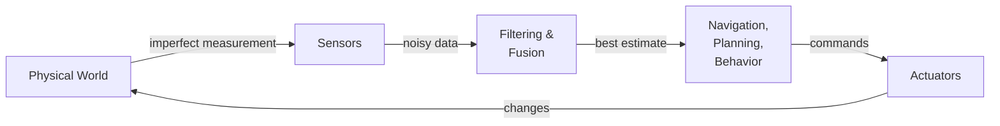

This chapter introduces the sensors you will work with throughout the book. Later chapters go deep on each one. Here the goal is to understand what each sensor is for, what it produces, and what its limitations are.

## 4.2 LIDAR

LIDAR (Light Detection And Ranging) is the primary sensor for obstacle detection and mapping in indoor mobile robots. A rotating laser fires pulses continuously around a 360° arc. Each pulse travels until it hits a surface and returns to the sensor. The sensor measures the round-trip travel time and, knowing the speed of light, computes the distance to that surface. Do this thousands of times per second across all angles and you have a complete 2D map of the robot's immediate surroundings.

The result of one full rotation is called a **scan**. A scan is an array of distance values, one per angle increment around the robot. On the YDLIDAR X4 (the sensor used in the TurtleBot3 Burger), the scan covers 360° with several hundred readings per rotation at roughly 5–10 rotations per second. In ROS, each scan is published as a `sensor_msgs/LaserScan` message on the `/scan` topic.

The key field in a `LaserScan` message is `ranges` — the array of distance values. Each element `ranges[i]` is the distance in meters to the nearest obstacle at the bearing corresponding to index `i`. The mapping from index to angle is given by `angle_min + i * angle_increment`.

```python
# How to compute bearing for each range reading
import math
angle = msg.angle_min + i * msg.angle_increment
distance = msg.ranges[i]
# Convert to Cartesian (in robot's local frame):
x = distance * math.cos(angle)
y = distance * math.sin(angle)
```

LIDAR data is reliable, fast, and relatively simple to process, which is why it is the backbone of most indoor navigation systems. But it has one important geometric limitation: a 2D LIDAR operates in a single horizontal plane. It is completely blind to anything above or below that plane. A chair leg is visible; the seat overhanging the robot is not. A person's feet are visible; their legs above the sensor are not. This limitation must be kept in mind whenever you design robot behavior around LIDAR data.

3D LIDAR sensors (which produce point clouds rather than flat scans) remove this limitation, but they are substantially more expensive. For most coursework and many real deployments, 2D LIDAR is sufficient.

## 4.3 Visual Cameras

A camera captures a color image — a two-dimensional array of pixels, where each pixel carries red, green, and blue intensity values. In software, this is simply a 3D array of shape `(height, width, 3)`. The TurtleBot3 Waffle Pi includes a Raspberry Pi Camera Module (standard RGB); the Burger does not include a camera. Images are published on `/camera/rgb/image_raw` as `sensor_msgs/Image` messages.

The processing library for camera images in robotics is OpenCV (`cv2` in Python). OpenCV provides an extensive toolkit: color space conversion, thresholding, edge detection, contour finding, template matching, feature detection, and much more. Chapter 6 covers the subset of OpenCV that is most useful for robot control.

One practical concern with cameras is data volume. A 640×480 image at 30 frames per second generates roughly 27 million pixel values per second. Over a WiFi link, this saturates bandwidth quickly. ROS addresses this with compressed image topics — `/camera/rgb/image_raw/compressed` publishes JPEG-compressed frames, and `/camera/rgb/image_raw/theora` publishes a compressed video stream. When working with a robot over wireless, always use compressed topics for transmission and decompress locally for processing.

## 4.4 Depth Cameras

A depth camera augments each pixel with a distance measurement, giving `{r, g, b, d}` per pixel. The Intel RealSense D435 and the Orbbec Astra are common examples. Depth cameras are useful when you need both visual identification of an object and its 3D location — for example, when a robot arm needs to reach for a detected object, or when you want to classify obstacles by shape rather than just location.

The TurtleBot3 base platforms (both Burger and Waffle Pi) do not include a depth camera as standard equipment. Adding one is straightforward — the RealSense and Astra both have ROS drivers that publish depth and color data on standard topics. Be aware that depth cameras are significantly more computationally expensive than 2D LIDAR and require a more powerful compute platform to process in real time.

## 4.5 Wheel Encoders and Odometry

Wheel encoders are sensors integrated into the drive motors that count how far each wheel has rotated. As the wheel turns, the encoder generates discrete pulses — typically hundreds per full rotation. Counting these pulses and knowing the wheel's circumference gives the distance the wheel has traveled. From the distance each wheel has traveled, differential-drive kinematics computes how far the robot has moved and in what direction. This accumulated position estimate is called **odometry**.

Odometry is published on the `/odom` topic as `nav_msgs/Odometry` messages. Each message contains the robot's estimated pose (position and orientation) and velocity. The pose is expressed in a coordinate frame called `odom`, which is anchored at the robot's starting position.

The fundamental problem with odometry is error accumulation. Wheels slip on smooth floors. Slight asymmetries in the motors cause the robot to drift. Bumps in the floor introduce rotational errors. Each individual error is small, but they compound over time: a robot relying on odometry alone will gradually lose track of where it is. Over a short distance (a few meters), odometry is reliable enough to use directly. Over longer distances, it must be corrected using external references such as LIDAR-based localization (Chapter 17) or fiducial markers.

```python
# Subscribing to odometry in ROS 2
import rclpy
from rclpy.node import Node
from nav_msgs.msg import Odometry

class OdomReader(Node):
    def __init__(self):
        super().__init__('odom_reader')
        self.create_subscription(Odometry, '/odom', self.odom_callback, 10)

    def odom_callback(self, msg):
        x = msg.pose.pose.position.x
        y = msg.pose.pose.position.y
        # Orientation is a quaternion — see Chapter 12 for conversion to heading angle
        qz = msg.pose.pose.orientation.z
        qw = msg.pose.pose.orientation.w
```

## 4.6 IMU (Inertial Measurement Unit)

An IMU measures forces and rotation rates using solid-state sensors. A three-axis accelerometer measures linear acceleration along each spatial axis. A three-axis gyroscope measures angular velocity around each axis. A three-axis magnetometer measures the local magnetic field, which (in outdoor or magnetically clean environments) gives an absolute heading reference.

Together, nine measurements give a rich picture of the robot's instantaneous motion. The IMU is particularly useful for measuring angular velocity: it can tell you how fast the robot is rotating with much lower latency than wheel encoders, which makes it valuable for fast, responsive control.

The TurtleBot3's OpenCR board includes an MPU9250 9-axis IMU. Its data is published on `/imu` as `sensor_msgs/Imu` messages. The IMU is typically used in combination with odometry — the two are fused together using a filter (extended Kalman filter or similar) to produce a pose estimate that is better than either sensor alone.

One important limitation: gyroscopes drift. Even a high-quality MEMS gyroscope accumulates a small rotational error every second. Over minutes, this drift becomes significant. In practice, gyroscope data must be regularly corrected against an independent reference (the magnetometer, or LIDAR-based localization) to remain useful for long-duration operation.

## 4.7 Other Sensors

Beyond the primary sensors above, robots use a variety of specialized sensors depending on the application.

**Touch and bump sensors** detect physical contact. They are simple and reliable — binary outputs that tell the robot it has hit something. The Roomba's bump sensor triggers a reactive escape behavior that is the entire basis of its navigation. On research platforms, bump sensors serve as a last-resort safety layer when other sensors fail to detect an obstacle in time.

**Cliff sensors** use downward-pointing infrared emitters and detectors to detect the absence of floor beneath the robot. When the robot reaches the edge of a table or the top of a staircase, the reflected infrared signal disappears and the robot stops. This is standard on domestic robots and useful on any platform that operates near elevation changes.

**GPS** provides absolute position outdoors with an accuracy of roughly 1–5 meters for consumer-grade receivers. It is unavailable indoors and unreliable near tall buildings where satellite signals are obstructed. For outdoor robots, GPS provides a global reference that can correct the accumulated drift of odometry. For indoor robots, it is not useful.

**Ultrasonic sensors** emit sound pulses and measure the echo return time, similar in principle to LIDAR but using sound instead of light. They are inexpensive and simple, but have lower angular resolution, shorter range, and more noise than LIDAR. They are common on low-cost platforms and as backup proximity sensors.

## 4.8 Sensor Fusion

No single sensor is sufficient. Each sensor has blind spots, failure modes, and domains where its data becomes unreliable. The solution is sensor fusion: combining data from multiple sensors to produce a state estimate that is more accurate and more robust than any individual sensor could provide.

The simplest fusion combines wheel odometry with IMU data. Odometry gives position but drifts during turns. The IMU gives accurate angular velocity but drifts over time. Combined with a complementary filter or an extended Kalman filter, the two produce a pose estimate better than either alone.

The most powerful fusion for indoor mobile robots combines odometry with LIDAR. Odometry provides a short-term position estimate; LIDAR matches the current scan against a map to correct accumulated drift. This is the basis of SLAM (Simultaneous Localization and Mapping), which is covered in Chapter 17.

The key insight is that the robot never knows exactly where it is or exactly what the world looks like. It maintains a **probability distribution** over possible states — a belief about where it might be — and updates that belief as new sensor data arrives. The algorithms in Chapters 17–19 formalize this probabilistic view.

## 4.9 Working with Sensor Data in ROS

Every sensor in a ROS system publishes its data on a topic with a standard message type. This uniformity is one of ROS's great strengths: a navigation algorithm written for the TurtleBot3's LIDAR will work with any other 2D LIDAR that publishes standard `LaserScan` messages.

The key sensor topics on the TurtleBot3 are:

| Topic | Message Type | Sensor | Rate |
|---|---|---|---|
| `/scan` | `sensor_msgs/LaserScan` | YDLIDAR X4 | 5–10 Hz |
| `/odom` | `nav_msgs/Odometry` | Wheel encoders | 30 Hz |
| `/imu` | `sensor_msgs/Imu` | MPU9250 | 30 Hz |
| `/camera/rgb/image_raw` | `sensor_msgs/Image` | Pi Camera (Waffle only) | 30 fps |

Two command-line tools are indispensable when working with sensor data. `ros2 topic echo /scan` prints scan messages to the terminal in real time — useful for verifying that the sensor is publishing and that values are in a reasonable range. `ros2 topic hz /scan` measures the actual publish rate — useful for detecting sensor failures or processing bottlenecks.

For visual inspection, **RViz** is the primary tool. It can display LIDAR scans as point clouds, render the robot model in 3D, show the occupancy grid map, and overlay the robot's estimated trajectory — all in real time. Getting comfortable with RViz is a high-leverage investment: it will be your primary window into what the robot perceives throughout this book.

---

*Previous: [Chapter 3: Robot Software Architecture](ch03_software_architecture.md)*
*Next: [Chapter 5: Working with LIDAR](ch05_lidar.md)*
---
title: "Chapter 5: Working with LIDAR"
date: 2026-04-26
author: Claude Sonnet 4.6
---

# Chapter 5: Working with LIDAR

LIDAR is the workhorse sensor of indoor mobile robotics. It is fast, reliable, and produces data that is relatively straightforward to process compared to camera images. Almost every meaningful behavior a TurtleBot3 can perform — obstacle avoidance, wall following, mapping, localization — depends on LIDAR data. This chapter teaches you how to work with it in practice: how to subscribe to scan data, how to interpret it correctly, how to filter out invalid readings, and how to structure your code so the rest of your logic stays clean.

## 5.1 The LaserScan Message

LIDAR data arrives in ROS 2 as `sensor_msgs/LaserScan` messages on the `/scan` topic. To use it, subscribe within a Node class:

```python
from sensor_msgs.msg import LaserScan
# Inside __init__:
self.create_subscription(LaserScan, '/scan', self.scan_callback, 10)
```

The `LaserScan` message has several fields, but the ones you will use constantly are:

```
ranges[]        — array of float32 distance values, one per angle increment (meters)
angle_min       — start angle of the scan (radians)
angle_max       — end angle of the scan (radians)
angle_increment — angular distance between measurements (radians)
range_min       — minimum valid range (anything below is invalid)
range_max       — maximum valid range (anything above is invalid)
```

The `ranges` array is the core of the message. Each element is a distance in meters. The angle corresponding to element `i` is:

```
angle_i = angle_min + i * angle_increment
```

One rule to internalize immediately: **do not assume `ranges` has exactly 360 elements.** Different LIDAR models, different firmware versions, and simulated vs. physical sensors all produce different array lengths. Always use `len(msg.ranges)` to find the actual count. Hardcoding 360 is a common mistake that produces silent, wrong behavior.

```python
def scan_callback(msg):
    n = len(msg.ranges)  # actual number of readings — don't assume 360
    mid = n // 2         # index pointing directly ahead (angle ~0)
```

## 5.2 Understanding the Data

The `ranges` array is a snapshot of the robot's environment at one moment in time. Index 0 corresponds to `angle_min`, and the last index corresponds to `angle_max`. For a 360° LIDAR, `angle_min` is typically `-π` (or `0`) and `angle_max` is `π` (or `2π`).

Whether angles increase clockwise or counterclockwise depends on the specific LIDAR model and how the driver is configured. For the YDLIDAR X4 on the TurtleBot3 with the standard ROS driver, angles increase counterclockwise when viewed from above — the same convention as standard mathematical angles. Index 0 points forward (ahead of the robot).

There is a critical difference between the simulated LIDAR in Gazebo and the physical YDLIDAR X4 that will burn you if you do not know it:

- **Gazebo simulation**: no obstacle in range → `ranges[i] = float('inf')`
- **Physical YDLIDAR X4**: no obstacle in range → `ranges[i] = 0.0`

A value of `0.0` on the physical robot does *not* mean an obstacle is zero meters away. It means "no valid reading." Code that works perfectly in simulation (checking for obstacles below a threshold) can behave dangerously on hardware if it misinterprets zeros as nearby obstacles. Always filter before acting.

## 5.3 Filtering Invalid Data

LIDAR data is noisy. Individual readings can be wrong for many reasons: a ray reflects off a shiny surface at an unexpected angle, the beam grazes an edge at a shallow angle, or the target is outside the sensor's valid range. Before your algorithm sees the data, invalid readings need to be removed.

The definition of "invalid" combines several criteria:
- The reading is `inf` (Gazebo no-return)
- The reading is `0.0` or very near zero (physical robot no-return, or obstacle touching sensor)
- The reading is below `range_min` (too close for reliable measurement)
- The reading is above `range_max` (too far for reliable measurement)

A clean filter function:

```python
def valid_range(r, range_min, range_max):
    return (not math.isnan(r) and
            not math.isinf(r) and
            range_min <= r <= range_max)

def filter_scan(msg):
    return [r if valid_range(r, msg.range_min, msg.range_max)
            else float('inf')
            for r in msg.ranges]
```

This replaces invalid values with `inf` — a safe sentinel that will not accidentally trigger obstacle-detection thresholds. Code downstream can then safely compute `min()` on any sector without special-casing invalid values (since `inf` will never win a minimum over valid readings, unless the sector is entirely invalid — which is also useful information).

## 5.4 Working with Sectors

Raw `ranges` indices are not intuitive to work with directly. The standard approach is to divide the scan into named angular sectors — front, left, right, rear — and work with those sectors as units.

The sector boundaries depend on the actual scan resolution. For a scan with `n` readings covering 360°, one reading covers `360/n` degrees. A sector covering ±30° around forward contains `int(30 / (360/n))` readings on each side. Here is a general-purpose sector extraction:

```python
def get_sector(ranges, center_deg, half_width_deg):
    """Extract a sector centered at center_deg with ±half_width_deg."""
    n = len(ranges)
    deg_per_idx = 360.0 / n

    def idx(deg):
        return int(deg / deg_per_idx) % n

    start = idx(center_deg - half_width_deg)
    end   = idx(center_deg + half_width_deg)

    if start <= end:
        return list(ranges[start:end+1])
    else:  # wraps around 0
        return list(ranges[start:]) + list(ranges[:end+1])
```

For illustrative examples in this chapter, we use a 360-reading scan (which is representative of the YDLIDAR X4 at typical resolution). Named sectors:

```python
# Assumes n=360 for illustration — use get_sector() for production code
front = list(ranges[0:30])  + list(ranges[330:360])  # ±30° ahead
left  = list(ranges[60:120])                          # left side
right = list(ranges[240:300])                         # right side
rear  = list(ranges[150:210])                         # behind
```

To find the closest obstacle in a sector, take the minimum of the filtered values:

```python
front_filtered = [r for r in front if r != float('inf')]
if front_filtered:
    closest_ahead = min(front_filtered)
```

## 5.5 The Filter Node Pattern

As your robot code grows, you will find that every node that uses LIDAR data needs to apply the same filtering logic. Duplicating that logic across nodes is a maintenance problem. The standard solution is a dedicated **filter node**.

The filter node sits between the LIDAR driver and all logic nodes. It subscribes to `/scan` (raw LIDAR data), applies filtering and any other preprocessing, and publishes to `/scan/filtered`. Every other node subscribes to `/scan/filtered` and never sees raw data.

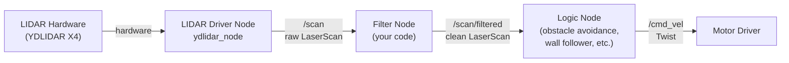

This pattern has several benefits. The filtering logic lives in one place and is tested once. Logic nodes are simpler because they can assume valid data. Switching from physical hardware to simulation requires changing only the filter node (to handle `0` vs `inf` differently), not every logic node.

A minimal filter node:

```python
#!/usr/bin/env python3
import math
import rclpy
from rclpy.node import Node
from sensor_msgs.msg import LaserScan

class LidarFilter(Node):
    def __init__(self):
        super().__init__('lidar_filter')
        self.pub = self.create_publisher(LaserScan, '/scan/filtered', 1)
        self.create_subscription(LaserScan, '/scan', self.scan_callback, 1)

    def scan_callback(self, msg):
        filtered = list(msg.ranges)
        for i, r in enumerate(filtered):
            if (math.isnan(r) or math.isinf(r) or
                    r < msg.range_min or r > msg.range_max):
                filtered[i] = float('inf')
        out = LaserScan()
        out.header = msg.header
        out.angle_min = msg.angle_min
        out.angle_max = msg.angle_max
        out.angle_increment = msg.angle_increment
        out.time_increment = msg.time_increment
        out.scan_time = msg.scan_time
        out.range_min = msg.range_min
        out.range_max = msg.range_max
        out.ranges = filtered
        self.pub.publish(out)

def main():
    rclpy.init()
    rclpy.spin(LidarFilter())
    rclpy.shutdown()

if __name__ == '__main__':
    main()
```

## 5.6 Semantic Scan Topics

An extension of the filter node pattern is the **semantic scan node**. Instead of publishing a cleaned-up `LaserScan`, it publishes a custom message with higher-level fields derived from the scan — for example, the minimum distance in each named sector, or boolean flags indicating whether each direction is clear.

This is not standard ROS practice for general-purpose components, but it is very useful for application-specific code. A wall-follower node that needs only `right_wall_distance` is simpler and easier to test when that single number is published as a topic rather than re-derived from the full `ranges` array inside the node.

## 5.7 Practical Example: Obstacle Avoidance

To make these ideas concrete, here is a complete node that drives the robot forward and stops when an obstacle comes within 0.5 meters ahead.

```python
#!/usr/bin/env python3
import math
import rclpy
from rclpy.node import Node
from sensor_msgs.msg import LaserScan
from geometry_msgs.msg import Twist

STOP_DISTANCE = 0.5   # meters
FORWARD_SPEED = 0.15  # m/s

class ObstacleStop(Node):
    def __init__(self):
        super().__init__('obstacle_stop')
        self.cmd_pub = self.create_publisher(Twist, '/cmd_vel', 1)
        self.create_subscription(LaserScan, '/scan', self.scan_callback, 1)

    def scan_callback(self, msg):
        n = len(msg.ranges)

        # Extract ±20° front sector
        width = int(20.0 / (360.0 / n))
        front_indices = list(range(0, width)) + list(range(n - width, n))
        front_ranges = [msg.ranges[i] for i in front_indices]

        # Filter invalid readings
        valid = [r for r in front_ranges
                 if not math.isnan(r) and not math.isinf(r)
                 and msg.range_min <= r <= msg.range_max]

        # Decide
        twist = Twist()
        if valid and min(valid) < STOP_DISTANCE:
            twist.linear.x = 0.0
            twist.angular.z = 0.0
        else:
            twist.linear.x = FORWARD_SPEED
            twist.angular.z = 0.0

        self.cmd_pub.publish(twist)

def main():
    rclpy.init()
    rclpy.spin(ObstacleStop())
    rclpy.shutdown()

if __name__ == '__main__':
    main()
```

This is a purely reactive controller: it reads sensor data and immediately produces a motor command. No state, no memory, no map. Reactive controllers are simple and fast, but they cannot handle complex environments. More sophisticated behaviors — wall following, navigation, exploration — build on this pattern while adding state and more sophisticated decision logic.

## 5.8 Visualizing LIDAR Data in RViz

RViz is an indispensable tool for debugging LIDAR-based code. To display the scan:

1. Launch RViz: `rviz2`
2. Set the Fixed Frame to `base_link` (or `odom`)
3. Click Add → By topic → `/scan` → LaserScan
4. The scan appears as a ring of colored dots around the robot model

RViz 2 shows the scan in real time. Move the robot and watch the dots respond. Place an obstacle near the robot and verify it appears in the expected angular position. This visual feedback is far faster for debugging than reading raw numbers from `ros2 topic echo`.

For offline analysis, record scan messages to a bag file and replay or inspect offline:

```bash
ros2 bag record /scan                     # record to bag
ros2 bag info <bag_dir>                   # inspect contents
ros2 topic echo /scan --once              # print one message
```

To capture scan data as CSV, use a short Python script that subscribes to `/scan` and writes `ranges` to a file — the `ros2 topic echo` command can also export in YAML format for offline inspection.

---

*Previous: [Chapter 4: Sensors Overview](ch04_sensors_overview.md)*
*Next: [Chapter 6: Computer Vision](ch06_computer_vision.md)*
---
title: "Chapter 6: Computer Vision"
date: 2026-04-26
author: Claude Sonnet 4.6
---

# Chapter 6: Computer Vision

LIDAR tells a robot where obstacles are. A camera tells it what they are. Color, texture, shape, text, faces, printed markers — none of these are accessible through a LIDAR scan, but all of them are visible in a camera image. Computer vision is the field of algorithms that extract meaning from pixels, and in robotics it connects the rich information in images to actionable decisions.

This chapter focuses on practical computer vision for robot control: getting images from ROS, processing them with OpenCV, and using the results to steer a robot. The examples build toward a complete line-following robot — a classic benchmark that exercises the full perception-to-action pipeline.

## 6.1 What Vision Adds

A LIDAR scan tells you there is an object at bearing 45°, distance 1.2 meters. A camera can tell you it is a red ball, a door, a person, or a stop sign. This richer semantic content enables behaviors that LIDAR alone cannot support: following a specific colored path, docking to a visual marker, recognizing a goal location, or detecting when a person is nearby.

The tradeoff is complexity. Camera images contain orders of magnitude more data than LIDAR scans and require more computation to process. Vision algorithms are also sensitive to lighting: an algorithm calibrated under fluorescent lab lights may fail in sunlight or shadow. These are not reasons to avoid vision — they are constraints to design around.

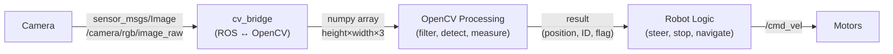

## 6.2 Camera Types

Several types of cameras appear in robotics, each suited to different tasks.

A **standard RGB camera** captures color images — `{r, g, b}` values per pixel. It is the simplest and cheapest option, suitable for color detection, line following, and fiducial recognition. The TurtleBot3 Waffle Pi includes a Raspberry Pi Camera Module V2, which is a standard RGB camera.

A **depth camera** adds a distance measurement per pixel: `{r, g, b, d}`. Depth cameras like the Intel RealSense D435 or Orbbec Astra are useful when you need both visual identification and 3D position — for example, a robot arm reaching for a detected object. They are significantly more expensive and computationally demanding than 2D cameras.

A **stereo camera** uses two lenses separated by a known distance. The disparity between corresponding pixels in the two images encodes depth, similar to human binocular vision. Stereo cameras work without active illumination (unlike many depth cameras) and function outdoors.

A **fisheye or wide-angle camera** captures a wider field of view — up to 180° — at the cost of significant barrel distortion at the image edges. Useful for surveillance and navigation contexts where wide coverage matters.

For this chapter, we work with the standard RGB camera on the TurtleBot3 Waffle Pi.

## 6.3 Images in ROS

Camera images in ROS are published as `sensor_msgs/Image` messages. The primary topic is `/camera/rgb/image_raw`. This topic publishes raw, uncompressed images — each message contains the full pixel data for one frame.

Raw images are large. Over a WiFi link, publishing raw images saturates bandwidth and introduces lag. ROS provides two compressed alternatives:

- `/camera/rgb/image_raw/compressed` — JPEG or PNG compression; much smaller than raw, with slight quality loss
- `/camera/rgb/image_raw/theora` — Theora video codec; even smaller for video streams

For remote development (robot on WiFi, processing on laptop), always subscribe to a compressed topic and decompress locally. For onboard processing (algorithm running on the Raspberry Pi or Jetson), raw topics are fine.

To see what the camera sees:

```bash
rqt_image_view
```

This opens a GUI where you can select any image topic and see a live feed. It is the first thing to run when debugging camera-based code — verify the image looks right before spending time debugging the algorithm.

```bash
ros2 topic hz /camera/rgb/image_raw   # measure frame rate
ros2 topic info /camera/rgb/image_raw # show message type and publishers
```

## 6.4 OpenCV and cv_bridge

OpenCV (`cv2` in Python) is the standard library for computer vision processing. It operates on `numpy` arrays, not on ROS message objects. The bridge between the two worlds is the `cv_bridge` package, which converts `sensor_msgs/Image` messages to `numpy` arrays and back.

A minimal ROS 2 node that receives camera images and processes them:

```python
#!/usr/bin/env python3
import rclpy
from rclpy.node import Node
import cv2
import numpy as np
from sensor_msgs.msg import Image
from cv_bridge import CvBridge

class CameraProcessor(Node):
    def __init__(self):
        super().__init__('camera_processor')
        self.bridge = CvBridge()
        self.create_subscription(Image, '/camera/rgb/image_raw',
                                 self.image_callback, 10)

    def image_callback(self, msg):
        # Convert ROS Image message to OpenCV numpy array (BGR format)
        cv_image = self.bridge.imgmsg_to_cv2(msg, desired_encoding='bgr8')
        # cv_image.shape == (height, width, 3)

        # --- your OpenCV processing goes here ---

        # Display (optional, useful for debugging)
        cv2.imshow("Camera", cv_image)
        cv2.waitKey(1)

def main():
    rclpy.init()
    rclpy.spin(CameraProcessor())
    rclpy.shutdown()

if __name__ == '__main__':
    main()
```

Note the encoding: OpenCV uses BGR (blue-green-red) channel order, not RGB. When you index into `cv_image[y, x]`, you get `[blue, green, red]`. This matters when specifying colors — always use BGR order in OpenCV calls, not RGB.

## 6.5 Color Filtering

The most common first step in robot vision is isolating pixels of a specific color. LIDAR detects obstacles regardless of color; vision can select *which* obstacles or features to respond to based on color.

RGB color space is inconvenient for color filtering because a given color (say, "yellow") corresponds to many different `{r, g, b}` combinations depending on lighting. In bright light, yellow is a large value; in shadow, it is small. The *hue* (what color it is) and the *brightness* (how much light there is) are tangled together.

**HSV (Hue-Saturation-Value)** separates hue from brightness. Hue is a single number (0–179 in OpenCV) representing the color angle on the color wheel, independent of lighting. Saturation measures color purity. Value measures brightness. For color filtering, you set a hue range and accept a wide range of saturation and value — this gives you a filter that recognizes a color across a range of lighting conditions.

```python
# Convert BGR image to HSV
hsv = cv2.cvtColor(cv_image, cv2.COLOR_BGR2HSV)

# Define yellow range in HSV
# Hue: 20–40 (yellow on the 0–179 OpenCV hue scale)
# Saturation: wide range to accept various lighting
# Value: wide range to accept dim and bright
lower_yellow = np.array([20,  50,  50])
upper_yellow = np.array([40, 255, 255])

# Create binary mask: 255 where color matches, 0 elsewhere
mask = cv2.inRange(hsv, lower_yellow, upper_yellow)
```

The result is a binary image: white (255) pixels are yellow, black (0) pixels are not. You can visualize this mask with `cv2.imshow("mask", mask)`.

Color thresholds must always be tuned for the specific environment. The values above work under typical indoor fluorescent lighting; sunlight and incandescent lighting shift the hue significantly. When deploying a vision-based robot, always test under actual operating conditions and retune if needed.

## 6.6 Finding the Centroid

Once you have a binary mask, you often need to know *where* the matching pixels are — specifically, the center of mass, called the **centroid**. For a line-following robot, the centroid of the line tells you whether the line is to the left or right of center, which tells you how to steer.

OpenCV computes image moments — statistical summaries of pixel distributions — with `cv2.moments()`. The centroid follows from the first-order moments:

```python
M = cv2.moments(mask)

if M['m00'] > 0:  # m00 is the total white pixel area — check nonzero
    cx = int(M['m10'] / M['m00'])  # centroid x coordinate
    cy = int(M['m01'] / M['m00'])  # centroid y coordinate

    # Draw centroid for debugging
    cv2.circle(cv_image, (cx, cy), 10, (0, 0, 255), -1)
else:
    cx, cy = None, None  # no yellow pixels found
```

`cx` is the horizontal position of the centroid in the image (0 = left edge, image_width = right edge). If `cx` is less than `image_width / 2`, the yellow line is to the left of the robot's view. If it is greater, the line is to the right. This directly encodes the steering error.

## 6.7 Line Following

Line following brings together everything in this chapter: get an image, filter by color, find the centroid, and compute a steering command. It is a complete perception-to-action pipeline.

```mermaid
graph LR
    CAM["Camera<br/>/camera/rgb/image_raw"] -->|"Image"| CB["cv_bridge<br/>imgmsg_to_cv2"]
    CB -->|"BGR array"| HSV["Convert to HSV<br/>cv2.cvtColor"]
    HSV -->|"HSV array"| MASK["Color Mask<br/>cv2.inRange"]
    MASK -->|"binary image"| CROP["Crop to<br/>bottom strip"]
    CROP -->|"strip"| MOM["Moments →<br/>centroid cx"]
    MOM -->|"cx"| ERR["error =<br/>cx − width/2"]
    ERR -->|"error"| CTRL["P-controller<br/>angular_z = −Kp·error"]
    CTRL -->|"Twist"| MOTORS["/cmd_vel"]
```

The crop step (working only with the bottom strip of the image) focuses the centroid computation on the part of the image closest to the robot, where the line is most relevant for immediate steering.

Full implementation:

```python
#!/usr/bin/env python3
import rclpy
from rclpy.node import Node
import cv2
import numpy as np
from sensor_msgs.msg import Image
from geometry_msgs.msg import Twist
from cv_bridge import CvBridge

KP            = 1.0 / 320   # proportional gain (tune this)
FORWARD_SPEED = 0.15         # m/s

class LineFollower(Node):
    def __init__(self):
        super().__init__('line_follower')
        self.bridge = CvBridge()
        self.cmd_pub = self.create_publisher(Twist, '/cmd_vel', 1)
        self.create_subscription(Image, '/camera/rgb/image_raw',
                                 self.image_callback, 10)

    def image_callback(self, msg):
        cv_image = self.bridge.imgmsg_to_cv2(msg, desired_encoding='bgr8')
        h, w = cv_image.shape[:2]

        # Work only with the bottom 20% of the image
        strip = cv_image[int(0.8 * h):h, :]

        # Color filter: yellow in HSV
        hsv = cv2.cvtColor(strip, cv2.COLOR_BGR2HSV)
        mask = cv2.inRange(hsv,
                           np.array([20,  50,  50]),
                           np.array([40, 255, 255]))

        # Find centroid
        M = cv2.moments(mask)
        twist = Twist()

        if M['m00'] > 0:
            cx = int(M['m10'] / M['m00'])
            error = cx - w / 2          # positive = line is right of center
            twist.linear.x = FORWARD_SPEED
            twist.angular.z = -KP * error   # steer toward line
        else:
            # No line detected — stop
            twist.linear.x = 0.0
            twist.angular.z = 0.0

        self.cmd_pub.publish(twist)

def main():
    rclpy.init()
    rclpy.spin(LineFollower())
    rclpy.shutdown()

if __name__ == '__main__':
    main()
```

This is a **proportional controller** (P-controller): the steering correction is proportional to the error. When the line is far to the right, the robot turns sharply right. When the line is nearly centered, it turns gently. The gain `KP` controls how aggressively the robot reacts. Too high and it oscillates; too low and it drifts off before correcting. Chapter 14 covers PID control in detail — adding integral and derivative terms produces smoother, more robust line following.

## 6.8 Fiducial Markers

Color filtering works when the environment is controlled, but it is fragile: a yellow floor tile breaks a yellow-line follower, and changing lighting shifts the color thresholds. **Fiducial markers** are a more robust alternative for situations where you need to reliably identify specific locations or objects.

A fiducial is a printed pattern designed specifically for machine recognition. Each marker has a unique binary ID encoded in its pattern. A vision algorithm can detect the marker, decode its ID, and — because the marker's physical size is known — compute its precise 3D position and orientation relative to the camera.

The two most widely used fiducial systems in ROS robotics are:

**ArUco markers** — developed at the University of Córdoba, integrated into OpenCV. The `aruco_detect` ROS package detects ArUco markers and publishes their poses as `fiducial_msgs/FiducialTransformArray` messages.

**AprilTags** — developed at the University of Michigan, widely used in research robotics. The `apriltag_ros` package provides full ROS integration.

Both systems work in varied lighting, from multiple distances, and at moderate angles. They provide sub-centimeter position accuracy at close range. Typical uses in robot applications include: labeling goal locations the robot should navigate to, providing absolute position references to correct odometry drift, enabling visual docking, and coordinating multi-robot systems where robots need to recognize each other.

```bash
# Launch ArUco detection (ROS 2 — aruco_opencv or similar package)
ros2 launch aruco_opencv aruco_opencv.launch.py

# View detected fiducials
ros2 topic echo /fiducial_transforms
```

> **Note:** The ROS 1 `aruco_detect` package has ROS 2 equivalents including `aruco_opencv` and `ros2_aruco`. Check the current package availability for your ROS 2 distribution (Humble, Jazzy, etc.) before installing.

## 6.9 Practical Considerations

Several practical issues affect vision-based robot code in ways that are easy to underestimate.

**Bandwidth.** Raw image topics should only be used for local processing. Over WiFi, always subscribe to `/compressed` and use `CompressedImage` messages. The `cv_bridge` package handles compressed images as well as raw ones.

**Latency.** Each step in the vision pipeline adds delay: camera capture, serialization, network transmission, deserialization, processing, motor command publication. For a line-following robot moving at 0.15 m/s, even 200ms of total pipeline latency corresponds to 3cm of travel between sense and response. If the robot oscillates or overshoots, latency is often a contributor. Measure pipeline latency with `ros2 topic delay /camera/rgb/image_raw` and optimize the bottlenecks.

**Lighting.** Vision algorithms are sensitive to lighting in ways that no amount of careful code can fully compensate for. When your robot works in the lab but fails in the hallway, lighting is usually the reason. Test under actual operating conditions. Build tuning tools (sliders for HSV thresholds, live mask display) so you can adjust quickly.

**Resolution.** Higher resolution gives more detail but more computation. For line following and color detection, 320×240 is often sufficient and runs comfortably on a Raspberry Pi. For fiducial detection at distance, higher resolution helps. Profile your pipeline before committing to a resolution.

**Debugging.** The most important tool is `cv2.imshow()` — display the image, the HSV conversion, the mask, and any intermediate results at every stage. When an algorithm fails, visual inspection of intermediate images reveals the problem far faster than reading numbers.

---

*Previous: [Chapter 5: Working with LIDAR](ch05_lidar.md)*
*Next: [Chapter 7: ROS Introduction](ch07_ros_introduction.md)*
