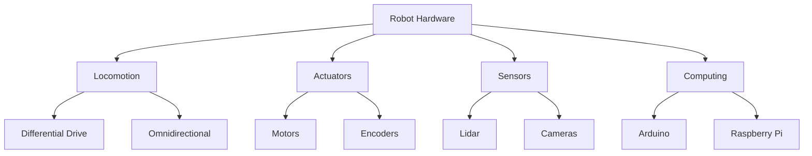

# Chapter 2: Robot Hardware

## 2.1 Overview of Robot Hardware
Every robot, regardless of its application, is built around four key subsystems: **locomotion** (wheels, legs, or other means of movement), **actuation** (motors, arms, and the mechanisms that produce force), **sensing** (cameras, lidar, encoders, and other devices that perceive the environment), and **computing** (the microcontrollers and single-board computers that process information and issue commands). Each subsystem has both a physical hardware component and a software representation, and they work together to enable a robot to operate autonomously in the real world.

---

## 2.2 Locomotion Types
### Holonomic vs. Non-Holonomic
A robot is described as **holonomic** if it can move instantaneously in any direction, regardless of its current heading — omnidirectional robots with specially designed wheels fall into this category. A **non-holonomic** robot, by contrast, has constraints on the directions it can move at any given moment; a car is the canonical example, since it cannot slide sideways. The number of independent movements a robot can make is captured by its **degrees of freedom (DoF)**: a robot operating in a flat 2-D plane has three possible DoF (x translation, y translation, and rotation), but a non-holonomic robot may only be able to control two of them directly.

### Differential Drive
The differential-drive configuration is by far the most common layout for small mobile robots — TurtleBot3 and mBot both use it. The platform has two independently powered drive wheels mounted on the same axle, plus one or two passive casters for stability. Steering is achieved purely by varying the relative speeds of the two wheels: equal speeds produce straight-line motion, opposite speeds cause the robot to pivot in place, and intermediate combinations produce arcs of varying radii.

### Four-Wheeled and Other Vehicles
Beyond differential drive, several other locomotion designs appear in practice. **Skid-steering** uses four wheels (or continuous tracks) where the left and right sides are driven independently, producing turns through wheel-speed differences, similar in principle to a tank. **Ackermann steering** mirrors conventional car geometry, with front wheels that angle around a common turning center — it is mechanically more complex but rolls more naturally on smooth surfaces. **Mecanum wheels**, with angled rollers around their circumference, allow full holonomic motion, enabling a robot to translate sideways without rotating. Finally, **quadrupeds** move on four legs and require careful coordination of gait patterns — trot, gallop, and others — to remain stable across varied terrain.

---

## 2.3 Actuators and Manipulators
The motors that drive a robot's wheels and joints come in several varieties — DC motors for continuous rotation, servo motors for precise angular positioning, stepper motors for open-loop step-count control, and smart motors such as the Dynamixel series that combine a motor, gearbox, encoder, and network interface in a single unit. Motor controllers sit between the computing platform and the motors, translating speed and direction commands into the appropriate electrical signals. **Encoders** attached to each wheel or joint measure rotation, providing the feedback that makes closed-loop velocity and position control possible. When a robot must interact with objects rather than just navigate around them, it gains one or more **manipulators** — articulated arms composed of rigid links connected by revolute or prismatic joints, often ending in a gripper. The geometry of these joints and links is formally described in a **URDF** (Unified Robot Description Format) file, which ROS 2 uses to maintain the robot's kinematic model ([URDF documentation](https://docs.ros.org/en/rolling/Tutorials/Intermediate/URDF/URDF-Main.html)).

---

## 2.4 Sensors
### Lidar
A **lidar** sensor emits a rotating laser beam and measures the time each pulse takes to return from a nearby surface, building up a distance map of the surroundings. The sensors used on most classroom robots produce a **2-D scan** — a 360-degree ring of distance readings in a single horizontal plane — rather than a full 3-D point cloud. ROS 2 publishes these measurements on the `/scan` topic as [`LaserScan`](https://docs.ros2.org/latest/api/sensor_msgs/msg/LaserScan.html) messages, making them straightforward to consume from any node. A representative low-cost unit is the [YDLIDAR X4](https://www.ydlidar.com/products/view/5.html). For practical techniques for working with scan data — filtering noise, detecting obstacles, and building maps — see [Chapter 5: Working with LIDAR](chapter5_lidar.md).

### Visual Cameras
A standard webcam delivers a continuous stream of color images, each represented internally as a matrix of RGB pixel values. In ROS 2 this data arrives as `sensor_msgs/Image` messages and is most commonly processed with [OpenCV](https://opencv.org/), which provides a broad library of image-processing algorithms. **Depth cameras** (such as the Microsoft Kinect or Intel RealSense) go further by combining a color image with a per-pixel distance estimate, enabling the robot to perceive the three-dimensional structure of its environment. Image processing and computer vision techniques — line detection, feature extraction, fiducial markers — are covered in depth in [Chapter 6: Computer Vision](chapter6_computer_vision.md).

---

## 2.5 Computing Platforms
Robot computing generally involves at least two layers of hardware. **Microcontrollers** such as Arduino, the MCore board used in mBot, and the OpenCR board used in TurtleBot3 handle time-critical, low-level tasks: reading encoder ticks, sending PWM signals to motor drivers, and polling simple sensors at high frequency. Above that sits a **single-board computer** — commonly a Raspberry Pi or BeagleBone — that runs a full Linux operating system and the ROS 2 middleware stack, handling higher-level reasoning, sensor fusion, and network communication. Because ROS 2 is designed as a distributed system, nodes can be spread across multiple devices: the robot's onboard Raspberry Pi may run navigation and sensor drivers while a more powerful laptop handles perception or visualization, all communicating transparently over the network. This architecture is explored further in [Chapter 3: Robot Software Architecture](chapter3_software_arch.md#32-distributed-systems-in-robotics).

### Example: mBot
The mBot educational robot is built around Makeblock's **MCore** board, which integrates an Arduino Uno-compatible microcontroller with a dual motor controller, sensor ports, RGB LEDs, a buzzer, and a radio transceiver on a single PCB. This tight integration makes it easy to get motors and sensors running with minimal wiring, which is why it serves as a convenient first platform for learning basic robotics concepts. Full hardware details are available at the [MCore information page](http://blog.hmpg.net/2016/04/makeblock-mcore-information.html).

### Example: TurtleBot3
The TurtleBot3 is the reference platform used throughout this course. It carries two Dynamixel smart motors driving its differential-drive wheel pair, with a single passive caster at the rear. An **OpenCR** board (Arduino-compatible, with a built-in IMU) handles low-level motor control and sensor I/O, while a **Raspberry Pi** running Ubuntu and ROS 2 manages higher-level computation and communicates with a student laptop over Wi-Fi. Comprehensive hardware documentation is available in the [Robotis TurtleBot3 Manual](https://emanual.robotis.com/docs/en/platform/turtlebot3/overview/), and software setup is described in the [TurtleBot3 ROS 2 Quick Start](https://emanual.robotis.com/docs/en/platform/turtlebot3/quick-start/).

---

## 2.6 Simulators
- Software to simulate robots and environments
- **Gazebo:** Full 3D simulation and visualization. See [Gazebo with ROS 2](https://docs.ros.org/en/rolling/Tutorials/Advanced/Simulators/Gazebo/Gazebo.html).
- **RViz2:** 3D visualization (not a simulator). See [RViz2 documentation](https://docs.ros.org/en/rolling/Tutorials/Intermediate/RViz/RViz-User-Guide/RViz-User-Guide.html).

---

## 2.7 Diagrams

---

## Assignments

The following assignments relate to the hardware topics in this chapter:

- **Lab 3:** Work with real robots
- **Mini-PA: URDF** (Lab 10) — Create and test a URDF for your project robot

## 2.8 Further Reading
- [Robotis TurtleBot3 Manual](https://emanual.robotis.com/docs/en/platform/turtlebot3/overview/)
- [TurtleBot3 ROS 2 Quick Start](https://emanual.robotis.com/docs/en/platform/turtlebot3/quick-start/)
- [YDLIDAR X4](https://www.ydlidar.com/products/view/5.html)
- [URDF documentation](https://docs.ros.org/en/rolling/Tutorials/Intermediate/URDF/URDF-Main.html)
- [LaserScan msg](https://docs.ros2.org/latest/api/sensor_msgs/msg/LaserScan.html)
- [ROS 2 tf2 (coordinate frames)](https://docs.ros.org/en/rolling/Concepts/Intermediate/About-Tf2.html)

---

*This chapter is based solely on classroom source materials. All links and diagrams are for educational use.*

> **Disclaimer:** This content was generated from classroom source materials by an AI assistant. Errors may be present — please report any to [pitosalas@gmail.com](mailto:pitosalas@gmail.com).
