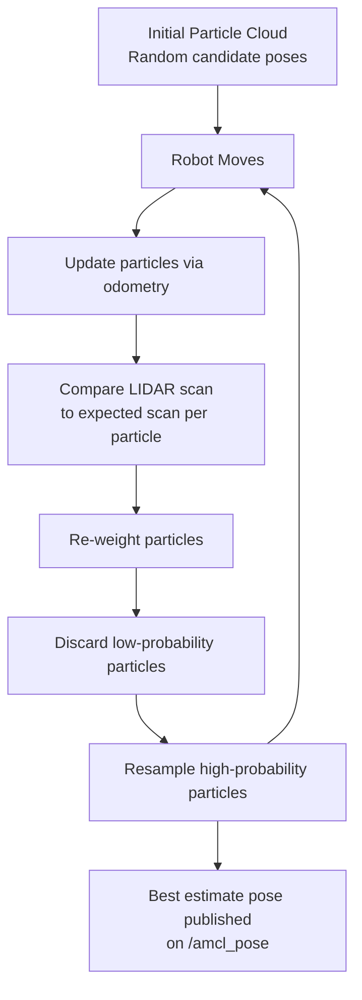
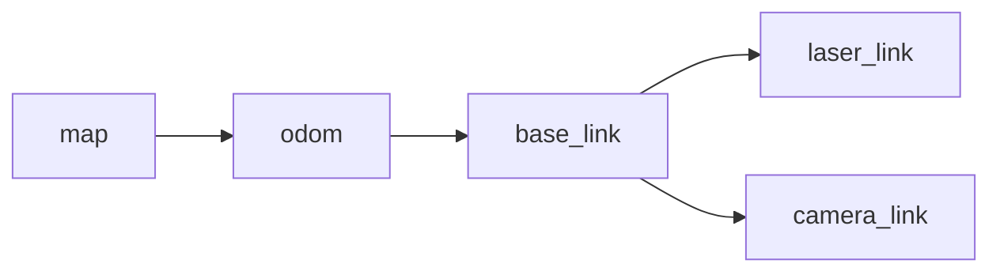

# Chapter 7: Localization and Mapping

← [Chapter 6: Computer Vision](chapter6_computer_vision.md) | [Chapter 8: Planning and Navigation](chapter8_navigation.md) →

---

## 7.1 The Problem of Knowing Where You Are

Imagine walking through an unfamiliar building with your eyes closed. You know where you started, and you can count your steps and feel yourself turn — but with every step, your mental model of your position drifts a little further from reality. Bump into a wall, misjudge a turn, or simply take uneven strides, and before long you are genuinely lost. This is the situation a mobile robot faces every moment of its operation.

A robot navigating through the world must maintain a continuous estimate of its own position. In two-dimensional mobile robotics, this is called the **pose**, represented as a triple *(x, y, θ)*: two coordinates locating the robot on the floor plane and one angle describing which way it is facing. That pose must be expressed relative to some fixed coordinate frame — typically the origin of a known map — so that when the robot is commanded to go to a particular location, it can compute a path from where it currently is.

The most straightforward way to estimate pose is **odometry**, also called dead reckoning. The robot tracks how much each wheel has rotated and integrates those measurements over time to compute how far it has moved and in which direction. This works well over short distances and short times, but odometry error is cumulative: small inaccuracies in wheel encoder readings, slight wheel slippage on the floor, and tiny mismatches in wheel diameter all add up. A robot relying on odometry alone will eventually be confidently wrong about where it is — certain it is standing in the middle of the hallway when it is actually wedged against the wall.

Solving this problem well is the central challenge of mobile robot navigation. The field has converged on two complementary techniques. When no map of the environment is available, the robot must build one while simultaneously figuring out where it is — a "chicken-and-egg" problem known as **SLAM** (Simultaneous Localization and Mapping). When a map already exists, the robot can use it to correct its drifting odometry estimate, a process called **localization**. Both techniques, and the data structures that support them, are the subject of this chapter.

---

## 7.2 Maps in ROS 2

Before a robot can localize, it needs a map. In 2D mobile robotics the standard map format is the **occupancy grid**: a regular grid of cells laid over the floor plane, where each cell stores one of three values. A black cell is *occupied* — there is a wall or obstacle there. A white cell is *free* — the robot can drive through it. A grey cell is *unknown* — no sensor data has reached that region yet.

ROS 2 represents occupancy grids on the `/map` topic as `nav_msgs/OccupancyGrid` messages, but the persistent on-disk format is simpler: a standard grayscale image file (`.pgm`) paired with a small YAML configuration file that describes how to interpret the image. The image pixels encode occupancy values, and the YAML file supplies the metadata needed to place the image correctly in the real world.

```yaml
# contents of mymap.yaml
image: map.pgm
resolution: 0.1
origin: [0.0, 0.0, 0.0]
occupied_thresh: 0.65
free_thresh: 0.196
negate: 1
```

The `resolution` field states how many meters each pixel represents — here, 0.1 m/pixel, so each pixel covers a 10 cm × 10 cm square of floor. The `origin` gives the real-world coordinates of the lower-left corner of the image (in meters), which anchors the grid to a global coordinate frame. The `occupied_thresh` and `free_thresh` fields define the probability thresholds that determine whether a cell is treated as occupied or free; cells whose probability falls between the two thresholds are treated as unknown. The `negate` field flips the interpretation of pixel brightness — when set to 1, dark pixels mean free space and light pixels mean walls, which is a common convention in some mapping tools.

The [ROS 2 `nav2_map_server`](https://docs.ros.org/en/rolling/p/nav2_map_server/) package handles loading this file at launch time and publishing the map on the `/map` topic for other nodes to consume. The map server also provides a service interface so that nodes can request the map programmatically at runtime.

---

## 7.3 Building Maps with SLAM

When deploying a robot in a new space, there is no map to load. The robot must survey its environment, and that survey must happen while the robot is moving — because a stationary robot cannot see around corners or into unexplored corridors. The technical term for this coupled problem is **SLAM: Simultaneous Localization and Mapping**. SLAM algorithms use incoming sensor data to extend a growing map, and they use that same growing map to refine the robot's estimate of its own location within it. The two sub-problems are deeply intertwined.

In ROS 2, the standard package for 2D LIDAR-based SLAM is [SLAM Toolbox](https://docs.ros.org/en/rolling/p/slam_toolbox/). It replaces the older `gmapping` package that was widely used in ROS 1. SLAM Toolbox subscribes to the robot's laser scan topic (`/scan`) and its odometry topic (`/odom`). As the robot moves, SLAM Toolbox accumulates scan data, detects loop closures (the moment the robot revisits a previously-mapped area and can correct accumulated drift), and publishes a continuously updated occupancy grid on the `/map` topic.

A typical SLAM session involves three terminals running in parallel. In the first terminal, a Gazebo simulation (or a physical robot) is launched to provide sensor data. In the second, SLAM Toolbox is started. In the third, a teleoperation node lets a human operator drive the robot around the space so that all areas are covered by the LIDAR. When the map looks complete in RViz2, it is saved to disk.

```bash
# Terminal 1: launch Gazebo simulation
ros2 launch turtlebot3_gazebo turtlebot3_stage_4.launch.py

# Terminal 2: launch SLAM Toolbox
ros2 launch slam_toolbox online_async_launch.py

# Terminal 3: teleop to drive the robot and explore the space
ros2 run turtlebot3_teleop teleop_keyboard

# When map looks complete, save it
ros2 run nav2_map_server map_saver_cli -f ~/my_map
```

> **ROS 1 → ROS 2 note:** Source materials for this course were originally written for ROS 1, which used `gmapping` for SLAM and `map_saver` (without the `_cli` suffix) for saving maps. In ROS 2, `gmapping` is replaced by SLAM Toolbox and the save command becomes `map_saver_cli`. The conceptual workflow is identical.

The data flow during a SLAM session is straightforward once you see it laid out:

```mermaid
graph LR
    A[/scan - LIDAR] --> C[SLAM Toolbox]
    B[/odom - Odometry] --> C
    C --> D[/map topic]
    C --> E[Map File .pgm + .yaml]
    D --> F[RViz2 visualization]
```

LIDAR scans and odometry readings flow into SLAM Toolbox continuously. SLAM Toolbox publishes the growing map to RViz2 for real-time monitoring, and at the end of the session the operator saves the finished map to disk as the `.pgm`/`.yaml` pair described in the previous section. That saved map then becomes the input for the localization phase.

The quality of the resulting map depends heavily on how thoroughly the robot covers the space. Dead ends, narrow corridors, and large open rooms with few distinguishing features all cause difficulties. Operators learn to drive slowly, revisit areas from multiple directions, and watch for the telltale signs of drift — walls that suddenly appear at odd angles or corridors that do not close properly — before ending a mapping session.

---

## 7.4 Localization: AMCL

Once a map is available, a new robot session no longer needs to build one — it needs only to figure out where within the existing map it is currently located. This is the **localization** problem, and in ROS 2 it is solved by the [Nav2 AMCL package](https://docs.ros.org/en/rolling/p/nav2_amcl/): **Adaptive Monte Carlo Localization**.

To understand why the approach is called "Monte Carlo," it helps to think about why a simpler approach fails. The intuitive idea would be to maintain a single best-guess pose and update it as new sensor readings arrive. But when the robot is first powered on (or placed in a new location in a known map), there may be many positions that look equally plausible from the first few LIDAR scans — long corridors, symmetric rooms, or locations with few distinguishing features all produce similar scan patterns from multiple candidate poses. A single-hypothesis tracker would commit to one guess immediately and then be unable to recover if that guess was wrong.

AMCL avoids this trap by maintaining a **population of candidate poses**, called *particles*. Each particle represents a hypothesis about where the robot might be: a specific *(x, y, θ)* triple along with a probability weight indicating how consistent that hypothesis is with the observed sensor data. Early in a session, particles are spread broadly across the map. As the robot moves and observes more of the environment, particles that are consistent with the observations accumulate higher weights, while inconsistent particles are discarded and replaced by new samples drawn from around the high-weight survivors.

The update cycle works as follows:

1. **Prediction step.** When the robot moves, each particle is displaced by the same motion, with a small amount of added noise to model the uncertainty in odometry. If the robot drives forward 0.5 m, every particle is shifted 0.5 m forward in its own local direction — but with slight random variations in distance and heading.

2. **Update step.** A new LIDAR scan arrives. For each particle, AMCL simulates what the LIDAR scan *would* look like if the robot were actually at that particle's pose, using the known map. It compares that simulated scan to the real scan and assigns a likelihood score. Particles whose simulated scans match the real scan well receive high weights; those that match poorly receive low weights.

3. **Resampling.** Low-probability particles are discarded. High-probability particles are duplicated with slight variations, focusing the population on the most promising regions of pose space. Over several update cycles the particle cloud converges on the true pose.

4. **Publication.** The weighted mean (or best particle) is published as the robot's estimated pose on the `/amcl_pose` topic, which downstream navigation nodes use for path planning.

The "Adaptive" in AMCL refers to the fact that the number of particles is not fixed: when the robot is well-localized and the particle cloud is tightly clustered, fewer particles are needed. When localization is uncertain — for example, just after startup or after the robot has been picked up and placed elsewhere — more particles are used to maintain broad coverage of pose space.



A practical note for students working with TurtleBot3: AMCL requires an initial pose estimate to be provided before it can converge quickly. In RViz2, the "2D Pose Estimate" tool lets the operator click on the map at approximately where the robot is and drag to indicate its heading. This seeds the particle cloud in the right region and dramatically speeds up convergence. Without this hint, AMCL must spread particles across the entire map and convergence can take several minutes of driving.

---

## 7.5 Fiducial Localization

LIDAR-based localization assumes that the robot's environment has been pre-mapped and that the LIDAR scan of the current environment is meaningfully similar to the stored map — an assumption that breaks down in dynamic environments where furniture moves, doors open and close, or people walk around. An alternative approach uses **fiducial markers**: physically printed tags placed at known locations in the environment.

The [AprilTag](https://april.eecs.umich.edu/software/apriltag) system, introduced in [Chapter 6](chapter6_computer_vision.md#fiducial-markers), is the standard fiducial in ROS 2 robotics. Each AprilTag encodes a unique integer ID in a high-contrast black-and-white pattern. When a camera detects a tag, it can compute the tag's 3D position and orientation relative to the camera using the known physical size of the tag and the camera's calibration parameters.

Fiducial localization inverts this relationship. Instead of asking "where is this tag relative to my camera?", the robot asks "given that I can see tag #42, and I know that tag #42 is mounted at position *(x, y, z)* with orientation *(roll, pitch, yaw)* in the map frame, where must my camera (and therefore my robot body) be in the map frame?" This is a straightforward geometric computation — a coordinate frame transformation — and it provides an absolute pose estimate without any of the accumulated drift that plagues odometry.

Several practical constraints apply. The robot must be able to see at least one fiducial at all times; if tags are spaced too far apart, there will be regions of the environment where the robot has no fiducial in view and must fall back on odometry. Seeing two or more fiducials simultaneously over-constrains the pose estimate and can improve accuracy significantly. Tags must be mounted at consistent heights and angles, printed accurately at known sizes, and illuminated well enough for the camera to detect them reliably.

Fiducial localization is particularly attractive in controlled indoor environments — labs, warehouses, competition arenas — where tags can be placed deliberately. It is less suitable for unstructured or outdoor environments where placing and maintaining tags is impractical. For many classroom and competition scenarios, however, it offers a simpler and more robust alternative to full SLAM.

---

## 7.6 Coordinate Frames and tf2

All of the localization and mapping machinery described in this chapter ultimately produces one thing: a continuously updated answer to the question "where is the robot in the map?" In ROS 2, this answer is not expressed as a single published number but as a **chain of coordinate frame transformations** managed by the `tf2` library.

Understanding `tf2` is essential for working with any ROS 2 navigation stack. The library maintains a tree of named coordinate frames and the geometric transformations between them, updated in real time as the robot moves. Any node can query `tf2` for the current transform between any two frames, and `tf2` will either return it directly (if a direct transform is available) or compose transforms along the path through the tree.

For mobile robot navigation, the relevant frames are:

- **`map`** — The global coordinate frame, fixed to the environment. Its origin is the position that was designated as "zero" when the map was saved. All absolute positions — waypoints, goals, the robot's estimated location — are expressed in this frame.

- **`odom`** — The odometry frame. Its origin is wherever the robot was when odometry was reset (typically at startup). As the robot drives, the `odom → base_link` transform is updated by the odometry node based on wheel encoder data. This transform is smooth but drifts over time — it does not correct for accumulated error.

- **`base_link`** — The robot's body frame, rigidly attached to the robot's center. All sensors and actuators are described relative to `base_link`.

- **`laser_link`** / **`camera_link`** — Sensor-specific frames describing the position and orientation of each sensor relative to `base_link`. The LIDAR scan data arrives in `laser_link`; knowing the fixed transform from `laser_link` to `base_link` lets the navigation stack interpret scan data correctly regardless of where on the robot the LIDAR is mounted.

AMCL's role in this picture is to publish the **`map → odom`** transform. This transform represents the correction between the drifting odometry frame and the true map frame. It is AMCL's running estimate of how far odometry has drifted from reality. All other transforms in the chain are either fixed (sensor mounts) or updated by the odometry node. By publishing `map → odom`, AMCL allows any node to query `tf2` for the robot's true location in the map frame.



This frame chain has a pleasant consequence: sensor data is automatically expressed in the right frame for any consumer. A navigation node that wants to know where an obstacle is in map coordinates can ask `tf2` to transform the obstacle's position from `laser_link` (where the LIDAR reported it) to `map`, and `tf2` will compose all the intermediate transforms automatically.

For a deeper dive into `tf2`, including how to write nodes that listen for and broadcast transforms, see the official [ROS 2 tf2 documentation](https://docs.ros.org/en/rolling/Concepts/Intermediate/About-Tf2.html).

---

## 7.7 Summary

Localization and mapping are the foundational infrastructure on which all autonomous robot navigation rests. A robot that does not know where it is cannot plan a path to where it needs to go.

Maps in ROS 2 are occupancy grids: 2D arrays of cells encoding free space, obstacles, and unknown regions, stored on disk as `.pgm` image files paired with YAML metadata. When no map exists, SLAM Toolbox builds one by fusing LIDAR scans and odometry in real time as the robot explores its environment. When a map is available, AMCL localizes the robot within it using a particle filter: a population of candidate poses that is iteratively reweighted based on how well each candidate explains incoming LIDAR data. An alternative approach uses AprilTag fiducials to provide absolute pose estimates without a LIDAR map. All of these systems communicate through ROS 2's `tf2` coordinate frame library, which maintains the `map → odom → base_link` transform chain that every navigation component relies on.

With a working map and a reliable localization estimate in hand, a robot is ready to plan and execute paths to specific goals. That is the subject of [Chapter 8: Planning and Navigation](chapter8_navigation.md).

---

## Assignments

- **HW: TF2 Tutorial Extension** — Work through the official [ROS 2 tf2 tutorials](https://docs.ros.org/en/rolling/Tutorials/Intermediate/Tf2/Tf2-Main.html) and then extend the final tutorial to broadcast a third frame that moves relative to `turtle2` over time. Visualize the result in RViz2 and submit a screen recording. See also [Appendix A: Homework Assignments](chapter10_homework.md).

- **Lab: SLAM Mapping Session** — Using TurtleBot3 in Gazebo (or a physical robot if available), run a full SLAM session on `turtlebot3_stage_4`. Save the resulting map and annotate a screenshot identifying at least three free-space regions, two occupied walls, and one unknown region.

- **Lab: AMCL Localization** — Load the map from the previous lab. Launch Nav2 AMCL, set an initial pose estimate in RViz2, and drive the robot through the map using teleop. Observe how the particle cloud converges. Document what happens to the particle cloud when the robot enters a long symmetric corridor.

---

## 7.8 Further Reading

- [SLAM Toolbox (ROS 2)](https://docs.ros.org/en/rolling/p/slam_toolbox/) — the standard ROS 2 package for 2D LIDAR-based SLAM
- [Nav2 AMCL](https://docs.ros.org/en/rolling/p/nav2_amcl/) — Adaptive Monte Carlo Localization in the Nav2 stack
- [Nav2 map_server](https://docs.ros.org/en/rolling/p/nav2_map_server/) — loading and serving occupancy grid maps
- [tf2 documentation](https://docs.ros.org/en/rolling/Concepts/Intermediate/About-Tf2.html) — coordinate frame management in ROS 2
- [PythonRobotics — reference implementations](https://github.com/AtsushiSakai/PythonRobotics) — clean Python implementations of EKF SLAM, particle filter localization, and related algorithms
- Riisgaard & Blas, ["SLAM for Dummies" (2004)](https://dspace.mit.edu/bitstream/handle/1721.1/36832/16-412JSpring2004/NR/rdonlyres/Aeronautics-and-Astronautics/16-412JSpring2004/A3C5517F-C092-4554-AA43-232DC74609B3/0/1Aslam_blas_report.pdf) — the most accessible introduction to SLAM, directly tied to the concepts in this chapter

### Relevant Papers

- Montemerlo et al., ["FastSLAM: A Factored Solution to the Simultaneous Localization and Mapping Problem"](http://ai.stanford.edu/~koller/Papers/Montemerlo+al:AAAI02.pdf) — the particle-filter SLAM algorithm underlying many modern SLAM systems, including the ideas embodied in SLAM Toolbox
- Thrun, Burgard & Fox, *Probabilistic Robotics* (MIT Press, 2005) — the definitive textbook treatment of both particle filter localization and SLAM; Chapters 4 and 9 are directly relevant to this chapter's content

---

*This chapter is based solely on classroom source materials from the COSI 119a Autonomous Robotics course at Brandeis University and is designed for educational use.*

> **Disclaimer:** This content was generated from classroom source materials by an AI assistant. Errors may be present — please report any to [pitosalas@gmail.com](mailto:pitosalas@gmail.com).
