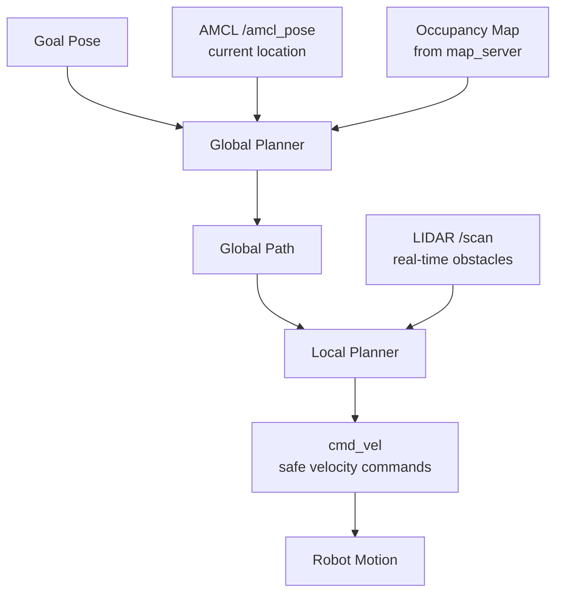
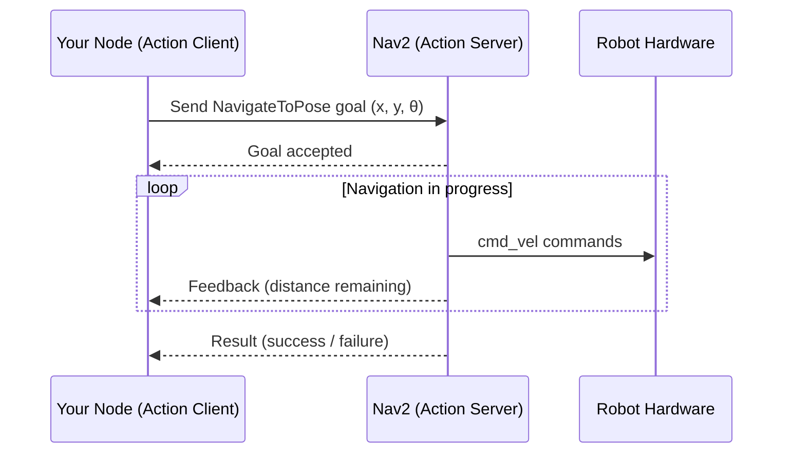
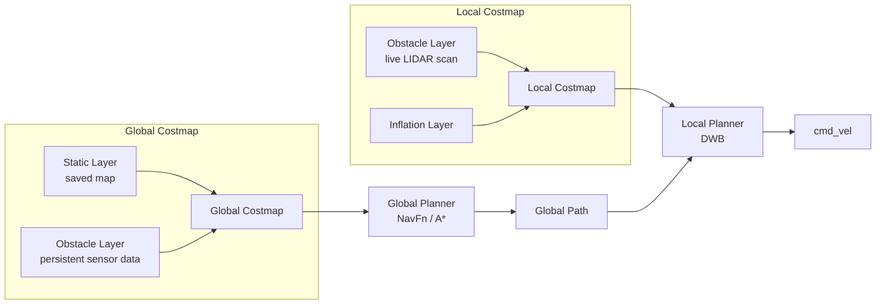
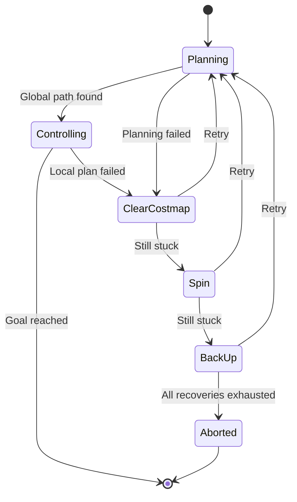

# Chapter 8: Planning and Navigation

← [Chapter 7: Localization and Mapping](chapter7_localization_mapping.md) | [Chapter 9: Robot Behaviors and State Machines](chapter9_behaviors.md) →

---

## 8.1 What is Navigation?

Navigation is the problem of getting a robot from where it is to where it needs to be — reliably, safely, and efficiently. This deceptively simple goal turns out to require combining most of what the previous chapters have covered: LIDAR sensing ([Chapter 5](chapter5_lidar.md)), localization and maps ([Chapter 7](chapter7_localization_mapping.md)), and coordinate transforms (tf2). Navigation also introduces a new challenge on top of all that sensing and localization work: *planning*. Given a map, a current pose (from AMCL), and a goal pose, what sequence of motions should the robot execute to reach that goal without crashing into anything?

A human navigating a building uses a combination of a remembered floor plan, real-time visual perception, and reactive motor skills — slowing down when a hallway is crowded, re-routing when a door is locked, freezing when a child runs across the path. A mobile robot must do something analogous. It needs to plan a route through known free space on the map, while simultaneously reacting to obstacles that were not on the map (a box left in the corridor, a person walking by). Navigation is therefore both a *deliberative* task (think ahead, compute a route) and a *reactive* one (respond immediately to the environment).

This chapter works through how ROS 2 and the Nav2 stack approach this layered problem.

---

## 8.2 Path Planning Concepts

Before diving into the Nav2 implementation, it helps to understand the conceptual pieces that any navigation system must assemble.

### What the Robot Needs to Know

For a robot to plan a path, it needs several things to be true simultaneously:

1. **A coordinate system** — a consistent reference frame, typically the `map` frame, so that poses can be specified meaningfully. The tf2 library (see [Chapter 3](chapter3_software_arch.md)) manages the chain of transforms from `map` → `odom` → `base_link`.
2. **A map** — a representation of which areas of the environment are free and which are occupied by obstacles. Chapter 7 covered how SLAM produces this map.
3. **Localization** — an estimate of where the robot currently is within that map. AMCL provides a probabilistic pose estimate in the `map` frame.
4. **Real-time sensing** — live data from LIDAR or cameras to detect obstacles that were not present when the map was made.

Without any one of these, path planning is either impossible or unsafe. If the robot does not know where it is, it cannot know whether its planned path is valid. If it has no map, it has no basis for planning at all. If it has no live sensing, it will drive into obstacles that appeared after the map was built.

### Two Ways to Represent the World

Two broad families of map representation are used in robotics navigation:

**Topological (graph-based) maps** represent the environment as a graph: nodes are meaningful places (intersections, rooms, landmarks) and edges connect pairs of places that can be traversed directly, often annotated with a cost (distance, expected travel time, or risk). Route planning on a topological map reduces to a classic graph-search problem. Dijkstra's algorithm finds the shortest path by total edge cost; A* adds a heuristic estimate of remaining distance to search more efficiently. Topological maps are compact and computationally cheap, and they scale well to large environments like road networks. Their weakness is that they do not encode fine-grained geometry, so they cannot easily represent the exact shape of a corridor or guide a robot around a chair.

**Metric (occupancy grid) maps** represent the world as a dense 2D grid of cells, each of which records a probability of being occupied. The map produced by SLAM (Chapter 7) is an occupancy grid. Metric maps capture precise geometry: the robot can see exactly how wide a doorway is, how close it can pass to a wall, and whether a gap between two obstacles is large enough to fit through. Path planning on an occupancy grid is more computationally demanding because the search space is much larger, but the paths it produces are geometrically precise. The ROS 2 navigation stack works primarily with occupancy grid maps.

### The Two-Layer Planning Architecture

Modern robot navigation systems, including ROS 2's Nav2 stack, decompose the planning problem into two layers that operate at different timescales:

**Global planner:** Given the full occupancy grid map and the robot's current pose from AMCL, the global planner computes a complete route from the robot's current location to the goal. This is a deliberative computation: it examines the entire map, applies a search algorithm (typically a variant of A* or Dijkstra's on the grid), and returns a sequence of waypoints through known free space. The global plan is computed once when a new goal arrives, and recomputed if the robot diverges significantly from it.

**Local planner:** The local planner operates continuously at high frequency (typically 20–50 Hz). It takes the global plan as a reference and uses real-time LIDAR data to generate safe velocity commands (`cmd_vel`) for the robot at each timestep. It works only within a small local window around the robot — the *local costmap* — and it handles obstacles that are not on the global map: moving people, boxes left in the hall, a door that has been closed. The local planner must ensure that the robot tracks the global plan while avoiding whatever is in front of it right now.

The classic local planner algorithm in ROS is the **Dynamic Window Approach (DWA)**. DWA samples the space of feasible velocity commands (constrained by the robot's acceleration limits), simulates each command forward in time, scores the resulting trajectories by how well they follow the global plan while avoiding obstacles, and selects the best command. Nav2's default local planner, *DWB*, is a modernized and configurable version of DWA.



This diagram captures the data flow of the two-layer architecture. The global planner is fed by the map and the robot's localized pose; it produces a global path. The local planner is fed by that global path and by live sensor data; it produces velocity commands that drive the robot. Sensors feed both layers, but on very different timescales.

---

## 8.3 Nav2 — The ROS 2 Navigation Stack

The Navigation 2 stack (Nav2) is the canonical ROS 2 framework for autonomous robot navigation. It replaces the ROS 1 `move_base` package and was redesigned from the ground up for ROS 2's lifecycle nodes, action servers, and component-based architecture. See the [Nav2 documentation](https://nav2.ros.org/) for full details.

### The Action Server Interface

Nav2 presents its navigation capability through a ROS 2 *action server*. Actions (see [ROS 2 Actions documentation](https://docs.ros.org/en/rolling/Concepts/Basic/About-Actions.html)) are the right abstraction for long-running tasks that need progress feedback and the ability to be cancelled midway. When your robot program wants to navigate somewhere, it acts as an *action client*: it sends a `NavigateToPose` goal (a target pose in the map frame), then waits. Nav2 plans the route, starts driving, and periodically sends *feedback* (estimated time remaining, current pose). When it arrives (or fails), it sends a *result*. This is much cleaner than the old ROS 1 approach of publishing a goal on a topic and polling a separate status topic.



### Nav2's Major Components

Nav2 is intentionally modular. Each major function is implemented as a separate lifecycle-managed node, and alternative implementations can be swapped in by changing configuration:

| Component | Role |
|---|---|
| `nav2_bt_navigator` | Top-level behavior tree that orchestrates planning, control, and recovery |
| `nav2_planner` | Global planner (default: NavFn / A*) |
| `nav2_controller` | Local planner / controller (default: DWB) |
| `nav2_costmap_2d` | Generates and maintains global and local costmaps |
| `nav2_recoveries` | Recovery behavior plugins (spin, back-up, clear costmap) |
| `nav2_map_server` | Serves a previously-saved occupancy grid map |
| `nav2_amcl` | Localization via AMCL (see Chapter 7) |
| `nav2_lifecycle_manager` | Starts and stops all nodes in the correct order |

The top-level orchestrator in Nav2 is a *behavior tree* — a formalism for structuring complex robot behaviors that Chapter 9 will cover in detail. When a goal arrives, the behavior tree tries the global planner, then hands control to the local planner, and if either fails it invokes recovery behaviors before trying again.

---

## 8.4 Costmaps

An occupancy grid from SLAM records each cell as simply occupied or free. A *costmap* adds nuance: each cell is assigned a numeric cost, where 0 means perfectly free and 254 means lethal (occupied). Cells near obstacles — but not directly on them — receive intermediate costs, implementing an *inflation radius* that represents the robot's footprint. The robot's path planner prefers low-cost cells, automatically keeping the robot away from walls and obstacles even without explicit collision checking. See the [Nav2 Costmap 2D documentation](https://docs.ros.org/en/rolling/p/nav2_costmap_2d/) for configuration details.

Nav2 maintains two independent costmaps, each built from a stack of *layers*:

### Global Costmap

The global costmap covers the entire known map and is used by the global planner. Its layers include:

- **Static layer:** Inflated version of the saved occupancy grid map. Walls and known obstacles from SLAM appear here with their inflation halos.
- **Obstacle layer:** Live sensor data projected onto the global map frame. This allows the global planner to route around large persistent obstacles that have appeared since the map was saved, though it primarily reflects the static map for long-horizon planning.

The global costmap is large (it covers the whole map) but changes slowly. It is typically updated at a low rate.

### Local Costmap

The local costmap covers only a small window around the robot (often 3 × 3 meters or 5 × 5 meters) and is updated at the full sensor rate. It is used by the local planner (DWB) to generate velocity commands. Its obstacle layer is driven directly by the most recent LIDAR scan, so it reflects the true current state of the robot's immediate environment.



The inflation layer computes the cost gradient around obstacles. The cost falls off from 254 (lethal, touching the obstacle) through a configurable `inflation_radius`, reaching 0 in open free space. The exact shape of the falloff (linear, quadratic, or exponential) is configurable and affects how cautiously the robot hugs or avoids walls.

---

## 8.5 Sending a Navigation Goal

Nav2 can be commanded from the command line (using `ros2 action send_goal`), from RViz2's interactive goal-setting tool, or programmatically from another node. The programmatic approach is essential when you want your robot to autonomously decide where to go next — for patrol routes, task-driven navigation, or exploration.

Here is a minimal Python node that sends a `NavigateToPose` action goal to Nav2:

```python
import rclpy
from rclpy.node import Node
from rclpy.action import ActionClient
from nav2_msgs.action import NavigateToPose
from geometry_msgs.msg import PoseStamped

class NavClient(Node):
    def __init__(self):
        super().__init__('nav_client')
        self._client = ActionClient(self, NavigateToPose, 'navigate_to_pose')

    def send_goal(self, x, y):
        goal_msg = NavigateToPose.Goal()
        goal_msg.pose = PoseStamped()
        goal_msg.pose.header.frame_id = 'map'
        goal_msg.pose.header.stamp = self.get_clock().now().to_msg()
        goal_msg.pose.pose.position.x = x
        goal_msg.pose.pose.position.y = y
        # Orientation: facing the positive x direction (yaw = 0)
        goal_msg.pose.pose.orientation.w = 1.0
        self._client.wait_for_server()
        self._send_goal_future = self._client.send_goal_async(
            goal_msg,
            feedback_callback=self.feedback_callback
        )
        self._send_goal_future.add_done_callback(self.goal_response_callback)

    def goal_response_callback(self, future):
        goal_handle = future.result()
        if not goal_handle.accepted:
            self.get_logger().warn('Goal rejected!')
            return
        self.get_logger().info('Goal accepted, navigating...')
        self._result_future = goal_handle.get_result_async()
        self._result_future.add_done_callback(self.result_callback)

    def feedback_callback(self, feedback_msg):
        fb = feedback_msg.feedback
        self.get_logger().info(
            f'Distance remaining: {fb.distance_remaining:.2f} m'
        )

    def result_callback(self, future):
        result = future.result().result
        self.get_logger().info(f'Navigation complete: {result}')

def main():
    rclpy.init()
    node = NavClient()
    node.send_goal(2.0, 1.5)
    rclpy.spin(node)
    rclpy.shutdown()

if __name__ == '__main__':
    main()
```

A few things are worth noting in this example. The `frame_id` is set to `'map'` — all Nav2 goals are specified in the map coordinate frame, not relative to the robot. The orientation uses a quaternion: setting `w = 1.0` with `x = y = z = 0.0` corresponds to facing the positive x-axis (yaw = 0). If you want the robot to arrive facing a different direction, you need to compute the appropriate quaternion (the `transforms3d` or `tf_transformations` library can help).

The `feedback_callback` receives periodic updates while navigation is in progress. This is useful for monitoring, for timeout logic, or for deciding to cancel navigation if the robot has not made progress.

For the full `NavigateToPose` action interface, see the [Nav2 nav2_msgs documentation](https://docs.ros.org/en/rolling/p/nav2_msgs/).

### Sending a Goal from the Command Line

For quick testing, you can send a goal directly without writing any Python:

```bash
ros2 action send_goal /navigate_to_pose nav2_msgs/action/NavigateToPose \
  "{pose: {header: {frame_id: map}, pose: {position: {x: 2.0, y: 1.5, z: 0.0},
   orientation: {w: 1.0}}}}"
```

This is useful when debugging whether Nav2 is running correctly before investing in a full client node.

### Sending Multiple Waypoints

For patrol or multi-point navigation, Nav2 provides the `NavigateThroughPoses` action. It accepts a list of `PoseStamped` waypoints and navigates through each in sequence:

```python
from nav2_msgs.action import NavigateThroughPoses

# Build a list of waypoints
waypoints = []
for (x, y) in [(1.0, 0.0), (2.0, 1.0), (0.0, 2.0)]:
    pose = PoseStamped()
    pose.header.frame_id = 'map'
    pose.pose.position.x = x
    pose.pose.position.y = y
    pose.pose.orientation.w = 1.0
    waypoints.append(pose)

goal_msg = NavigateThroughPoses.Goal()
goal_msg.poses = waypoints
```

---

## 8.6 Recovery Behaviors

Real environments are messy. The robot may get itself into a situation where the local planner cannot find a valid path forward — a narrow gap it cannot fit through, a sensor anomaly that has painted phantom obstacles into the costmap, or a situation where the robot has drifted slightly off-course and its planned path is now blocked. When this happens, Nav2 triggers *recovery behaviors*: a sequence of fallback strategies intended to unstick the robot so it can try again.

The default recovery sequence in Nav2 is:

1. **Clear the local costmap** — Discard all obstacle data in the local costmap and recompute it from the current sensor reading. This removes phantom obstacles from stale data, sensor noise, or reflections that may have caused the planner to believe the path was blocked.
2. **Spin in place** — Rotate 360° to update the robot's sensor coverage and get a fresh view of the local environment. This also helps localization if the robot's AMCL estimate has drifted.
3. **Back up slowly** — Move backward a short distance to escape from a tight corner or a situation where the robot has driven too close to an obstacle.
4. **Wait** — Pause briefly and then retry. In a dynamic environment, a temporarily blocked path (someone walking past) may clear on its own.
5. **Abort** — If all recovery behaviors have been tried and the planner still cannot find a path, Nav2 reports failure to the action client and waits for a new goal.



The recovery behavior sequence is itself implemented as a *behavior tree* inside Nav2. This means it is configurable: you can add your own recovery plugins, reorder the sequence, or change the conditions under which recovery is triggered. [Chapter 9: Robot Behaviors and State Machines](chapter9_behaviors.md) covers behavior trees in detail and explains how Nav2's orchestration logic is structured.

The key insight here is that navigation robustness is not just a matter of having a good planner. A navigation system that gives up the moment it hits an obstacle is not useful in the real world. Recovery behaviors are what transform a fragile planner into a robust navigation system.

---

## 8.7 Navigation in Practice: TurtleBot3

The TurtleBot3 (introduced in [Chapter 2](chapter2_robot_hardware.md)) is the standard development platform for these exercises. Running the full Nav2 stack on a TurtleBot3 requires several components to be active simultaneously:

```mermaid
graph TB
    subgraph Robot Hardware
        LDS[LIDAR sensor<br/>LDS-02] --> ScanTopic["/scan topic"]
        Enc[Wheel encoders] --> OdomTopic["/odom topic"]
        Motors[Drive motors] ← CmdVelTopic["/cmd_vel topic"]
    end
    subgraph Navigation Stack
        ScanTopic --> AMCL
        OdomTopic --> AMCL
        MapServer[map_server<br/>saved .yaml/.pgm] --> AMCL
        MapServer --> GlobalCM[Global Costmap]
        ScanTopic --> LocalCM[Local Costmap]
        AMCL --> GlobalCM
        GlobalCM --> GlobalPlanner[Global Planner<br/>NavFn]
        LocalCM --> LocalPlanner[Local Planner<br/>DWB]
        GlobalPlanner --> LocalPlanner
        LocalPlanner --> CmdVelTopic
    end
```

Launching Nav2 on a TurtleBot3 typically looks like this (after saving a map with SLAM):

```bash
# Terminal 1: Start the robot bringup
ros2 launch turtlebot3_bringup robot.launch.py

# Terminal 2: Launch Nav2 with the saved map
export TURTLEBOT3_MODEL=burger
ros2 launch turtlebot3_navigation2 navigation2.launch.py \
  map:=/path/to/my_map.yaml

# Terminal 3: Launch RViz2 for visualization and goal-setting
ros2 launch nav2_bringup rviz_launch.py
```

In RViz2, you can use the **2D Pose Estimate** tool (the green arrow) to give AMCL an initial pose estimate if localization has not converged automatically, and the **Nav2 Goal** tool (the pink arrow) to click a goal pose on the map and trigger navigation.

---

## 8.8 Limitations and Practical Challenges

No navigation system is perfect, and understanding the failure modes helps you design more robust robot programs:

**Localization drift:** If AMCL's pose estimate is wrong (for instance, because the environment has changed significantly since the map was built, or because the robot has been moved by hand), the global plan will be based on an incorrect starting position. The robot may drive confidently toward a wall because it believes it is somewhere else. Always verify localization with RViz2 before sending navigation goals.

**Dynamic obstacles:** The local planner handles dynamic obstacles reactively, but it has a limited lookahead horizon. A person walking toward the robot from around a corner may not be seen until they are very close. For environments with many dynamic obstacles, more sophisticated planners (such as the MPPI controller in Nav2) or separate pedestrian-aware planning layers may be needed.

**Narrow passages:** Both the global and local planners may struggle with doorways or gaps that are only slightly wider than the robot's footprint. The inflation radius must be tuned carefully: too large, and the planner cannot find paths through narrow spaces; too small, and the robot clips corners.

**Map staleness:** If the physical environment changes significantly after the map was saved — furniture moved, new obstacles added — the global planner may route the robot into obstacles. Periodic re-mapping with SLAM, or using Nav2's dynamic obstacle layers, addresses this.

---

## 8.9 Summary

Navigation in ROS 2 is built from layered components that each solve a piece of the overall problem. A saved occupancy grid map and AMCL localization provide the global context within which the global planner can find a route. The local planner executes that route safely in real time by reacting to live LIDAR data through the local costmap. Nav2 ties everything together through a behavior-tree orchestrated action server interface that handles the full navigation task — including graceful recovery when things go wrong.

The separation between global planning (deliberative, uses the full map, runs once per goal) and local planning (reactive, uses live sensors, runs continuously) is a fundamental architectural pattern in mobile robotics. Understanding this separation makes it easier to diagnose navigation failures: is the robot not finding a path at all (global planner problem), or is it finding a path but then deviating or getting stuck (local planner or localization problem)?

Navigation is also not a leaf skill — it depends on localization ([Chapter 7](chapter7_localization_mapping.md)), sensing ([Chapter 5](chapter5_lidar.md)), and coordinate transforms ([Chapter 3](chapter3_software_arch.md)), and it provides the foundation on which higher-level behaviors ([Chapter 9](chapter9_behaviors.md)) are built.

---

## Assignments

- **PA: Maze Escape!** — Apply navigation and wall-following to escape a maze. Use Nav2's recovery behaviors and, optionally, your own state machine logic to handle dead ends. See [Appendix A: Homework Assignments](chapter10_homework.md) for the full specification.

---

## 8.10 Further Reading

- [Nav2 Documentation](https://nav2.ros.org/) — the authoritative reference for the ROS 2 navigation stack
- [Nav2 Costmap 2D](https://docs.ros.org/en/rolling/p/nav2_costmap_2d/) — costmap configuration and layer plugins
- [Nav2 AMCL](https://docs.ros.org/en/rolling/p/nav2_amcl/) — localization parameters and tuning
- [ROS 2 Actions](https://docs.ros.org/en/rolling/Concepts/Basic/About-Actions.html) — the action communication pattern used by Nav2
- [Nav2 nav2_msgs](https://docs.ros.org/en/rolling/p/nav2_msgs/) — message and action definitions including `NavigateToPose`
- [PythonRobotics — path planning algorithms](https://github.com/AtsushiSakai/PythonRobotics) — well-documented Python implementations of A*, DWA, RRT, and many others; excellent for building intuition
- Fox, Burgard & Thrun, ["The Dynamic Window Approach to Collision Avoidance"](http://www.cs.washington.edu/node/4749) — the foundational paper for the DWA local planner algorithm underlying DWB in Nav2
- Kavraki et al., ["Probabilistic Roadmaps for Path Planning in High-Dimensional Configuration Spaces"](http://www.kavrakilab.org/sites/default/files/kavraki1996prm-high-dim-conf.pdf) — the PRM algorithm for sampling-based global planning
- LaValle, ["Rapidly-Exploring Random Trees: A New Tool for Path Planning"](http://msl.cs.uiuc.edu/~lavalle/papers/Lav98c.pdf) — the RRT algorithm, widely used for high-dimensional planning problems

---

*This chapter is based solely on classroom source materials from the COSI 119a Autonomous Robotics course at Brandeis University and is designed for educational use.*

> **Disclaimer:** This content was generated from classroom source materials by an AI assistant. Errors may be present — please report any to [pitosalas@gmail.com](mailto:pitosalas@gmail.com).
