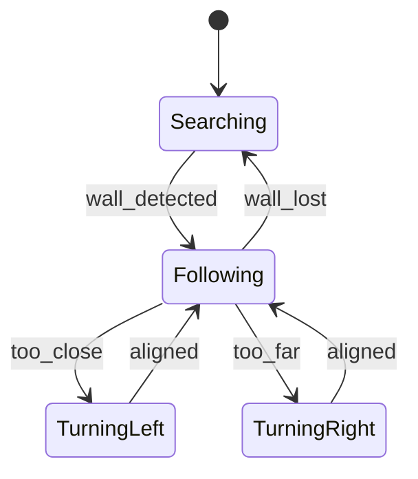
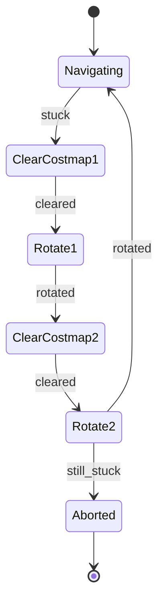
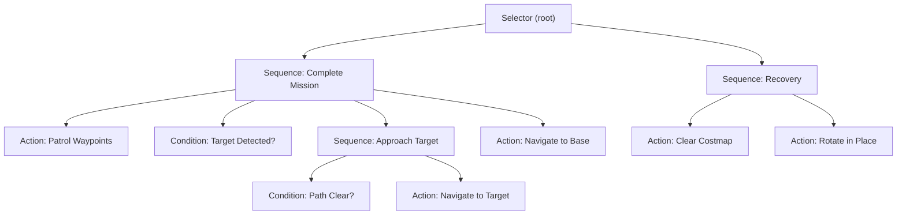
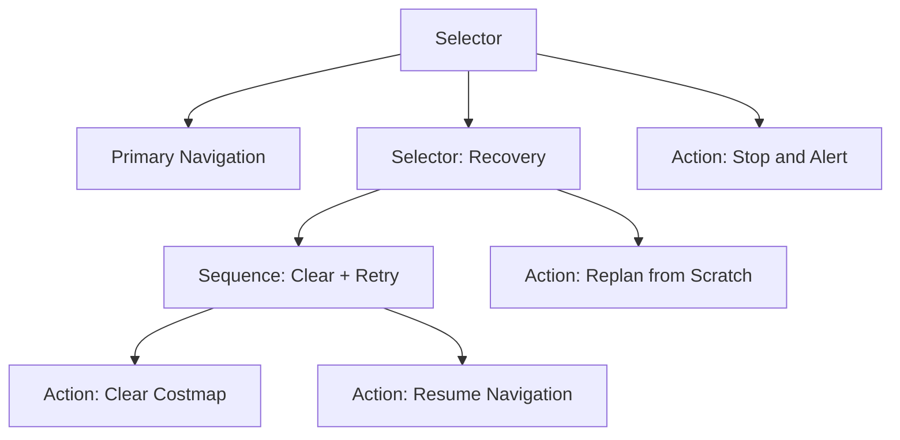
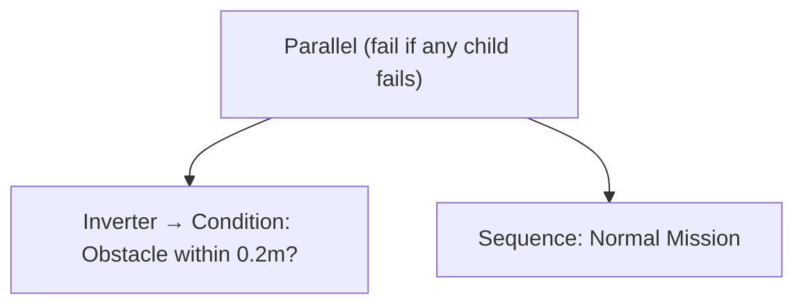

# Chapter 9: Robot Behaviors and State Machines

*This chapter is based on the COSI 119a Autonomous Robotics course at Brandeis University.*

---

## 9.1 What Do We Mean by Behavior?

The simplest robot programs are built around a single loop: sense the environment, decide what to do, act, and repeat. For a robot that only does one thing — drive straight until it hits a wall, then stop — this is sufficient. But real autonomous robots must juggle multiple objectives simultaneously, respond to unexpected events, and recover gracefully from failure.

Consider a delivery robot tasked with patrolling a hallway. It must navigate between waypoints, detect when it has reached its target, approach the target carefully, and then return to base. Along the way it might become stuck behind an obstacle, run low on battery, or lose localization. Each of these situations demands a different response. The robot cannot just run the same loop forever; it needs a structured way to decide *which* behavior is active at any given moment, and how to transition between behaviors.

This chapter covers two complementary and widely-used tools for expressing these multi-step, event-driven behaviors:

1. **Finite State Machines (FSMs):** A classical model from computer science, extremely simple to reason about, and well-suited to small, well-defined behavior sequences.
2. **Behavior Trees (BTs):** A hierarchical model originally developed in game AI, now the dominant approach in production robotics — including the ROS 2 Nav2 navigation stack.

Both tools structure the same insight: a robot's behavior at any moment depends on what *state* it is in, and events cause it to move between states. FSMs make this explicit and flat; Behavior Trees make it hierarchical and composable.

---

## 9.2 Finite State Machines

### What Is an FSM?

A Finite State Machine is a mathematical model of computation defined by:

- A **finite set of named states** — for example, `searching`, `following`, `turning_left`.
- **Transitions** between states, each triggered by an event or condition — for example, "if wall is detected while in `searching`, move to `following`."
- One **initial state** — the state the robot starts in when the FSM is created.
- One or more **final (accepting) states** — states that represent a completed or terminal condition.

At any moment the robot is in exactly one state. When an event occurs, the FSM looks up the appropriate transition and moves to the next state. The current state completely determines how the robot responds to any event.

FSMs underlie many areas of computer science — regular expressions, compiler lexers, and network protocol parsers are all FSMs in disguise. In robotics they are valued for a different reason: they make the control logic **explicit, auditable, and testable**. You can draw the FSM as a diagram, hand it to a colleague, and they can immediately understand what the robot will do in any situation.

### Example: A Wall-Following FSM

As a concrete example, consider a robot that should follow a wall at a fixed distance. Its behavior can be described with four states:

- **Searching:** No wall is currently detected. The robot drives forward slowly, scanning with its LIDAR.
- **Following:** A wall is detected at roughly the correct distance. The robot drives forward parallel to the wall.
- **TurningLeft:** The robot got too close to the wall. It turns left to increase clearance.
- **TurningRight:** The robot drifted too far from the wall. It turns right to close the gap.

The transitions between these states are:

| From | Event | To |
|---|---|---|
| Searching | wall_detected | Following |
| Following | too_close | TurningLeft |
| Following | too_far | TurningRight |
| TurningLeft | aligned | Following |
| TurningRight | aligned | Following |
| Following | wall_lost | Searching |

This is expressed as a state diagram:



Notice how the diagram is completely self-documenting. A reader who has never seen this code can understand the intended behavior in thirty seconds. This is the primary advantage of FSMs for robotics.

### Implementing an FSM in Python

The most direct way to implement an FSM is with a loop and a variable that tracks the current state:

```python
import rclpy
from rclpy.node import Node
from sensor_msgs.msg import LaserScan
from geometry_msgs.msg import Twist

TOO_CLOSE = 0.25   # meters
TOO_FAR   = 0.50   # meters

class WallFollowerNode(Node):
    def __init__(self):
        super().__init__('wall_follower')
        self.state = 'searching'
        self.pub = self.create_publisher(Twist, 'cmd_vel', 10)
        self.create_subscription(LaserScan, 'scan', self.scan_cb, 10)
        self.create_timer(0.1, self.control_loop)
        self.right_dist = float('inf')

    def scan_cb(self, msg):
        # Take the minimum distance in the right 90-degree arc
        right_ranges = msg.ranges[270:360]
        valid = [r for r in right_ranges if 0.05 < r < 5.0]
        self.right_dist = min(valid) if valid else float('inf')

    def control_loop(self):
        twist = Twist()
        d = self.right_dist

        if self.state == 'searching':
            if d < TOO_FAR:
                self.state = 'following'
            else:
                twist.linear.x = 0.15  # drive forward slowly

        elif self.state == 'following':
            if d > TOO_FAR:
                self.state = 'searching'
            elif d < TOO_CLOSE:
                self.state = 'turning_left'
            elif d > TOO_FAR * 0.8:
                self.state = 'turning_right'
            else:
                twist.linear.x = 0.2

        elif self.state == 'turning_left':
            if TOO_CLOSE < d < TOO_FAR:
                self.state = 'following'
            else:
                twist.angular.z = 0.4  # turn left

        elif self.state == 'turning_right':
            if TOO_CLOSE < d < TOO_FAR:
                self.state = 'following'
            else:
                twist.angular.z = -0.4  # turn right

        self.pub.publish(twist)
```

This works, but as the number of states grows the `if/elif` chain becomes unwieldy. A cleaner approach uses the [`transitions`](https://github.com/pytransitions/transitions) library, which provides a declarative FSM API:

```python
from transitions import Machine

class WallFollower:
    states = ['searching', 'following', 'turning_left', 'turning_right']

    def __init__(self):
        self.machine = Machine(
            model=self,
            states=WallFollower.states,
            initial='searching'
        )
        self.machine.add_transition('wall_detected', 'searching',  'following')
        self.machine.add_transition('too_close',     'following',  'turning_left')
        self.machine.add_transition('too_far',       'following',  'turning_right')
        self.machine.add_transition('aligned',
            ['turning_left', 'turning_right'], 'following')
        self.machine.add_transition('wall_lost',     'following',  'searching')

follower = WallFollower()
print(follower.state)    # searching
follower.wall_detected()
print(follower.state)    # following
follower.too_close()
print(follower.state)    # turning_left
follower.aligned()
print(follower.state)    # following
```

The `transitions` library also supports entry and exit callbacks on states, conditions on transitions, and automatic diagram generation. See the [pytransitions documentation](https://github.com/pytransitions/transitions) for details.

### Case Study: Nav2 Recovery Behaviors as an FSM

Nav2's built-in recovery behavior for a stuck robot is itself a state machine. When the planner detects that the robot has not made progress toward its goal for a configurable timeout, it hands control to a recovery sequence. The sequence proceeds through states in order:

1. **ClearCostmap1:** Clear the local costmap (remove stale obstacle data).
2. **Rotate1:** Rotate in place to gather fresh sensor data.
3. **ClearCostmap2:** Clear the costmap again.
4. **Rotate2:** Rotate in place again.
5. **Aborted:** If the robot is still stuck after all recovery steps, declare failure.



This simple sequence — encoded as an FSM inside Nav2's behavior tree (see Section 9.3) — handles many real-world stuck scenarios automatically without any application-level code.

### Limitations of FSMs

FSMs scale poorly. For a robot with many concurrent objectives — navigate, monitor battery, watch for humans, manage the arm, communicate status — the number of states and transitions grows combinatorially. A system with $n$ independent binary conditions can require $2^n$ states. The resulting diagram is unreadable, and adding a new behavior requires touching transitions throughout the entire machine.

FSMs also have no built-in notion of *hierarchy*. If `following` and `turning_left` and `turning_right` all share common behavior (e.g., "keep logging wall distance"), that logic must be duplicated in every state that needs it.

These two problems — combinatorial explosion and lack of modularity — motivated the development of Behavior Trees.

---

## 9.3 Behavior Trees

### Introduction

Behavior Trees (BTs) were invented in the game AI community to manage the behavior of non-player characters, where a single NPC might need to patrol, attack, heal, seek cover, and call for backup — with complex interactions between all these objectives. They have since been adopted widely in industrial robotics, where the same scalability requirements apply.

A Behavior Tree is, as the name says, a **tree**. At the root is a single control node. The leaves are actions and conditions. The internal nodes control the flow of execution. The tree is **ticked** repeatedly at a fixed rate; each tick propagates from the root down through the relevant branches of the tree. Every node, when ticked, returns one of exactly three status values:

- **SUCCESS:** The node completed its task successfully.
- **FAILURE:** The node could not complete its task.
- **RUNNING:** The node is still working; tick it again next cycle.

This uniform interface is what makes BTs composable. Any subtree can be dropped into any position in the tree and the parent node does not need to know what is inside it — it only sees SUCCESS, FAILURE, or RUNNING.

### Node Types

#### Leaf Nodes

Leaf nodes are the "real" nodes — they actually interface with the robot.

**Action nodes** command the robot to do something: publish a velocity command, call a ROS 2 action server, wait for a duration, or write to a parameter server. An action node that controls the robot over time returns RUNNING on each tick until the action is complete (SUCCESS) or has failed (FAILURE).

**Condition nodes** test something about the world or the robot's state: is the LIDAR detecting an obstacle within 0.3 m? Is the battery above 20%? Is the goal reached? A condition node never returns RUNNING — it immediately returns SUCCESS or FAILURE.

Every leaf node has a three-phase lifecycle:

1. **Initialize:** Called the first time the node is ticked after being in a non-RUNNING state. Use this to start an action server call, reset counters, or log entry.
2. **Update:** Called on every tick. Must return SUCCESS, FAILURE, or RUNNING.
3. **Terminate:** Called when the node exits the RUNNING state (whether by completing, failing, or being preempted by the tree). Use this to cancel action server goals or clean up resources.

#### Composite Nodes

Composite nodes are the internal control-flow nodes.

**Sequence** (→): Ticks its children from left to right. Returns SUCCESS only when *all* children succeed in order. If *any* child returns FAILURE, the Sequence immediately returns FAILURE (without ticking the remaining children). If a child returns RUNNING, the Sequence returns RUNNING. Think of a Sequence as "do A, *then* B, *then* C — abort if any step fails."

**Selector** (also called *Fallback*) (?): Ticks its children from left to right. Returns SUCCESS as soon as *any* child succeeds. If *all* children fail, returns FAILURE. Think of a Selector as "try A; if that fails, try B; if that fails, try C."

**Parallel** (⇉): Ticks *all* children on every tick simultaneously. The success/failure policy is configurable — for example, succeed when M of N children succeed. Useful for behaviors that must run concurrently, such as navigating while monitoring a safety stop condition.

#### Decorator Nodes

Decorator nodes have exactly one child and modify its behavior — inverting SUCCESS/FAILURE, forcing a retry loop, or limiting execution time. The most commonly used decorators are:

- **Inverter:** Returns SUCCESS if the child returns FAILURE and vice versa. Useful for writing "is *not* in state X" conditions.
- **Retry(N):** Retries the child up to N times before returning FAILURE.
- **Timeout(T):** Returns FAILURE if the child has been RUNNING for more than T seconds.

### A Complete Behavior Tree Example

Here is a BT for the same delivery robot scenario described in Section 9.1 — patrol, detect target, approach, return to base:



When the tree ticks:

1. The root Selector ticks its first child, `MissionSeq`.
2. `MissionSeq` ticks `Patrol`, which returns RUNNING while the robot is moving. On the next tick, `Patrol` eventually returns SUCCESS.
3. `MissionSeq` then ticks `DetectTarget`. If no target is visible it returns FAILURE, causing `MissionSeq` to return FAILURE.
4. The root Selector then ticks its second child, `Recovery`.
5. Recovery clears the costmap, rotates, and returns SUCCESS — the tree resets and starts again.

This recursive fallback structure is what makes BTs so powerful. The primary mission path is a Sequence; recovery is a fallback Selector. Neither path needs to know the other exists.

### Behavior Trees in Python with py_trees

For standalone behavior design and testing, the [`py_trees`](https://py-trees.readthedocs.io/) library provides a complete Python BT framework compatible with ROS 2. The following example implements the patrol → detect → approach loop:

```python
import py_trees
import py_trees_ros

# Condition: is target visible?
class TargetDetected(py_trees.behaviour.Behaviour):
    def __init__(self):
        super().__init__("Target Detected?")

    def update(self):
        # In practice, read from the blackboard or a ROS topic
        target_visible = self.blackboard.get("target_visible", default=False)
        if target_visible:
            return py_trees.common.Status.SUCCESS
        return py_trees.common.Status.FAILURE

# Action: navigate to a pose (wraps a Nav2 action)
class NavigateToPose(py_trees.behaviour.Behaviour):
    def __init__(self, goal_name):
        super().__init__(f"Navigate to {goal_name}")
        self.goal_name = goal_name
        self.sent = False

    def initialise(self):
        self.sent = False
        self.get_logger().info(f"Starting navigation to {self.goal_name}")

    def update(self):
        if not self.sent:
            # send_goal() in real code would call the Nav2 action server
            self.sent = True
            return py_trees.common.Status.RUNNING
        done = self.blackboard.get(f"{self.goal_name}_reached", default=False)
        if done:
            return py_trees.common.Status.SUCCESS
        return py_trees.common.Status.RUNNING

    def terminate(self, new_status):
        if new_status == py_trees.common.Status.INVALID:
            pass  # cancel the action server goal here

# Build the tree
def create_tree():
    approach_seq = py_trees.composites.Sequence(
        "Approach Target",
        memory=True,
        children=[
            TargetDetected(),
            NavigateToPose("target"),
        ]
    )
    mission_seq = py_trees.composites.Sequence(
        "Complete Mission",
        memory=True,
        children=[
            NavigateToPose("waypoint_A"),
            NavigateToPose("waypoint_B"),
            approach_seq,
            NavigateToPose("base"),
        ]
    )
    recovery_seq = py_trees.composites.Sequence(
        "Recovery",
        memory=False,
        children=[
            py_trees.behaviours.Running("Clear Costmap"),  # placeholder
            py_trees.behaviours.Running("Rotate in Place"),
        ]
    )
    root = py_trees.composites.Selector(
        "Root",
        memory=False,
        children=[mission_seq, recovery_seq]
    )
    return root
```

> **Note:** The source materials reference `py_trees 0.7` from the ROS 1 era. For ROS 2 use the current `py_trees 2.x` release — the API is significantly updated. Install with `pip install py_trees` or via `apt install ros-humble-py-trees-ros`.

### Behavior Trees in Nav2

ROS 2 Nav2 uses Behavior Trees natively for its navigation execution logic via the [BehaviorTree.CPP library](https://github.com/BehaviorTree/BehaviorTree.CPP), a high-performance C++ BT framework. The navigation behavior is defined in an XML file that describes the tree structure, and Nav2 loads and ticks this tree at runtime.

The default Nav2 BT XML (simplified):

```xml
<root main_tree_to_execute="MainTree">
  <BehaviorTree ID="MainTree">
    <RecoveryNode number_of_retries="6" name="NavigateRecovery">
      <PipelineSequence name="NavigateWithReplanning">
        <RateController hz="1.0">
          <ComputePathToPose goal="{goal}" path="{path}" />
        </RateController>
        <FollowPath path="{path}" />
      </PipelineSequence>
      <ReactiveFallback name="RecoveryFallback">
        <GoalUpdated />
        <SequenceStar name="RecoveryActions">
          <ClearEntireCostmap ... />
          <Spin spin_dist="1.57" />
          <Wait wait_duration="5" />
          <BackUp backup_dist="0.15" />
        </SequenceStar>
      </ReactiveFallback>
    </RecoveryNode>
  </BehaviorTree>
</root>
```

This XML *is* the robot's behavior policy. Changing it changes how the robot navigates without touching any C++ code. Nav2 ships with several default trees optimized for different scenarios (point-to-point navigation, waypoint following, docking), and you can write your own. See the [Nav2 BT documentation](https://docs.nav2.ros.org/en/latest/concepts/index.html) for the full list of available BT nodes.

### When to Use FSMs vs. Behavior Trees

Neither FSMs nor BTs are universally better. The choice depends on the complexity of the behavior:

| Criterion | FSM | Behavior Tree |
|---|---|---|
| Number of behaviors | Small (< ~8 states) | Any number |
| Modularity | Low — transitions couple states | High — subtrees are independent |
| Recovery logic | Explicit per-transition | Natural via Selectors |
| Readability for small problems | Very high | Moderate (tree has overhead) |
| ROS 2 Nav2 integration | Manual | Native (BehaviorTree.CPP) |
| Concurrency | Awkward | Native (Parallel node) |

In practice: student robots doing a single well-defined task (wall following, line following, simple patrol) are a natural fit for FSMs. More complex projects — multi-step missions, autonomous navigation with recovery — benefit from the modularity of Behavior Trees. Nav2 already provides a BT runtime; learning to read and modify its XML tree is a valuable skill.

---

## 9.4 Behavior Design Patterns

Several recurring patterns appear in robot behavior design. Understanding them as named patterns helps you recognize when to apply each one.

### Pattern: Wall Follower

The wall follower FSM from Section 9.2 is the canonical starting point for reactive behaviors. The key insight is that all the complexity of "following a wall" decomposes into just four states and six transitions. When implementing wall following as a course assignment (see [Appendix A: Homework Assignments](chapter10_homework.md)), students almost always start with the flat `if/elif` approach and discover independently that formalizing it as an FSM makes debugging much easier.

### Pattern: Patrol

A patrol robot visits a sequence of waypoints in order, looping back to the start when it reaches the end. In ROS 2 this is most naturally expressed as a Sequence of `NavigateToPose` actions:

```python
import rclpy
from nav2_simple_commander.robot_navigator import BasicNavigator
from geometry_msgs.msg import PoseStamped
import tf_transformations

def make_pose(navigator, x, y, yaw):
    pose = PoseStamped()
    pose.header.frame_id = 'map'
    pose.header.stamp = navigator.get_clock().now().to_msg()
    pose.pose.position.x = x
    pose.pose.position.y = y
    q = tf_transformations.quaternion_from_euler(0, 0, yaw)
    pose.pose.orientation.x = q[0]
    pose.pose.orientation.y = q[1]
    pose.pose.orientation.z = q[2]
    pose.pose.orientation.w = q[3]
    return pose

def main():
    rclpy.init()
    nav = BasicNavigator()
    nav.waitUntilNav2Active()

    waypoints = [
        make_pose(nav,  1.0,  0.0, 0.0),
        make_pose(nav,  1.0,  2.0, 1.57),
        make_pose(nav, -1.0,  2.0, 3.14),
        make_pose(nav, -1.0,  0.0, -1.57),
    ]

    while True:
        nav.followWaypoints(waypoints)
        while not nav.isTaskComplete():
            rclpy.spin_once(nav, timeout_sec=0.1)
        result = nav.getResult()
        if result.name != 'SUCCEEDED':
            nav.get_logger().warn(f"Patrol failed: {result.name}")
```

This is a simple state machine with one state — but note how Nav2's own behavior tree is handling the navigation and recovery internally.

### Pattern: Hierarchical Recovery

The most robust robot behaviors are hierarchical: try the primary behavior; if it fails, try a less aggressive recovery; if that fails, try a more aggressive recovery; if all else fails, stop and alert a human. This maps directly to a nested Selector in a BT:



### Pattern: Event-Driven Stop

A common safety requirement is "stop immediately if an obstacle appears within the safety radius, regardless of what else the robot is doing." In a BT this is expressed as a Parallel node with a high-priority condition child:



If the obstacle condition returns SUCCESS (obstacle detected), the Inverter turns it into FAILURE, which causes the Parallel to return FAILURE immediately, halting the entire mission subtree. This pattern cleanly separates safety monitoring from mission logic.

---

## 9.5 Summary

Finite State Machines and Behavior Trees are complementary tools for expressing non-trivial robot behavior. FSMs are ideal when the behavior is well-defined, the number of states is small, and clarity of the state diagram matters most. They are easy to implement, easy to debug, and easy to explain to others.

Behavior Trees scale gracefully to complex robots with many objectives. Their key properties — the uniform SUCCESS/FAILURE/RUNNING interface, the composability of subtrees, and the built-in fallback logic of Selectors — make it possible to build large, robust behavior systems without the combinatorial explosion that plagues FSMs.

In the ROS 2 ecosystem, both tools appear in practice. For student projects involving a single well-defined task, an FSM is often the right starting point. For projects involving full autonomous navigation, Nav2's built-in BT runtime is already doing the heavy lifting — and learning to read and modify its BT XML is one of the most practical skills a robotics engineer can develop.

The progression from sense–decide–act loops → FSMs → Behavior Trees reflects the maturation of the field. Each step adds structure and modularity at the cost of some simplicity. Knowing when each tool is appropriate, and how to implement it in ROS 2, is the core competency this chapter aims to build.

---

## Assignments

- **PA: Wall Follower FSM** — Implement a wall-following behavior using a Finite State Machine. The robot should search for a wall, follow it at a fixed distance, handle corners, and recover if the wall is lost. See [Appendix A: Homework Assignments](chapter10_homework.md) for full specification.
- **Project Work** — Most semester projects require multi-step behavior. FSMs and BTs are the recommended implementation approach. See [Appendix B: Robot Project Ideas](chapter11_projects.md) for project descriptions.

---

## 9.6 Further Reading

- [py_trees documentation](https://py-trees.readthedocs.io/) — Python Behavior Tree library, compatible with ROS 2.
- [BehaviorTree.CPP](https://github.com/BehaviorTree/BehaviorTree.CPP) — The C++ BT library used by Nav2; includes an excellent tutorial series.
- [Nav2 Concepts: Behavior Trees](https://docs.nav2.ros.org/en/latest/concepts/index.html) — Official Nav2 documentation explaining how BTs are used in navigation.
- [Nav2 BT Node Reference](https://docs.nav2.ros.org/en/latest/configuration/packages/configuring-bt-xml.html) — Full list of available BT action and condition nodes in Nav2.
- [Introduction to Behavior Trees — Robohub](https://robohub.org/introduction-to-behavior-trees/) — Accessible introductory article on BT concepts.
- [pytransitions (Python FSM library)](https://github.com/pytransitions/transitions) — Declarative FSM library for Python.
- [Finite State Machine — Wikipedia](https://en.wikipedia.org/wiki/Finite-state_machine) — Background on the formal theory.
- Brooks, R. A., ["A Robust Layered Control System for a Mobile Robot"](https://www.semanticscholar.org/paper/A-robust-layered-control-system-for-a-mobile-robot-Brooks/dc66c15a005dd1a3a9f033769e7fbc3b943be188), *IEEE Journal of Robotics and Automation*, 1986 — The foundational paper on reactive behavior architectures that motivated modern FSM and BT approaches in robotics.

---

*This chapter is based solely on classroom source materials from COSI 119a at Brandeis University and is designed for educational use.*

> **Disclaimer:** This content was generated from classroom source materials by an AI assistant. Errors may be present — please report any to [pitosalas@gmail.com](mailto:pitosalas@gmail.com).
