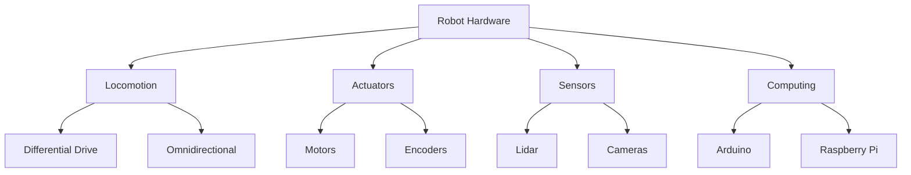

# Chapter 2: Robot Hardware

## 2.1 Overview of Robot Hardware
Robots are composed of several key subsystems:
- **Locomotion** (e.g., wheels, legs)
- **Actuation** (e.g., motors, arms)
- **Sensing** (e.g., cameras, lidar, encoders)
- **Computing** (e.g., single-board computers, microcontrollers)

Each subsystem is represented in software and hardware, working together to enable robot autonomy.

---

## 2.2 Locomotion Types
### Holonomic vs. Non-Holonomic
- Holonomic: Can move in any direction (e.g., omnidirectional robots)
- Non-Holonomic: Limited movement directions (e.g., differential drive)
- Degrees of Freedom (DoF): Number of independent movements a robot can make

### Differential Drive
- Two powered wheels (e.g., TurtleBot3, mBot) and one or two casters
- Turns by varying wheel speeds
- Can move forward/backward and pivot in place

### Four-Wheeled and Other Vehicles
- Skid steering (tracks or 4 wheels)
- "Akkerman" steering (like a car)
- Mechanum wheels for omnidirectional movement
- Quadrupeds: Gait patterns (trot, gallop, etc.)

---

## 2.3 Actuators and Manipulators
- Motors: DC, servo, stepper, Dynamixel (smart motors)
- Motor controllers: Control speed and direction
- Encoders: Measure wheel/motor rotation
- Manipulators: Arms, grippers, kinematic chains
- Joints and Links: Defined in URDF ([URDF documentation](https://docs.ros.org/en/rolling/Tutorials/Intermediate/URDF/URDF-Main.html))

---

## 2.4 Sensors
### Lidar
- Rotating laser measures distance to obstacles
- 2D (scan) or 3D (point cloud); ours is 2D
- Data published on `/scan` topic ([LaserScan msg](https://docs.ros2.org/latest/api/sensor_msgs/msg/LaserScan.html))
- Example: [YDLIDAR X4](https://www.ydlidar.com/products/view/5.html)
- For practical use of scan data, see [Chapter 5: Working with LIDAR](chapter5_lidar.md)

### Visual Cameras
- Webcams provide color images (matrix of RGB values)
- Data processed with tools like OpenCV
- Depth cameras (e.g., Kinect) add distance info
- For image processing and computer vision techniques, see [Chapter 6: Computer Vision](chapter6_computer_vision.md)

---

## 2.5 Computing Platforms
- Microcontrollers: Arduino, MCore (mBot), OpenCR (TurtleBot3)
- Single-Board Computers: Raspberry Pi, BeagleBone
- Distributed Computing: ROS nodes run on multiple devices (Pi, laptop, etc.) — see [Chapter 3: Robot Software Architecture](chapter3_software_arch.md#32-distributed-systems-in-robotics)

### Example: mBot
- MCore board (Arduino Uno + peripherals)
- Dual motor controller, sensors, LEDs, radio, etc.
- [Details about MCore](http://blog.hmpg.net/2016/04/makeblock-mcore-information.html)

### Example: TurtleBot3
- Two powered wheels, one caster
- Dynamixel smart motors
- OpenCR board (Arduino compatible, with IMU)
- Raspberry Pi running Ubuntu and ROS 2
- [Robotis TurtleBot3 Manual](https://emanual.robotis.com/docs/en/platform/turtlebot3/overview/)
- [TurtleBot3 ROS 2 Quick Start](https://emanual.robotis.com/docs/en/platform/turtlebot3/quick-start/)

---

## 2.6 Simulators
- Software to simulate robots and environments
- **Gazebo:** Full 3D simulation and visualization. See [Gazebo with ROS 2](https://docs.ros.org/en/rolling/Tutorials/Advanced/Simulators/Gazebo/Gazebo.html).
- **RViz2:** 3D visualization (not a simulator). See [RViz2 documentation](https://docs.ros.org/en/rolling/Tutorials/Intermediate/RViz/RViz-User-Guide/RViz-User-Guide.html).

---

## 2.7 Diagrams

---

## 2.8 Further Reading
- [Robotis TurtleBot3 Manual](https://emanual.robotis.com/docs/en/platform/turtlebot3/overview/)
- [TurtleBot3 ROS 2 Quick Start](https://emanual.robotis.com/docs/en/platform/turtlebot3/quick-start/)
- [YDLIDAR X4](https://www.ydlidar.com/products/view/5.html)
- [URDF documentation](https://docs.ros.org/en/rolling/Tutorials/Intermediate/URDF/URDF-Main.html)
- [LaserScan msg](https://docs.ros2.org/latest/api/sensor_msgs/msg/LaserScan.html)
- [ROS 2 tf2 (coordinate frames)](https://docs.ros.org/en/rolling/Concepts/Intermediate/About-Tf2.html)

---

*This chapter is based solely on classroom source materials. All links and diagrams are for educational use.*

> **Disclaimer:** This content was generated from classroom source materials by an AI assistant. Errors may be present — please report any to [pitosalas@gmail.com](mailto:pitosalas@gmail.com).
