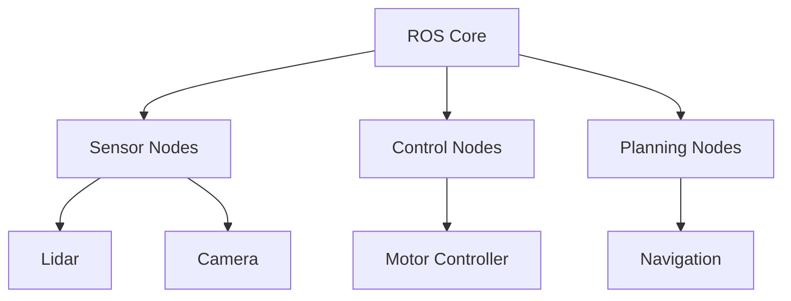

# Chapter 3: Robot Software Architecture

## 3.1 Why Robots Need Special Software

Robots are not just computers on wheels—they are complex, tightly integrated systems that must sense, plan, and act in the real world. Unlike traditional software, which runs in predictable digital environments, robot software must constantly interact with unpredictable physical realities. This means:

- Integrating hardware (motors, sensors, controllers) with software logic
- Reacting in real time to sensor input and environmental changes
- Handling uncertainty, noise, and incomplete information
- Supporting autonomy, safety, and robust error handling

For example, a robot vacuum must detect obstacles, plan a path, and control its motors—all while responding instantly to a pet darting across its path. These requirements demand software architectures that are modular, responsive, and resilient.

Robots also face unique challenges: sensors can fail or provide noisy data, actuators may not behave as expected, and the environment can change without warning. Good robot software anticipates these issues, using feedback loops, error detection, and redundancy to maintain reliable operation.

## 3.2 Distributed Systems in Robotics

Modern robots are, by necessity, distributed systems. Rather than a single computer running all code, robots typically use multiple processors and microcontrollers, each responsible for different subsystems. For example:

- A Raspberry Pi or laptop might run high-level planning and perception
- An Arduino or OpenCR board handles low-level motor control and sensor interfacing
- Sensors and actuators may have their own embedded processors

These components communicate over wired or wireless networks, exchanging data and commands. This distributed approach offers several advantages:

- **Modularity:** Each subsystem can be developed, tested, and replaced independently
- **Scalability:** More sensors or actuators can be added without redesigning the whole system
- **Fault tolerance:** If one part fails, others can continue operating or compensate

However, distributed systems also introduce complexity. Communication delays, synchronization issues, and network failures must be managed. Robot software frameworks, like ROS, are designed to address these challenges.

## 3.3 ROS Motivation and Architecture

The Robot Operating System (ROS) is the most widely used framework for robot software development. ROS was created to solve the unique challenges of robotics:

- **Nodes:** Each functional component (e.g., sensor driver, controller, planner) runs as a separate process, called a node. This separation improves reliability and makes it easier to develop and debug complex systems.
- **Topics:** Nodes communicate by publishing and subscribing to topics. For example, a LIDAR node publishes sensor data on a `/scan` topic, while a mapping node subscribes to that topic to build a map.
- **Services:** For request/response interactions, nodes can offer services. For example, a node might provide a service to reset the robot's position or query its battery level.
- **Actions:** Some tasks, like navigation, take time and require feedback. ROS actions support long-running goals with progress updates and the ability to cancel or preempt tasks.

ROS abstracts away hardware details, allowing developers to focus on high-level logic. It also provides powerful tools for simulation (Gazebo), visualization (RViz), and debugging. The modularity of ROS means that code can be reused across different robots and projects, accelerating development and fostering collaboration.

## 3.4 Example Architectures

To make these concepts concrete, let's look at two example architectures:

### Simple Robot Software Stack

Imagine a basic mobile robot equipped with a LIDAR and a camera. Its software might be organized as follows:

- **Sensor nodes** publish data from the LIDAR and camera
- **Control nodes** subscribe to sensor data and send commands to the motors
- **State estimation and planning nodes** use sensor data to estimate the robot's position and plan paths

This modular approach allows each part of the system to be developed and tested independently. If you want to swap out the camera for a different model, you only need to update the camera node.

### TurtleBot3 Software Architecture

The TurtleBot3 is a popular educational and research robot. Its architecture illustrates the distributed, modular nature of modern robotics:

- The Raspberry Pi runs the ROS core and high-level nodes for navigation, mapping, and user interaction.
- The OpenCR board handles low-level motor control, reading wheel encoders, and processing IMU data.
- LIDAR and camera nodes publish sensor data to the ROS network.
- All nodes communicate over ROS topics and services, allowing for flexible integration and easy debugging.

The diagram below summarizes this architecture:

This architecture allows the TurtleBot3 to perform complex tasks like simultaneous localization and mapping (SLAM), obstacle avoidance, and autonomous navigation—all using modular, reusable software components.

## 3.5 Further Reading

To deepen your understanding of robot software architecture and ROS, explore these resources:

- [ROS Wiki](http://wiki.ros.org/)
- [TurtleBot3 Software Architecture](http://emanual.robotis.com/docs/en/platform/turtlebot3/software/)

---

*This chapter is based solely on classroom source materials and is designed for educational use.*
