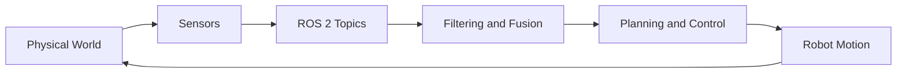

# Chapter 4: Sensors Overview

## 4.1 Introduction to Robot Sensors
Sensors are the robot's connection to the physical world. Motors and actuators let a robot move, but without sensing, that motion is blind. Every useful behavior in mobile robotics begins with measurement: how far the nearest wall is, whether the robot is turning, whether it is colliding with something, and whether it is still on a safe surface.

In this course's platforms, no single sensor is sufficient by itself. A 2D LIDAR can provide reliable obstacle distance in one horizontal plane, but it cannot identify object class. A camera can identify visual features, but it can be sensitive to lighting and motion blur. Wheel encoders provide short-term motion estimates, but they drift over time. The practical skill in robotics is learning to combine these signals so that each sensor compensates for another's weakness.



The rest of this chapter introduces the sensing modalities used throughout the book and explains what each one contributes to navigation and autonomy.

## 4.2 LIDAR
LIDAR (Light Detection and Ranging) uses a laser emitter and receiver to estimate distance to nearby surfaces. On our mobile robot setup, the LIDAR rotates and returns a 2D sweep of obstacle distances around the base. In ROS 2, this stream is typically published as `sensor_msgs/msg/LaserScan` on `/scan`.

LIDAR is one of the most valuable sensors for indoor navigation because it directly captures geometry: where free space ends and obstacles begin. That makes it central to obstacle avoidance, localization, and mapping workflows.

At the same time, real scans are imperfect. Glass, highly reflective surfaces, and geometry at sharp angles can produce invalid or unstable returns. Practical pipelines almost always include filtering and thresholding before downstream planning uses the data.

Example hardware used in course materials: [YDLIDAR X4](https://www.ydlidar.com/products/view/5.html).

## 4.3 Cameras
Cameras provide dense visual information as pixel arrays, usually RGB images. Compared with range sensors, camera data is semantically rich: it can support object recognition, line following, marker detection, and interaction tasks such as face or gesture recognition.

In ROS 2 systems, camera feeds are often transported as `sensor_msgs/msg/Image` and processed with OpenCV. For networked robots, compressed image transport is often necessary to reduce bandwidth use.

Unlike LIDAR, camera perception depends strongly on illumination and scene texture. This is why robust robot systems often use cameras alongside geometric sensors, not as the only source of perception.

## 4.4 Depth Sensors
Depth sensors estimate per-pixel distance, producing a 3D-aware view of the environment. This can come from structured light or time-of-flight technologies, depending on the device.

Depth data is especially useful for tasks where 2D geometry is not enough: estimating object pose for manipulation, segmenting near/far obstacles, or reasoning about vertical structure (for example, table surfaces versus floor-level clutter).

Depth sensing is computationally heavier than simple 2D range sensing, so system design needs to account for processing cost and frame rate.

## 4.5 Odometry and IMU
Odometry is the robot's estimate of how it has moved over time, usually derived from wheel encoder measurements. It is continuously available and low-latency, which makes it ideal for short-term motion feedback.

An IMU (Inertial Measurement Unit) contributes accelerometer and gyroscope data, helping estimate orientation and turn dynamics. In practical robot stacks, odometry and IMU are fused to produce a more stable state estimate than either source alone.

The key limitation is drift. Small wheel slip and bias errors accumulate, so long-duration accuracy requires periodic correction from external references such as LIDAR-based localization or visual landmarks.

```python
# ROS 2-style callback sketch for scan + odom integration points
from sensor_msgs.msg import LaserScan, Imu
from nav_msgs.msg import Odometry

def scan_callback(msg: LaserScan):
	nearest = min(r for r in msg.ranges if r > 0.0)
	print(f"Nearest obstacle: {nearest:.2f} m")

def odom_callback(msg: Odometry):
	x = msg.pose.pose.position.x
	y = msg.pose.pose.position.y
	print(f"Estimated pose: ({x:.2f}, {y:.2f})")

def imu_callback(msg: Imu):
	wz = msg.angular_velocity.z
	print(f"Yaw rate: {wz:.3f} rad/s")
```

## 4.6 Touch and Contact Sensors
Touch and contact sensors include bump switches, whisker-style switches, and force-sensitive elements. They are usually simple compared with vision or LIDAR, but they are crucial for safety and robustness.

These sensors provide immediate confirmation of physical contact, which can trigger emergency stop or recovery behaviors. In manipulation, force feedback can indicate whether an object has been grasped or whether excessive force is being applied.

## 4.7 GPS and Outdoor Sensing
GPS provides global position references outdoors, making it valuable for large-scale navigation where local maps alone are not enough. For indoor robots, GPS is generally unavailable or too noisy to be useful.

Even outdoors, consumer GPS is not precise enough by itself for close obstacle maneuvering. It is typically combined with local sensing (LIDAR, camera, IMU, odometry) to balance global context with local precision.

## 4.8 Integration Strategy
The practical takeaway is that robot perception is a systems problem, not a single-device problem. A reliable mobile robot typically:

1. Uses LIDAR for fast local geometry and obstacle distance.
2. Uses odometry and IMU for short-term motion tracking and control stability.
3. Uses cameras or depth sensors for richer scene understanding and task-specific perception.
4. Uses GPS when operating outdoors and global coordinates matter.

This layered approach is the foundation for later chapters on LIDAR processing, computer vision, and full autonomy stacks.

## 4.9 Further Reading
- [LaserScan (ROS 2 sensor_msgs)](https://docs.ros2.org/latest/api/sensor_msgs/msg/LaserScan.html)
- [YDLIDAR X4](https://www.ydlidar.com/products/view/5.html)
- [OpenCV](https://opencv.org/)
- [TurtleBot3 Overview](https://emanual.robotis.com/docs/en/platform/turtlebot3/overview/)

---

*This chapter is based solely on classroom source materials and is designed for educational use.*
