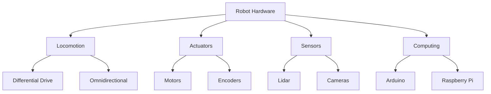
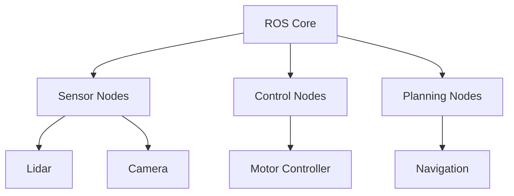
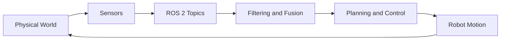

# Introduction

## What is Robotics?
Robotics is the science and engineering of intelligent machines that can sense, plan, and act in the world. Robots are more than just machines—they are integrated systems that combine hardware, software, and intelligence to perform tasks autonomously or semi-autonomously. Robotics draws from engineering, computer science, mathematics, and even biology and psychology.

Historically, robotics has evolved from simple mechanical automata to sophisticated systems capable of perception, reasoning, and adaptation. Today, robots are found in factories, hospitals, homes, and even on other planets. The field is rapidly expanding, with new applications emerging every year.

## Why Study Robotics?
Robotics is a rapidly growing field with profound impact on technology and society. Robots are transforming industries, enabling new forms of automation, and opening up possibilities in research, exploration, and daily life. Studying robotics develops skills in problem-solving, creativity, and interdisciplinary thinking.

Robotics is inherently hands-on. Building and programming robots provides immediate feedback and a tangible sense of accomplishment. Whether you are interested in engineering, artificial intelligence, or simply enjoy making things move, robotics offers a unique and rewarding learning experience.

## Structure of This Book
This book is organized to guide you from foundational concepts to hands-on practice:

- **Defining Robots:** What makes a robot a robot?
- **Robot Hardware:** Locomotion, actuators, sensors, and computing platforms
- **Robot Software Architecture:** Why robots need special software, distributed systems, and ROS
- **Perception, Planning, and Control:** How robots sense, decide, and act
- **Hands-On Labs and Projects:** Step-by-step exercises and real-world challenges
- **Appendices:** Reference materials, glossary, and further resources

Each chapter builds on the previous, blending theory with practical exercises. You will encounter special directives (e.g., `:topic_include`) that pull in focused content from classroom materials.

## Learning Approach
This book emphasizes learning by doing. You will:
- Complete hands-on labs using real robots and simulators
- Solve open-ended problems and design your own projects
- Use the Robot Operating System (ROS) to program and control robots
- Collaborate and share your work with others

No prior experience with robotics or ROS is required, but familiarity with basic programming and mathematics will be helpful. The goal is to make robotics accessible, engaging, and relevant.

## Further Reading and Resources
- [Robotis Turtlebot3 Manual](http://emanual.robotis.com/docs/en/platform/turtlebot3/overview/)
- [ROS Wiki](http://wiki.ros.org/)
- [YDLIDAR X4](https://www.ydlidar.com/products/view/5.html)
- [URDF documentation](http://wiki.ros.org/urdf/XML/joint)
- [Boston is a global hub for robotics!](https://masstech.org/robotics)

---

*This introduction is based solely on classroom source materials and is designed to set the stage for your journey into robotics.*
---
title: Defining Robots
author: GPT-4.1
date: 2026-04-26
---

# Chapter 1: Defining Robots

## 1.1 What is a Robot?
Defining what counts as a robot is not always straightforward. There are many definitions, and the boundaries can be blurry. Generally, a robot is a machine that can sense its environment, plan or process information, and act upon the world—often autonomously or semi-autonomously.

**Key characteristics of robots:**
- Ability to sense the environment (e.g., cameras, LIDAR, touch sensors)
- Ability to act (e.g., motors, arms, wheels)
- Some level of decision-making or control (software, logic)

Robots can range from industrial arms to autonomous vehicles, drones, and even social robots. The field is broad and rapidly evolving.

## 1.2 Why Study Robotics?
Robots are impacting the world in many ways:
- Automation in factories and warehouses
- Medical robots (e.g., surgical assistants)
- Assistive robots for the elderly or disabled
- Autonomous vehicles and public transportation
- Exploration (space, underwater, hazardous environments)

Boston, for example, is a global hub for robotics innovation, with companies like Boston Dynamics and Amazon Robotics leading the way ([see more](https://masstech.org/robotics)).

## 1.3 Types of Robots
- **Industrial robots:** Used in manufacturing and assembly
- **Service robots:** Healthcare, cleaning, delivery
- **Mobile robots:** Wheeled, tracked, or legged
- **Humanoids:** Robots with human-like form or behavior (e.g., Tesla Optimus)
- **Specialized robots:** Drones, underwater robots, etc.

## 1.4 Components of a Robot
- **Sensors:** Cameras, LIDAR, IMU, touch, etc.
- **Actuators:** Motors, servos, grippers
- **Controllers:** Microcontrollers, single-board computers
- **Power sources:** Batteries, solar, wired

## 1.5 Robots vs. Other Machines
What makes a robot different from other machines? Robots are typically distinguished by their ability to sense, decide, and act—often with some degree of autonomy. For example, an autonomous airport tram is arguably a robot, while a simple conveyor belt is not.

## 1.6 Challenges in Defining Robots
There are edge cases and ambiguous examples. As technology evolves, so do our definitions. Some systems blur the line between automation and autonomy.

## 1.7 Robots and People
Successful human–robot interaction requires awareness of humans in the environment and adherence to social conventions (e.g., not following too closely, responding to gestures or speech). Technologies like face recognition, speech recognition, and natural language processing are increasingly important.

## 1.8 Summary and Further Reading
- [Boston is a global hub for robotics!](https://masstech.org/robotics)
- [Jennie from Tombot](https://tombot.com)
- [Tesla Optimus](https://www.tesla.com/AI)

---

*This chapter is based solely on classroom source materials and is designed for educational use.*
---
title: Robot Hardware
author: GPT-4.1
date: 2026-04-26
---


# Chapter 2: Robot Hardware

## 2.1 Overview of Robot Hardware
Robots are composed of several key subsystems:
- **Locomotion** (e.g., wheels, legs)
- **Actuation** (e.g., motors, arms)
- **Sensing** (e.g., cameras, lidar, encoders)
- **Computing** (e.g., single-board computers, microcontrollers)

Each subsystem is represented in software and hardware, working together to enable robot autonomy.

---

## 2.2 Locomotion Types
### Holonomic vs. Non-Holonomic
- Holonomic: Can move in any direction (e.g., omnidirectional robots)
- Non-Holonomic: Limited movement directions (e.g., differential drive)
- Degrees of Freedom (DoF): Number of independent movements a robot can make

### Differential Drive
- Two powered wheels (e.g., TurtleBot3, mBot) and one or two casters
- Turns by varying wheel speeds
- Can move forward/backward and pivot in place

### Four-Wheeled and Other Vehicles
- Skid steering (tracks or 4 wheels)
- "Akkerman" steering (like a car)
- Mechanum wheels for omnidirectional movement
- Quadrupeds: Gait patterns (trot, gallop, etc.)

---

## 2.3 Actuators and Manipulators
- Motors: DC, servo, stepper, Dynamixel (smart motors)
- Motor controllers: Control speed and direction
- Encoders: Measure wheel/motor rotation
- Manipulators: Arms, grippers, kinematic chains
- Joints and Links: Defined in URDF ([URDF documentation](http://wiki.ros.org/urdf/XML/joint))

---

## 2.4 Sensors
### Lidar
- Rotating laser measures distance to obstacles
- 2D (scan) or 3D (point cloud); ours is 2D
- Data published on `/scan` topic ([LaserScan.msg](http://docs.ros.org/melodic/api/sensor_msgs/html/msg/LaserScan.html))
- Example: [YDLIDAR X4](https://www.ydlidar.com/products/view/5.html)

### Visual Cameras
- Webcams provide color images (matrix of RGB values)
- Data processed with tools like OpenCV
- Depth cameras (e.g., Kinect) add distance info

---

## 2.5 Computing Platforms
- Microcontrollers: Arduino, MCore (mBot), OpenCR (TurtleBot3)
- Single-Board Computers: Raspberry Pi, BeagleBone
- Distributed Computing: ROS nodes run on multiple devices (Pi, laptop, etc.)

### Example: mBot
- MCore board (Arduino Uno + peripherals)
- Dual motor controller, sensors, LEDs, radio, etc.
- [Details about MCore](http://blog.hmpg.net/2016/04/makeblock-mcore-information.html)

### Example: TurtleBot3
- Two powered wheels, one caster
- Dynamixel smart motors
- OpenCR board (Arduino compatible, with IMU)
- Raspberry Pi running Ubuntu and ROS
- [Robotis Turtlebot3](http://emanual.robotis.com/docs/en/platform/turtlebot3/overview/)

---

## 2.6 Simulators
- Software to simulate robots and environments
- **Gazebo:** Full 3D simulation and visualization
- **RViz:** 3D visualization (not a simulator)

---

## 2.7 Diagrams



---

## 2.8 Further Reading
- [Robotis Turtlebot3 Manual](http://emanual.robotis.com/docs/en/platform/turtlebot3/overview/)
- [YDLIDAR X4](https://www.ydlidar.com/products/view/5.html)
- [URDF documentation](http://wiki.ros.org/urdf/XML/joint)
- [LaserScan.msg](http://docs.ros.org/melodic/api/sensor_msgs/html/msg/LaserScan.html)

---

*This chapter is based solely on classroom source materials. All links and diagrams are for educational use.*
---
title: Robot Software Architecture
author: GPT-4.1
date: 2026-04-26
---


# Chapter 3: Robot Software Architecture

## 3.1 Why Robots Need Special Software

Robots are not just computers on wheels—they are complex, tightly integrated systems that must sense, plan, and act in the real world. Unlike traditional software, which runs in predictable digital environments, robot software must constantly interact with unpredictable physical realities. This means:

- Integrating hardware (motors, sensors, controllers) with software logic
- Reacting in real time to sensor input and environmental changes
- Handling uncertainty, noise, and incomplete information
- Supporting autonomy, safety, and robust error handling

For example, a robot vacuum must detect obstacles, plan a path, and control its motors—all while responding instantly to a pet darting across its path. These requirements demand software architectures that are modular, responsive, and resilient.

Robots also face unique challenges: sensors can fail or provide noisy data, actuators may not behave as expected, and the environment can change without warning. Good robot software anticipates these issues, using feedback loops, error detection, and redundancy to maintain reliable operation.

## 3.2 Distributed Systems in Robotics

Modern robots are, by necessity, distributed systems. Rather than a single computer running all code, robots typically use multiple processors and microcontrollers, each responsible for different subsystems. For example:

- A Raspberry Pi or laptop might run high-level planning and perception
- An Arduino or OpenCR board handles low-level motor control and sensor interfacing
- Sensors and actuators may have their own embedded processors

These components communicate over wired or wireless networks, exchanging data and commands. This distributed approach offers several advantages:

- **Modularity:** Each subsystem can be developed, tested, and replaced independently
- **Scalability:** More sensors or actuators can be added without redesigning the whole system
- **Fault tolerance:** If one part fails, others can continue operating or compensate

However, distributed systems also introduce complexity. Communication delays, synchronization issues, and network failures must be managed. Robot software frameworks, like ROS, are designed to address these challenges.

## 3.3 ROS Motivation and Architecture

The Robot Operating System (ROS) is the most widely used framework for robot software development. ROS was created to solve the unique challenges of robotics:

- **Nodes:** Each functional component (e.g., sensor driver, controller, planner) runs as a separate process, called a node. This separation improves reliability and makes it easier to develop and debug complex systems.
- **Topics:** Nodes communicate by publishing and subscribing to topics. For example, a LIDAR node publishes sensor data on a `/scan` topic, while a mapping node subscribes to that topic to build a map.
- **Services:** For request/response interactions, nodes can offer services. For example, a node might provide a service to reset the robot's position or query its battery level.
- **Actions:** Some tasks, like navigation, take time and require feedback. ROS actions support long-running goals with progress updates and the ability to cancel or preempt tasks.

ROS abstracts away hardware details, allowing developers to focus on high-level logic. It also provides powerful tools for simulation (Gazebo), visualization (RViz), and debugging. The modularity of ROS means that code can be reused across different robots and projects, accelerating development and fostering collaboration.

## 3.4 Example Architectures

To make these concepts concrete, let's look at two example architectures:

### Simple Robot Software Stack

Imagine a basic mobile robot equipped with a LIDAR and a camera. Its software might be organized as follows:

- **Sensor nodes** publish data from the LIDAR and camera
- **Control nodes** subscribe to sensor data and send commands to the motors
- **State estimation and planning nodes** use sensor data to estimate the robot's position and plan paths

This modular approach allows each part of the system to be developed and tested independently. If you want to swap out the camera for a different model, you only need to update the camera node.

### TurtleBot3 Software Architecture

The TurtleBot3 is a popular educational and research robot. Its architecture illustrates the distributed, modular nature of modern robotics:

- The Raspberry Pi runs the ROS core and high-level nodes for navigation, mapping, and user interaction.
- The OpenCR board handles low-level motor control, reading wheel encoders, and processing IMU data.
- LIDAR and camera nodes publish sensor data to the ROS network.
- All nodes communicate over ROS topics and services, allowing for flexible integration and easy debugging.

The diagram below summarizes this architecture:



This architecture allows the TurtleBot3 to perform complex tasks like simultaneous localization and mapping (SLAM), obstacle avoidance, and autonomous navigation—all using modular, reusable software components.

## 3.5 Further Reading

To deepen your understanding of robot software architecture and ROS, explore these resources:

- [ROS Wiki](http://wiki.ros.org/)
- [TurtleBot3 Software Architecture](http://emanual.robotis.com/docs/en/platform/turtlebot3/software/)

---

*This chapter is based solely on classroom source materials and is designed for educational use.*
---
title: Sensors Overview
author: GPT-5.3-Codex (Copilot)
date: 2026-04-26
---

# Chapter 4: Sensors Overview

## 4.1 Introduction to Robot Sensors
Sensors are the robot's connection to the physical world. Motors and actuators let a robot move, but without sensing, that motion is blind. Every useful behavior in mobile robotics begins with measurement: how far the nearest wall is, whether the robot is turning, whether it is colliding with something, and whether it is still on a safe surface.

In this course's platforms, no single sensor is sufficient by itself. A 2D LIDAR can provide reliable obstacle distance in one horizontal plane, but it cannot identify object class. A camera can identify visual features, but it can be sensitive to lighting and motion blur. Wheel encoders provide short-term motion estimates, but they drift over time. The practical skill in robotics is learning to combine these signals so that each sensor compensates for another's weakness.



The rest of this chapter introduces the sensing modalities used throughout the book and explains what each one contributes to navigation and autonomy.

## 4.2 LIDAR
LIDAR (Light Detection and Ranging) uses a laser emitter and receiver to estimate distance to nearby surfaces. On our mobile robot setup, the LIDAR rotates and returns a 2D sweep of obstacle distances around the base. In ROS 2, this stream is typically published as `sensor_msgs/msg/LaserScan` on `/scan`.

LIDAR is one of the most valuable sensors for indoor navigation because it directly captures geometry: where free space ends and obstacles begin. That makes it central to obstacle avoidance, localization, and mapping workflows.

At the same time, real scans are imperfect. Glass, highly reflective surfaces, and geometry at sharp angles can produce invalid or unstable returns. Practical pipelines almost always include filtering and thresholding before downstream planning uses the data.

Example hardware used in course materials: [YDLIDAR X4](https://www.ydlidar.com/products/view/5.html).

## 4.3 Cameras
Cameras provide dense visual information as pixel arrays, usually RGB images. Compared with range sensors, camera data is semantically rich: it can support object recognition, line following, marker detection, and interaction tasks such as face or gesture recognition.

In ROS 2 systems, camera feeds are often transported as `sensor_msgs/msg/Image` and processed with OpenCV. For networked robots, compressed image transport is often necessary to reduce bandwidth use.

Unlike LIDAR, camera perception depends strongly on illumination and scene texture. This is why robust robot systems often use cameras alongside geometric sensors, not as the only source of perception.

## 4.4 Depth Sensors
Depth sensors estimate per-pixel distance, producing a 3D-aware view of the environment. This can come from structured light or time-of-flight technologies, depending on the device.

Depth data is especially useful for tasks where 2D geometry is not enough: estimating object pose for manipulation, segmenting near/far obstacles, or reasoning about vertical structure (for example, table surfaces versus floor-level clutter).

Depth sensing is computationally heavier than simple 2D range sensing, so system design needs to account for processing cost and frame rate.

## 4.5 Odometry and IMU
Odometry is the robot's estimate of how it has moved over time, usually derived from wheel encoder measurements. It is continuously available and low-latency, which makes it ideal for short-term motion feedback.

An IMU (Inertial Measurement Unit) contributes accelerometer and gyroscope data, helping estimate orientation and turn dynamics. In practical robot stacks, odometry and IMU are fused to produce a more stable state estimate than either source alone.

The key limitation is drift. Small wheel slip and bias errors accumulate, so long-duration accuracy requires periodic correction from external references such as LIDAR-based localization or visual landmarks.

```python
# ROS 2-style callback sketch for scan + odom integration points
from sensor_msgs.msg import LaserScan, Imu
from nav_msgs.msg import Odometry

def scan_callback(msg: LaserScan):
	nearest = min(r for r in msg.ranges if r > 0.0)
	print(f"Nearest obstacle: {nearest:.2f} m")

def odom_callback(msg: Odometry):
	x = msg.pose.pose.position.x
	y = msg.pose.pose.position.y
	print(f"Estimated pose: ({x:.2f}, {y:.2f})")

def imu_callback(msg: Imu):
	wz = msg.angular_velocity.z
	print(f"Yaw rate: {wz:.3f} rad/s")
```

## 4.6 Touch and Contact Sensors
Touch and contact sensors include bump switches, whisker-style switches, and force-sensitive elements. They are usually simple compared with vision or LIDAR, but they are crucial for safety and robustness.

These sensors provide immediate confirmation of physical contact, which can trigger emergency stop or recovery behaviors. In manipulation, force feedback can indicate whether an object has been grasped or whether excessive force is being applied.

## 4.7 GPS and Outdoor Sensing
GPS provides global position references outdoors, making it valuable for large-scale navigation where local maps alone are not enough. For indoor robots, GPS is generally unavailable or too noisy to be useful.

Even outdoors, consumer GPS is not precise enough by itself for close obstacle maneuvering. It is typically combined with local sensing (LIDAR, camera, IMU, odometry) to balance global context with local precision.

## 4.8 Integration Strategy
The practical takeaway is that robot perception is a systems problem, not a single-device problem. A reliable mobile robot typically:

1. Uses LIDAR for fast local geometry and obstacle distance.
2. Uses odometry and IMU for short-term motion tracking and control stability.
3. Uses cameras or depth sensors for richer scene understanding and task-specific perception.
4. Uses GPS when operating outdoors and global coordinates matter.

This layered approach is the foundation for later chapters on LIDAR processing, computer vision, and full autonomy stacks.

## 4.9 Further Reading
- [LaserScan (ROS 2 sensor_msgs)](https://docs.ros2.org/latest/api/sensor_msgs/msg/LaserScan.html)
- [YDLIDAR X4](https://www.ydlidar.com/products/view/5.html)
- [OpenCV](https://opencv.org/)
- [TurtleBot3 Overview](https://emanual.robotis.com/docs/en/platform/turtlebot3/overview/)

---

*This chapter is based solely on classroom source materials and is designed for educational use.*
---
title: Working with LIDAR
author: GPT-4.1
date: 2026-04-26
---


# Chapter 5: Working with LIDAR

## 5.1 Introduction to LIDAR
LIDAR (Light Detection and Ranging) is one of the most important sensors in modern mobile robotics. It works by emitting laser pulses and measuring the time it takes for the light to reflect off objects and return. By rotating the laser, a LIDAR sensor can quickly scan its surroundings and build a 2D or 3D map of distances to obstacles.

LIDAR is used for mapping, localization, and obstacle avoidance. For example, the YDLIDAR X4 (used in our robots) provides a 2D scan of the environment, which is essential for navigation and safety.

## 5.2 LIDAR Data Structure
LIDAR data is typically published in ROS on the `/scan` topic as `LaserScan` messages. The most important field is `ranges`, which is an array of distance measurements. Each entry in this array corresponds to a specific angle, so together they form a "slice" of the robot's surroundings.

Other fields in the message include the minimum and maximum angles, the increment between measurements, and the time at which the scan was taken. For more details, see the [LaserScan.msg documentation](http://docs.ros.org/melodic/api/sensor_msgs/html/msg/LaserScan.html).

Here is a simple Python snippet to subscribe to LIDAR data in ROS:

```python
import rospy
from sensor_msgs.msg import LaserScan

def scan_callback(msg):
	print("Received scan with {} ranges".format(len(msg.ranges)))
	# Example: print the distance straight ahead
	print("Distance ahead: {:.2f} meters".format(msg.ranges[len(msg.ranges)//2]))

rospy.init_node('lidar_listener')
rospy.Subscriber('/scan', LaserScan, scan_callback)
rospy.spin()
```

## 5.3 Filtering and Cleaning LIDAR Data
Raw LIDAR data is often noisy. Reflections, transparent objects, or sensor limitations can produce invalid readings (such as 0 or NaN). Filtering is essential before using the data for navigation or mapping.

Common filtering steps include:
- Removing outliers (values outside the sensor's valid range)
- Replacing invalid values with a maximum distance or ignoring them
- Smoothing the data with a moving average or median filter

You can write a ROS node that subscribes to `/scan`, filters the data, and republishes it on a new topic (e.g., `/scan/clean`).

## 5.4 Obstacle Detection
One of the main uses of LIDAR is obstacle detection. By examining the `ranges` array, you can identify obstacles that are closer than a certain threshold. For example, if any value in `ranges` is less than 0.3 meters, the robot should stop or turn to avoid a collision.

You can also segment the scan to identify free and occupied regions, which is useful for mapping and path planning. More advanced algorithms can cluster points to detect individual objects or walls.

## 5.5 Visualization and Debugging
Visualization tools are essential for understanding and debugging LIDAR data. In ROS, RViz is the standard tool for visualizing 2D and 3D sensor data. You can see the LIDAR scan as a set of points or lines in the robot's coordinate frame.

To analyze LIDAR data offline, you can save it to a CSV file using the following command:

```bash
rostopic echo /scan -w 4 -p -n 50 > ~/scan_data
```

This will record 50 messages from the `/scan` topic for later analysis in a spreadsheet or plotting tool.

## 5.6 Further Reading
- [YDLIDAR X4](https://www.ydlidar.com/products/view/5.html)
- [Reading Laserscan Data](http://www.theconstructsim.com/read-laserscan-data/)
- [RViz](http://wiki.ros.org/rviz)

---

*This chapter is based solely on classroom source materials and is designed for educational use.*
---
title: Computer Vision
author: GPT-4.1
date: 2026-04-26
---


# Chapter 6: Computer Vision

## Introduction

Computer vision enables robots to interpret and understand visual information from the world. It is a cornerstone of modern robotics, supporting navigation, object recognition, tracking, and interaction. By processing images and video streams, robots can make sense of their environment, recognize objects and people, follow lines, and even read signs or gestures.

### Why Computer Vision?
Robots operate in complex, dynamic environments. Cameras provide rich, high-bandwidth data that, when processed with the right algorithms, allow robots to:
- Navigate through hallways and rooms
- Recognize and track objects or people
- Follow lines or paths on the ground
- Read signs, numbers, or QR codes
- Understand gestures and facial expressions

Computer vision is used in:
- Autonomous vehicles (lane detection, obstacle avoidance)
- Service robots (object pickup, face recognition)
- Industrial robots (quality inspection, sorting)

## Cameras and Image Acquisition

Robots use a variety of cameras and sensors to acquire visual data:

- **Webcams:** Standard RGB cameras, often used for basic vision tasks
- **Depth Cameras:** Devices like the Intel RealSense or Microsoft Kinect provide both color and depth information (RGB-D), allowing robots to perceive 3D structure
- **Stereo Cameras:** Use two lenses to estimate depth by triangulation

Image data is typically represented as a matrix of pixel values (for color: RGB). Depth cameras add a parallel matrix of distance values. This data is processed in real time for feedback and control.

**Example:**
> "Interface the depth camera to Alien and use it for something" (Project idea)

## OpenCV and Image Processing

[OpenCV](https://opencv.org/) is the most widely used open-source library for computer vision. It provides tools for:
- Image filtering (blurring, sharpening)
- Edge detection (Canny, Sobel)
- Color space conversion (RGB, HSV, grayscale)
- Feature detection (corners, blobs, contours)
- Object tracking

**Sample Python code for reading and displaying an image:**
```python
import cv2
img = cv2.imread('image.jpg')
cv2.imshow('Image', img)
cv2.waitKey(0)
cv2.destroyAllWindows()
```

**Sample code for real-time camera feed:**
```python
import cv2
cap = cv2.VideoCapture(0)
while True:
	ret, frame = cap.read()
	cv2.imshow('Camera', frame)
	if cv2.waitKey(1) & 0xFF == ord('q'):
		break
cap.release()
cv2.destroyAllWindows()
```

**Hands-On:**
- Try using OpenCV to filter an image, detect edges, or find contours.
- Use ROS topics to publish and subscribe to camera images.

## Line Detection

Line detection is a classic robotics problem, especially for line-following robots. The goal is to identify and follow lines or paths on the ground using a camera.

**Algorithms:**
- Color thresholding: Isolate the color of the line (e.g., black on white)
- Edge detection: Find boundaries of the line
- Hough Transform: Detect straight lines in an image

**Example:**
Detecting and following lines on the floor for navigation.

**Project:**
- "Create a Maze solver that uses Computer Vision. First use CV to follow a wall, then to tell the difference between a wall and an opening."

## Fiducial Markers

Fiducials are special patterns (such as AprilTags or QR codes) placed in the environment to help robots localize themselves. They are easy for computer vision algorithms to detect and uniquely identify.

**Applications:**
- Robot localization and mapping
- Identifying objects or locations
- Teaching robots to recognize specific places or items

**Fiducial SLAM:**
Instead of using LIDAR or video alone, Fiducial SLAM uses the positions of fiducials to define a coordinate space. The robot can locate itself and other objects relative to these markers, even if it cannot build a traditional map of walls.

**Project:**
- "Demonstrate understanding of Fiducials by implementing fiducial SLAM."

**Further Reading:**
- [AprilTag](https://april.eecs.umich.edu/software/apriltag.html)

## Face and Gesture Recognition

Robots can use computer vision to recognize faces and gestures, enabling more natural human-robot interaction.

**Face Recognition:**
- Detect and identify people using a camera
- Applications: personalized greetings, security, team interaction

**Gesture Recognition:**
- Recognize hand signals or body movements
- Applications: visual teleoperation, intuitive robot control

**Project Ideas:**
- "Design and implement some form of Face Recognition."
- "Recognize gestures visually."

## Depth Perception and 3D Vision

Depth cameras and stereo vision allow robots to perceive the world in three dimensions. This is essential for tasks like obstacle avoidance, object manipulation, and navigation in complex environments.

**Project:**
- "Interface the depth camera to Alien and use it for something."

## Computer Vision in Campus Rover

The Campus Rover project integrates many of these concepts:
- Recognizes faces of team members and greets them
- Reads door numbers visually to identify office locations
- Recognizes hand gestures for visual teleoperation
- Uses fiducials for localization and floor detection

## Hands-On Labs and Projects

Explore these project ideas to deepen your understanding of computer vision in robotics:
- Maze solver using computer vision
- Face recognition for personalized interaction
- Gesture recognition for robot control
- Depth camera integration
- Fiducial SLAM for localization

## Further Reading and Resources

- [OpenCV](https://opencv.org/)
- [AprilTag](https://april.eecs.umich.edu/software/apriltag.html)
- [ROS Vision Tutorials](http://wiki.ros.org/vision_opencv)
- [RealSense First Impressions](https://msadowski.github.io/Realsense-T265-First-Impressions/)

---

*This chapter is based solely on classroom source materials and is designed for educational use.*
